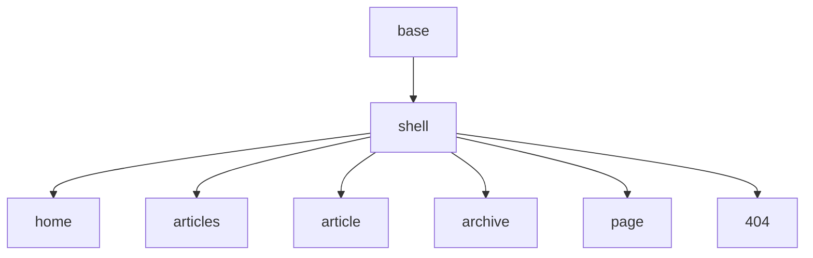

# StatSphere

[English](#english) | [中文](#chinese)

Personal blog of Wenxin Zhong — notes on statistics, data analysis, and related engineering.

Site: https://wenxin195.github.io

---

<a id="english"></a>

## English

### About

**StatSphere** is a personal Jekyll blog. It started from [TeXt Theme](https://github.com/kitian616/jekyll-TeXt-theme): the code block UI and the `prompt-*` callouts are borrowed from [Chirpy](https://github.com/cotes2020/jekyll-theme-chirpy), and the titled `box-*` / `details-*` callouts and the Liquid-tag authoring style are borrowed from [huanyushi.github.io](https://github.com/huanyushi/huanyushi.github.io).

On top of that, the theme has been rebuilt quite a bit. The notes below describe how the site is put together today, and what you need to know to write content for it.

### How the site is built

#### Layouts

Layouts are split into a shell layer and page kinds: `base` → `shell` → `home` / `articles` / `article` / `archive` / `page` / `404`.



The article header lives in its own `hero` layout instead of being buried inside the page shell.
#### Ruby plugins

```
_plugins/
  hooks/post_convert.rb     # entry point: filter, then enhance; reading time for posts
  hooks/posts_sort.rb       # post ordering: date, then title, then path
  content/
    enhancer.rb             # runs the whole parse/serialize pipeline once
    guard.rb                # skips non-article pages (e.g. assets/*.scss)
    toc.rb                  # build-time article TOC (hydrated client-side)
    reading_time.rb         # reading time from HTML-stripped text (posts only)
    language_name.rb        # maps Rouge language ids to display names
    icons.rb                # local Lucide icons (see _data/icons.yml)
    transforms/             # diagrams, figures, images, tables, task_lists, code_blocks
    markup_attrs.rb         # shared Liquid keyword attrs / ids
  callouts/tags.rb          #  / 
  figures/tags.rb           #  /  / 
  tables/tags.rb            #  / 
```

- Posts and pages are enhanced with Nokogiri in a single pass: Mermaid fences become plain `<div class="mermaid">` elements, tables get a horizontal-scroll wrapper, task-list markers are replaced with icons, and code blocks are rebuilt from scratch.
- Images get loading hints at build time: the first image keeps `fetchpriority="high"` for the LCP, the rest get `loading="lazy"` and `decoding="async"` (images inside code blocks are skipped).
- Code blocks are highlighted with Rouge at build time and rendered as a uniform `<figure class="code-block">` with a header, line numbers, and a copy button.
- `` requires a title; `` fails the build on unknown types.
- `` groups one or more `` images; `` is filled with 图 N in document order at build time.
- `` wraps a Markdown or HTML table; `` is filled with 表 N the same way. Figure and table counters are independent.
- Language display names come from `_data/language_aliases.yml`.
- Reading time (`reading_time`, `char_count`) is computed for posts only, from the HTML-stripped text after enhancement, using mixed CJK/English statistics.
- Pages with `aside.toc: true` get their TOC list generated at build time (`page.toc_html`); the client hydrates the same markup for scroll-spy instead of waiting for JS to render it.

### Writing content

#### Callouts

There are two callout systems with distinct roles — please don't mix them:

| System | Use for | How to write |
|--------|---------|--------------|
| **prompt** | short untitled tips | blockquote + `{: .prompt-tip\|info\|warning\|danger}` |
| **box** | titled callouts | `…` |
| **details** | collapsible notes | `` |

```markdown
> Short tip body.
{: .prompt-tip}


A longer, titled explanation…

```

An untitled `` is a build error — use `prompt-*` instead. The paragraph decorations `{:.success}` / `{:.info}` / `{:.warning}` / `{:.danger}` are a separate TeXt-style feature (background color only, no icon).

#### Figures

One `` block is one numbered caption (图 N). Extra panels in the same block become a grid; subcaptions get (a)(b)(c) when there is more than one panel.

```markdown





See .
```

| Attribute | Where | Notes |
|-----------|--------|--------|
| `id` | figures | required; unique in the page |
| `caption` | figures | required; becomes `图 N: …` |
| `cols` | figures | 1–12; CSS grid, collapses to 1 column below 768px |
| `align` | figures | `start` / `center` / `end` (default `end`) for unequal heights |
| `src` | panel | required |
| `caption` | panel | optional panel label |
| `alt` | panel | defaults to caption, then the filename |
| `width` | panel | optional pixel width |

In prose, write `` in place of a literal 「图 4」(the tag already includes 图 and the number). Math in a caption is written as in the body (`$A\subset B$`). `` may appear before the figure; numbering is assigned after Markdown convert.

#### Tables

One `` block is one numbered caption (表 N). The body can be a pipe table or an HTML `<table>` (without its own caption).

```markdown


| 交易 ID | 牛奶 | 面包 |
| ------ | ---: | ---: |
| 1 | 1 | 1 |



See .
```

| Attribute | Notes |
|-----------|--------|
| `id` | required; unique among tables on the page (independent of figure ids) |
| `caption` | required; becomes `表 N: …` |
| `align` | optional `center` / `left`; omit to keep the existing table-wrapper cell styles |

In prose, write `` in place of a literal 「表 1」. Math in a caption is fine. Unwrapped tables still get the scroll wrapper, but they are not numbered.

#### Code blocks

Fenced code blocks are highlighted with Rouge. By default each block shows a language label, line numbers starting from 1, and a copy button:

````markdown
```javascript
let score = 100;
```
````

You can tweak a block with a Kramdown IAL on the line after the closing fence:

| IAL | Effect |
|-----|--------|
| `{: file="app.js"}` | the header shows the filename instead of the language name |
| `{: .nolineno }` | no line numbers (the line-number markup isn't generated) |

`chart` fences are rendered by a client-side provider, so they get no code-block wrapper. `mermaid` fences are turned into `<div class="mermaid">` at build time.

#### Mermaid diagrams

Enable per page with `mermaid: true` in front matter (or rely on `layout.enhancements.mermaid`).

Sizing works like this: at build time the only markup is a single `div.mermaid`. After Mermaid draws the diagram, a small script crops the SVG `viewBox` down to what was actually drawn (plus `--mermaid-viewbox-padding`) and leaves no inline height. From there, scaling is pure CSS: the diagram is treated like an image and fits within `width: auto; height: auto; max-width: 100%; max-height: var(--mermaid-max-height)` (default `70vh`). Since the intrinsic width equals the viewBox width, diagrams are never upscaled. The font size follows the body text via `--mermaid-font-size` (`1rem`, resolved to pixels at render time). Switching themes or changing the root font size triggers a full re-render; a plain viewport resize is handled by CSS alone.

| Control | Effect |
|---------|--------|
| `flowchart LR` / `TD` (etc.) | pick the direction that fits the content; CSS handles both |
| (default) | fit the column width and the max height |
| `{: data-mermaid-fit="width"}` | fit the width only (IAL after the fence) |
| `{: data-mermaid-fit="none"}` | keep the intrinsic size (scrolls horizontally if too wide) |

Keep node labels short, and split very deep flows into several diagrams rather than relying on endless page height.

#### Styles

- The Sass toolchain was moved to Dart Sass with `@use` / `@forward` (TeXt still uses the older `@import` stack).
- Stylesheets are layered: `tokens` → `foundations` → `primitives` → `shell` → `blocks` → `kinds` → `enhancements` → `motion`.
- Design tokens are the single source of truth for scale, color, and breakpoints.
- Light and dark themes switch at runtime via CSS variables and `html[data-theme]`; syntax highlighting follows the site theme.

#### Scripts

- Pure ES modules under `assets/scripts/`, organized as `entries` / `features` / `lib` / `utils` / `boot`.
- No bundler, no jQuery, no large global configuration object.
- Features are split by responsibility: TOC, drawers, search, clipboard, archive filters, link prefetching, deferred flyout images, and so on.
- Entry module graphs are preloaded via `modulepreload`, selected per page.

#### Search and third-party services

- Site search runs on [Pagefind](https://pagefind.app/).
- Comments via Giscus (disabled by default).
- Visitor and pageview counts via [Busuanzi](https://busuanzi.ibruce.info/) in the footer.
- MathJax / Mermaid / Chart / KaTeX are kept where useful, enabled per page or by layout defaults; their scripts load only when idle (Mermaid also waits until a diagram is near the viewport).

#### Configuration

- `_config.yml` stays lean.
- Presentation defaults live in `_data/layout.yml`.
- Public third-party ids live in `_data/integrations.yml` (no secrets in a static site).

#### Responsive behavior

- Breakpoints: `sm` / `md` / `lg` / `xl`.
- On narrow screens the nav collapses into a hamburger drawer, and the article TOC becomes a drawer with a floating action button; the TOC list itself is rendered at build time, so it is visible before any JS runs.
- Drawers share the same modal primitive and are mutually exclusive with search.

### Local development

You'll need Ruby, Bundler, and [Pagefind](https://pagefind.app/) (CLI or `npx`).

```bash
bundle install               # install gems
bundle exec jekyll build     # build the site
npx pagefind --site _site    # build the search index into _site/pagefind

bundle exec jekyll serve     # serve locally
npx pagefind --site _site    # re-run after content changes if you need local search
```

### Deployment

The site is deployed to GitHub Pages by GitHub Actions (`.github/workflows/jekyll.yml`). Every push to `main` triggers it (changes to README, LICENSE, and issue templates are excluded), and it can also be run manually from the Actions tab.

The `build` job sets up Ruby and Node, runs the plugin unit tests (`bundle exec rake test`), builds the site with `JEKYLL_ENV=production`, generates the Pagefind index, and runs the Playwright e2e suite against the built site (system Chrome, no browser download). Only after all of that passes does the `deploy` job publish the artifact to Pages.

### License

- Site code: MIT (see `LICENSE`).
- Post content: [CC BY-NC-SA 4.0](https://creativecommons.org/licenses/by-nc-sa/4.0/) unless a post says otherwise.

If you redistribute substantial portions of the code, please keep the copyright and license notices of TeXt, Chirpy, and other upstream MIT components.

---

<a id="chinese"></a>

## 中文

### 关于

**StatSphere** 是钟文鑫的个人博客，记录统计学、数据分析及相关工程实践的笔记。

站点：https://wenxin195.github.io

站点基于 [TeXt Theme](https://github.com/kitian616/jekyll-TeXt-theme) 搭建：代码块界面和 `prompt-*` 短提示参考了 [Chirpy](https://github.com/cotes2020/jekyll-theme-chirpy)，带标题的 `box-*` / `details-*` 提示块和 Liquid 标签的写法参考了 [huanyushi.github.io](https://github.com/huanyushi/huanyushi.github.io)。在此之上，我对主题做了不少改造，下面记录的是站点目前的结构，以及写内容时需要遵循的约定。

### 站点是怎么搭起来的

#### 布局

布局分为外壳和页面两层：`base` → `shell` → `home` / `articles` / `article` / `archive` / `page` / `404`。


文章页头单独抽成了 `hero` 布局，不再放在页面外壳中。

#### Ruby 插件

```
_plugins/
  hooks/post_convert.rb     # 入口：先过滤，再增强；posts 额外计算阅读时间
  hooks/posts_sort.rb       # 文章排序：日期、标题、路径
  content/
    enhancer.rb             # 整个解析/序列化流程在此编排，只执行一次
    guard.rb                # 跳过非文章页面（如 assets/*.scss）
    toc.rb                  # 构建期生成文章 TOC（供前端 hydrate）
    reading_time.rb         # 去掉 HTML 后统计中英文（仅 posts）
    language_name.rb        # Rouge 语言 id 转显示名
    icons.rb                # 本地 Lucide 图标（见 _data/icons.yml）
    transforms/             # diagrams、figures、images、tables、task_lists、code_blocks
    markup_attrs.rb         # Liquid 关键字参数 / id 共用解析
  callouts/tags.rb          #  / 
  figures/tags.rb           #  /  / 
  tables/tags.rb            #  / 
```

- posts 和 pages 的 HTML 都由 Nokogiri 一次性完成增强：mermaid 围栏转换为 `<div class="mermaid">`，表格加上横向滚动容器，任务列表标记替换为图标，代码块则完全重建。
- 图片在构建期加上加载提示：首图保持 `fetchpriority="high"`（保证 LCP），其余图片设 `loading="lazy"` 和 `decoding="async"`（跳过代码块内的图片）。
- 代码块在构建期用 Rouge 高亮，统一渲染成 `<figure class="code-block">`，带标题栏、行号和复制按钮。
- `` 的标题是必填的；`` 遇到未知类型会使构建失败。
- `` 将一组 `` 组合为一张编号图；`` 在构建期按文中顺序填成「图 N」。
- `` 包裹 Markdown 或 HTML 表格；`` 同样填成「表 N」。图和表各自从 1 编号。
- 语言显示名来自 `_data/language_aliases.yml`。
- 阅读时间（`reading_time`、`char_count`）只在 **posts** 上计算：增强完成后去掉 HTML，再按中英文混合的方式统计。
- 开启 `aside.toc: true` 的页面会在构建期生成 TOC 列表（写入 `page.toc_html`），前端 hydrate 同一份 HTML 做滚动高亮，不用等 JS 渲染。

### 写内容

#### 提示块

提示块有两套体系，分工不同，请不要混用：

| 体系 | 用途 | 写法 |
|------|------|------|
| **prompt** | 无标题短提示 | 引用块 + `{: .prompt-tip\|info\|warning\|danger}` |
| **box** | 带标题说明 | `…` |
| **details** | 可折叠 | `` |

```markdown
> 短提示正文。
{: .prompt-tip}


带标题的较长说明……

```

无标题的 `` 会构建失败，这种情况请改用 `prompt-*`。`{:.success}` / `{:.info}` / `{:.warning}` / `{:.danger}` 是另一套 TeXt 风格的段落装饰，仅设置背景色，没有图标。

#### 插图

一组 `` 对应一个编号（图 N）；同一组里的多个 `` 排成网格，多于一张时自动加 (a)(b)(c)。

```markdown





示意图见 。
```

| 属性 | 位置 | 说明 |
|------|------|------|
| `id` | figures | 必填，全文唯一 |
| `caption` | figures | 必填，渲染为 `图 N: …` |
| `cols` | figures | 1–12；小于 768px 时改单列 |
| `align` | figures | `start` / `center` / `end`（默认 `end`），用来对齐不同高度 |
| `src` | panel | 必填 |
| `caption` | panel | 可选子图说明 |
| `alt` | panel | 默认用 caption，再退回文件名 |
| `width` | panel | 可选，像素宽度 |

正文里用 `` 代替手写的「图 4」（标签本身已包含「图」和序号）。caption 里的公式按正文那样写即可（`$A\subset B$`）。引用可以写在图前面，编号在 Markdown 转换之后按 DOM 顺序填写。

#### 表格

一组 `` 对应一个编号（表 N）。表体可以是管道表，也可以是不带 caption 的 HTML `<table>`。

```markdown


| 交易 ID | 牛奶 | 面包 |
| ------ | ---: | ---: |
| 1 | 1 | 1 |



见 。
```

| 属性 | 说明 |
|------|------|
| `id` | 必填，在本文表格中唯一（与图的 id 互不占用） |
| `caption` | 必填，渲染为 `表 N: …` |
| `align` | 可选 `center` / `left`；不写则沿用原来的 `.table-wrapper` 单元格样式 |

正文里用 `` 代替手写的「表 1」。caption 里可以写公式。未包 `` 的表仍会加上横向滚动容器，但不编号。

#### 代码块

围栏代码块由 Rouge 高亮。默认会显示语言标签、从 1 开始的行号和复制按钮：

````markdown
```javascript
let score = 100;
```
````

可以在结束围栏的下一行加 Kramdown IAL 来微调：

| IAL | 作用 |
|-----|------|
| `{: file="app.js"}` | 标题栏显示文件名，优先于语言名 |
| `{: .nolineno }` | 关闭行号（不生成行号的 DOM） |

`chart` 围栏由客户端脚本渲染，不会套代码块的外壳；`mermaid` 围栏在构建期转换为 `<div class="mermaid">`。

#### Mermaid 图

在 front matter 里写 `mermaid: true`（或依赖 `layout.enhancements.mermaid`）即可启用。

尺寸的处理方式是：构建期只输出一个 `div.mermaid`；Mermaid 画完之后，脚本把 SVG 的 `viewBox` 裁剪到实际绘制的内容（加上 `--mermaid-viewbox-padding`），并且不写入内联 height。之后的缩放完全交给 CSS，将图作为图片处理：`width: auto; height: auto; max-width: 100%; max-height: var(--mermaid-max-height)`（默认 `70vh`）。内在宽度就是 viewBox 的宽度，所以图不会被放大。字号通过 `--mermaid-font-size`（`1rem`，渲染时换算成像素）跟随正文。切换主题或修改根字号会整图重新渲染；单纯改变窗口大小则只由 CSS 处理。

| 控制 | 效果 |
|------|------|
| `flowchart LR` / `TD` 等 | 按内容选方向即可，CSS 两种都覆盖 |
| （默认） | 适配栏宽和最大高度 |
| `{: data-mermaid-fit="width"}` | 只适配宽度（写在结束围栏下一行） |
| `{: data-mermaid-fit="none"}` | 保持原始尺寸（过宽可横向滚动） |

节点文案尽量简短；过深的流程建议拆成几张图，不要依赖页面无限向下延伸。

#### 样式

- Sass 工具链已迁移到 Dart Sass，全面使用 `@use` / `@forward`（TeXt 仍使用基于 `@import` 的旧写法）。
- 样式按 `tokens` → `foundations` → `primitives` → `shell` → `blocks` → `kinds` → `enhancements` → `motion` 分层组织。
- 尺寸、颜色、断点都由设计令牌统一管理。
- 亮色/暗色主题在运行时切换，通过 CSS 变量和 `html[data-theme]` 实现，语法高亮也跟随站点主题。

#### 脚本

- `assets/scripts/` 下均为原生 ES 模块，按 `entries` / `features` / `lib` / `utils` / `boot` 分目录。
- 没有打包工具，没有 jQuery，也没有集中维护的全局配置对象。
- TOC、抽屉、搜索、复制、归档筛选、链接预取、弹层图片延迟加载等功能各自独立，按职责拆分。
- 入口模块图通过 `modulepreload` 提前声明，按页面条件选择。

#### 搜索与第三方服务

- 站内搜索基于 [Pagefind](https://pagefind.app/)。
- 评论用 Giscus（默认关闭）。
- 页脚通过[不蒜子](https://busuanzi.ibruce.info/)统计访问量和阅读量。
- MathJax / Mermaid / Chart / KaTeX 按需保留，可按页面或按布局开启；脚本推迟到空闲时才加载（Mermaid 还会等图接近视口）。

#### 配置

- `_config.yml` 保持精简。
- 展示相关的默认值放在 `_data/layout.yml`。
- 第三方的公开参数放在 `_data/integrations.yml`（静态站点中不存放机密信息）。

#### 响应式

- 断点：`sm` / `md` / `lg` / `xl`。
- 窄屏下导航折叠为汉堡抽屉，文章 TOC 以抽屉加悬浮按钮的形式提供；TOC 列表由构建期生成，JS 加载前即可见。
- 各抽屉复用同一个 modal 基础组件，且和搜索互斥。

### 本地开发

需要 Ruby、Bundler 和 [Pagefind](https://pagefind.app/)（CLI 或 `npx`）。

```bash
bundle install               # 安装依赖
bundle exec jekyll build     # 构建站点
npx pagefind --site _site    # 生成搜索索引到 _site/pagefind

bundle exec jekyll serve     # 本地预览
npx pagefind --site _site    # 内容有变动后重新运行一次，本地搜索才会生效
```

### 部署

站点由 GitHub Actions 部署到 GitHub Pages（`.github/workflows/jekyll.yml`）。推送到 `main` 分支即会触发（README、LICENSE 和 issue 模板的改动除外），也可以在 Actions 页面手动触发。

`build` 任务先安装 Ruby 和 Node，运行插件单元测试（`bundle exec rake test`），再以 `JEKYLL_ENV=production` 构建站点、生成 Pagefind 索引，并对构建产物运行一遍 Playwright 端到端测试（使用系统 Chrome，不下载浏览器）。全部通过后，`deploy` 任务才将产物发布到 Pages。

### 许可

- 站点代码：MIT（见 `LICENSE`）。
- 文章内容：除非单篇另有说明，均采用 [CC BY-NC-SA 4.0](https://creativecommons.org/licenses/by-nc-sa/4.0/)。

若再分发较大篇幅的代码，请保留 TeXt、Chirpy 等上游 MIT 组件的版权与许可声明。
