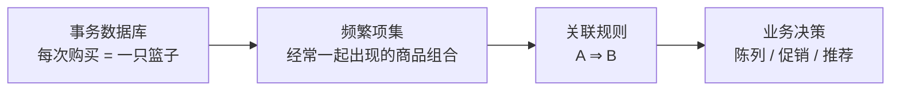
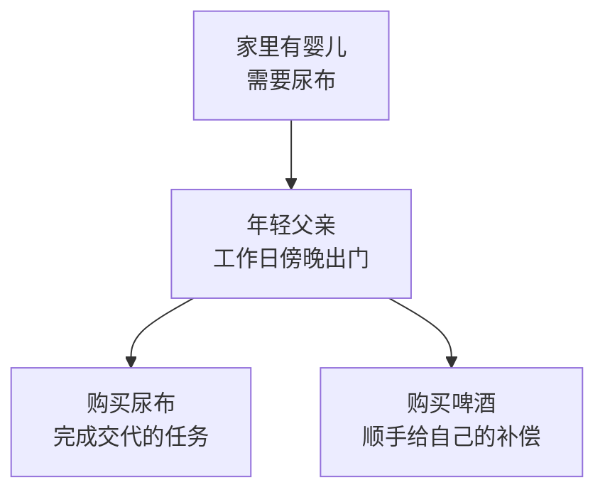
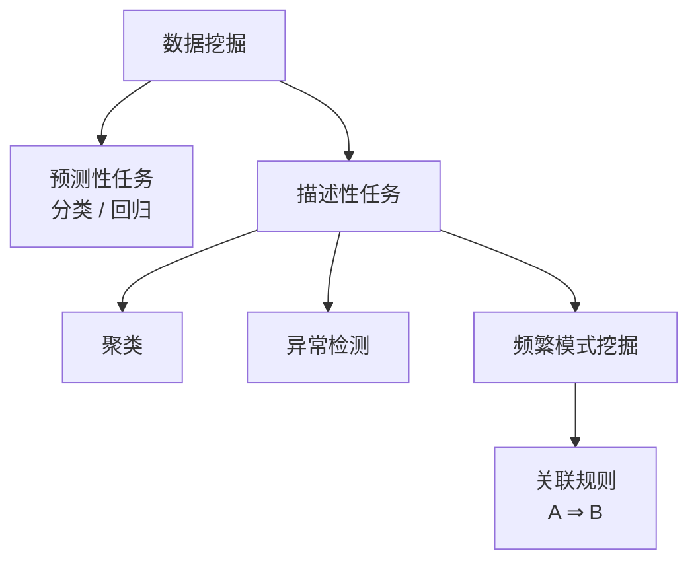
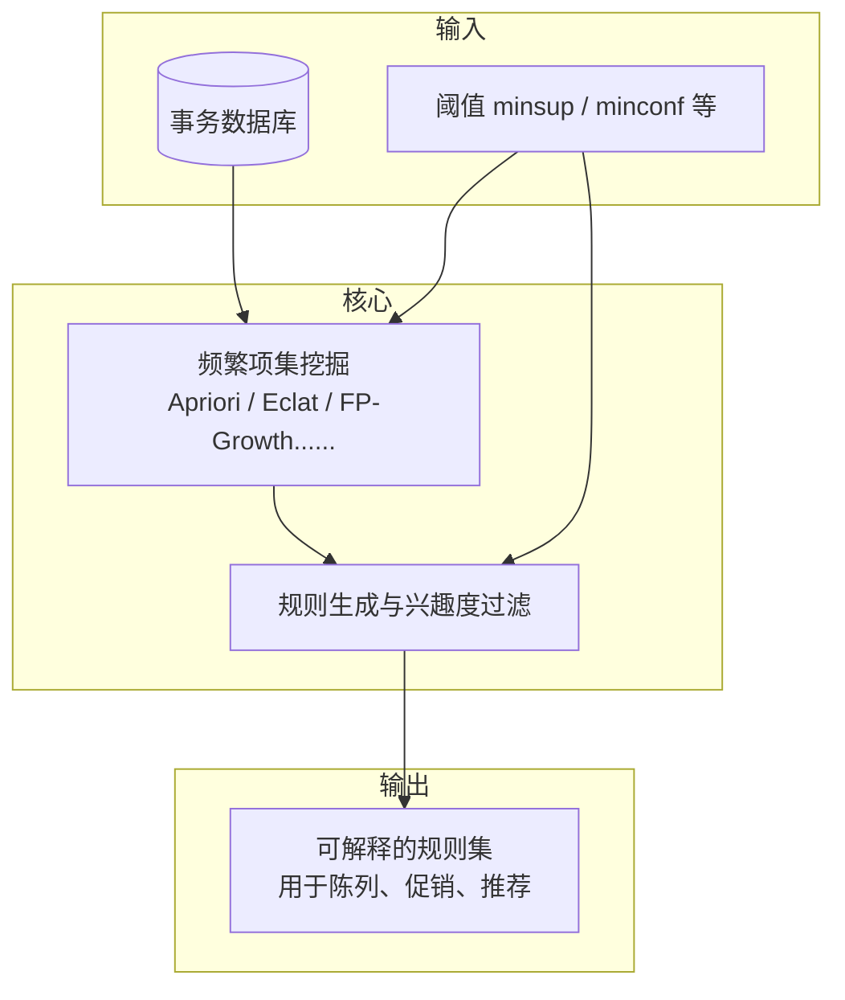
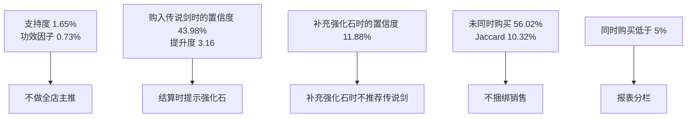

关联分析(<a href="https://en.wikipedia.org/wiki/Association_rule_learning" target="_blank">Analysis of Association Rules</a>)是一种 **基于规则** 的机器学习方法，用于发现数据集中变量之间的相关关系。它通过识别频繁模式、关联或相关性，帮助揭示数据中的条件概率模式，常用于无监督学习场景。

<!--more-->

## 购物篮分析

购物篮分析(Market Basket Analysis, MBA)是关联规则最经典、也最直观的应用场景。模型把一次消费记录看作一个 **购物篮**，分析篮中商品是否经常一起出现。该问题可以表述为：

顾客在购买 $A$ 商品之后，还有可能购买什么商品？
{:.info}

例如超市可能观察到：购买尿布的顾客中，有相当比例也会购买啤酒。若这种一起出现并非偶然，就可能影响货架陈列、捆绑促销或推荐排序。更一般地，只要数据能写成 **一次事务包含若干项目** 的形式，都可以做同类分析：网页一次会话里的点击、一份病历上同时出现的症状、一张播放列表里的歌曲，等等。





一次分析通常包含两步：

1. **找频繁项集**：在全部事务中，出现频率不低于阈值 $\mathrm{minsup}$ 的项目组合；
2. **由频繁项集生成规则**：对每个频繁项集 $X$，拆成前件 $A$ 与后件 $B$ (规定 $A\cup B=X$，$A\cap B=\varnothing$)，再按置信度等指标筛选出规则 $A\Rightarrow B$。


**啤酒与尿布** 是购物篮分析里流传最广的例子：据说某连锁超市发现，年轻父亲晚间买尿布时也常买啤酒。故事的出处与真实性常被质疑，但它很好地说明了 MBA 的价值：关联规则找的是 **数据里一起出现的结构**，未必符合先验常识，却可能对运营策略十分有用。






需要注意：关联规则的结果不代表项目之间具有因果性。规则 $A\Rightarrow B$ 只能说明“$A$ 出现时 $B$ 也经常出现”，并不能断言“因为买了 $A$ 所以去买 $B$”。解释规则、设计实验或干预时，仍要结合业务知识；提升度、杠杆率等这类指标，正是用来过滤“看起来很强、其实几乎独立”的伪规则。

## 频繁模式挖掘

数据挖掘从大规模数据里抽出可用的模式。常见任务可以粗分成几类：

- 分类与回归要预测一个标签或数值；
- 聚类把对象分成若干群；
- 异常检测找偏离常态的点；
- 频繁模式挖掘则寻找反复一起出现的项目组合。

关联规则属于最后一类，而且通常是无监督的。模型没有事先标好的“正确答案”，只根据事务里项目是否共同出现来发现结构。





频繁项集所记录的，是哪些项目经常 **一同出现**。关联规则在此基础上，将这样一个组合写成蕴涵式 $A\Rightarrow B$。同一组合可以按不同方式划分前件与后件，从而得到方向不同的规则。

每条规则附有支持度与置信度。支持度指该组合在全部事务中的相对频数；置信度则将计数范围限于已含前件的事务，衡量后件在其中一并出现的相对频数。分析者据此设定阈值，舍去支持度过低的规则，以及在给定前件的条件下后件较少一并出现的规则，再将所保留的规则用于货架陈列、捆绑促销或推荐排序。

## 发展历史

关联规则作为独立的数据挖掘问题，成型于 20 世纪 90 年代的数据库与知识发现(KDD)研究。IBM Almaden 的 Quest 项目把“从大规模交易库中挖掘形如 $X\Rightarrow Y$ 的规则”明确提出来，并迅速催生了一整条算法谱系。

### 问题的形式化

 在论文 *Mining Association Rules between Sets of Items in Large Databases* 中，把购物篮数据形式化为项目集 $\mathcal{I}$ 与事务集 $\mathcal{T}$，并定义支持度与置信度阈值下的规则挖掘任务。同期提出的 AIS 算法能找到频繁项集，但候选生成较粗：大量最终不频繁的候选项仍被计数，数据库扫描次数也偏多。

### Apriori 与向下封闭性

次年， 提出 <a href="https://en.wikipedia.org/wiki/Apriori_algorithm" target="_blank">Apriori</a> 及其变体 AprioriTid。核心思想是 **频繁项集的向下封闭性**(又称 Apriori 性质)：

> 若项集 $X$ 频繁，则其任一非空子集也必然频繁；等价地，若某子集不频繁，则包含它的超集都不可能频繁。
{: .prompt-info}

据此可以按项集长度逐层扩展，并在生成 $k\ -$ 候选之前用 $(k-1)\ -$ 频繁集做剪枝，显著减少无效计数。Apriori 成为后续十余年的基准算法；DHP(哈希剪枝)、Partition(分块挖掘再合并)等工作，多是在“少扫库、少候选”两个瓶颈上继续加压。

### 垂直格式与无候选

1997 年前后，Eclat 等算法采用 **垂直格式**(每个项目对应出现过它的事务 ID 集合)，用集合交集直接得到支持度，并常配合深度优先遍历。2000 年前后， 提出 <a href="https://en.wikipedia.org/wiki/Association_rule_learning#FP-growth_algorithm" target="_blank">FP-Growth</a>：先把事务压缩进一棵频繁模式树(FP-tree)，再在树结构上递归挖掘，从而 **避免显式候选枚举**，在许多稀疏或中等规模数据上远快于经典 Apriori。

### 兴趣度与模式扩展

规则 **找得多** 之后，问题很快变成 **哪些值得看**。置信度之外，提升度、杠杆率、信念度、Jaccard、Kulczynski 等兴趣度指标被系统引入，用于区分正相关、负相关与近似独立。对象也从静态购物篮扩展到序列模式、图模式、多维与定量关联；在业务侧，则进入推荐、交叉销售、风控特征构造与医疗组合分析等场景。





## 基本概念


设全体项目(Items)构成集合 $\mathcal{I}=\\{I_1,I_2,\ldots,I_m\\}$。其中每个事务(Transaction) $T$ 都是 $\mathcal{I}$ 的非空子集，即 $T\subseteq\mathcal{I}$。再设 $X$ 是 $\mathcal{I}$ 的一个子集，若 $X\subseteq T$，则称事务 $T$ 包含 $X$。


> 事务也就是数据条目。
{: .prompt-info}

下面用一款奇幻题材 MMORPG 的城镇商店作为案例：角色进城，在 NPC 商人处一次结清，记为一笔事务；商品只含战斗装备、消耗品和生活技能用品。交易由角色的购物行为模拟生成：每人有自己的金币和已经拥有的装备，再按这次进城准备做的事决定买什么。 列出了其中的前五笔交易，购买了该项记为 1，没有购买则记为 0。



| 交易 ID | 传说剑 | 强化石 | 护甲 | 鱼竿 | 鱼饵 | 背包 | 药水 |
| :---: | :---: | :---: | :---: | :---: | :---: | :---: | :---: |
| 1 | 1 | 1 | 0 | 0 | 0 | 0 | 1 |
| 2 | 0 | 0 | 1 | 0 | 0 | 1 | 1 |
| 3 | 0 | 0 | 0 | 1 | 1 | 0 | 0 |
| 4 | 1 | 1 | 1 | 0 | 0 | 1 | 1 |
| 5 | 0 | 1 | 0 | 0 | 0 | 0 | 0 |



在  中，项目集为 $\mathcal{I}=\\{传说剑, 强化石, 护甲, 鱼竿, 鱼饵, 背包, 药水\\}$；设 $X\subseteq\mathcal{I}$。一笔事务满足 $X$，当且仅当 $X$ 中每个项目在该行都是 1。取 $X=\\{传说剑,强化石,药水\\}$，第 1、4 笔满足 $X$。


设 $A\subset\mathcal{I}$，$B\subset\mathcal{I}$，$A$ 与 $B$ 均非空，且 $A\cap B=\emptyset$。蕴涵式 $A\Rightarrow B$ 称为关联规则，其中 $A$ 称为前件，$B$ 称为后件。


> 前件和后件可以含有多个项目。
{:.prompt-info}

例如 $\\{传说剑\\}\Rightarrow\\{强化石\\}$ 是一条规则：前件是传说剑，后件是强化石。

## 指标

以下按所比较的概率基准分组：

- **基本概率** 度量项目组合在全部事务中出现的概率，以及已含前件时后件出现的条件概率；
- **独立基准** 以 $P(A)P(B)$ 为基准，度量联合概率对这一乘积的偏离；
- **事务重叠** 在已经含有前件或后件的事务里，看二者如何同时出现；
- **列联表** 按是否包含前件、是否包含后件把全部事务分成四格，并计算优势比与 Yule 系数，其余指标只说明含义。

### 基本概率

#### 支持度

设项目集为 $X$，$n(X)$ 为包含 $X$ 的事务数，$N$ 为事务总数。从全部事务中均匀地任取一笔，其中包含 $X$ 的概率记为 $P(X)$。称该概率为 $X$ 的支持度(Support)：

$$
\begin{equation}
\mathrm{support}(X)=P(X)=\frac{n(X)}{N}\in[0,1]
\end{equation}
$$

规则 $A\Rightarrow B$ 所对应的项目集为 $A\cup B$。从全部事务中均匀地任取一笔，其中同时包含 $A$ 与 $B$ 的概率就是该项目集的支持度，即 $\mathrm{support}(A\cup B)=P(A\cap B)$。若 $X$ 仅含一个项目，则 $P(X)$ 为该项目的边缘概率。

> 支持度里的 $A\cup B$ 是项目集的并，计数的是同时包含这些项目的事务；概率论里的 $A\cup B$ 是事件的并，表示至少发生其一。同一件事在两边的符号并不相同。
{:.prompt-warning}

在模拟交易中，

$$
\mathrm{support}(传说剑)=3.76\%,\quad
\mathrm{support}(强化石)=13.90\%,\quad
\mathrm{support}(传说剑\cup 强化石)=1.65\%
$$

全部交易中购买传说剑的占 $3.76\%$，购买强化石的占 $13.90\%$，两件出现在同一笔交易中的占 $1.65\%$。传说剑是耐用品，观察期内购买它的人少；强化石用掉后会及时补充，因此在交易中更常见。

> 支持度的值与规则的方向无关，即 $\mathrm{support}(A\Rightarrow B)=\mathrm{support}(B\Rightarrow A)$。
{: .prompt-tip}

给定概率阈值 $\mathrm{minsup}$，称为最小支持度。若 $P(X)\geqslant\mathrm{minsup}$，则称 $X$ 为频繁项集。从全部事务中均匀任取一笔，该笔事务包含项目组合 $X$ 的概率不低于此阈值，这一组合才留下来，之后再基于此拆成规则。若 $P(X)<\mathrm{minsup}$，说明 $X$ 不够常见，该项目组合会被舍去，不再由它生成规则。

设 $\mathrm{minsup}=5\%$。传说剑与强化石同时购买的比例为 $1.65\%$，低于该阈值，这一项目集被舍去。若将 $\mathrm{minsup}$ 降至 $1\%$，则它不低于阈值，可以留下来生成规则。

#### 置信度

设规则为 $A\Rightarrow B$。只在包含前件 $A$ 的事务中均匀任取一笔，该笔事务也包含后件 $B$ 的概率记为 $P(B\mid A)$，称该条件概率为规则 $A\Rightarrow B$ 的置信度(Confidence)：

$$
\begin{equation}
\mathrm{confidence}(A\Rightarrow B)=P(B\mid A)=\frac{P(A\cap B)}{P(A)}=\frac{\mathrm{support}(A\cup B)}{\mathrm{support}(A)}\in[0,1]
\end{equation}
$$

反向规则 $B\Rightarrow A$ 的置信度为 $P(A\mid B)=P(A\cap B)/P(B)$。$P(B\mid A)$ 只在包含 $A$ 的事务中任取，$P(A\mid B)$ 只在包含 $B$ 的事务中任取，所限定的事务不同，故一般 $\mathrm{confidence}(A\Rightarrow B)\ne\mathrm{confidence}(B\Rightarrow A)$。在模拟交易中，

$$
\mathrm{confidence}(传说剑\Rightarrow 强化石)=43.98\%,
\qquad
\mathrm{confidence}(强化石\Rightarrow 传说剑)=11.88\%
$$

在购买传说剑的交易里，同时购买强化石的占到了 $43.98\%$；在购买强化石的交易里，同时购买传说剑的只占 $11.88\%$。传说剑多在金币攒够的情况下才会购买；强化石则会在后面的战斗准备里随时补充。玩家单独补充强化石时，同一笔交易里一般不会再买传说剑。

置信度用来衡量规则方向上相关性的强弱。其值接近 $1$ 时，含有前件的事务几乎全部都有后件；接近 $0$ 时，含有前件的事务几乎都不含后件。

> 置信度即条件概率本身。
{: .prompt-info}

#### 规则功效因子

规则功效因子(Rule Power Factor, RPF)定义为支持度与置信度之积，即联合概率再乘以同一方向的条件概率：

$$
\begin{equation}
\mathrm{rpf}(A\Rightarrow B)=P(A\cap B)\,P(B\mid A)=\frac{P(A\cap B)^{2}}{P(A)}=\mathrm{support}(A\cup B)\,\mathrm{confidence}(A\Rightarrow B)\in[0,1]
\end{equation}
$$

$P(B\mid A)$ 与 $P(A\mid B)$ 一般不同，因此两个方向的功效因子一般也不相等。当 $P(B\mid A)$ 接近 $1$ 时，只说明含有前件的事务几乎全部都有后件；若前件本身很少出现时，功效因子仍然很低。在模拟交易中，

$$
\mathrm{rpf}(传说剑\Rightarrow 强化石)=0.73\%,
\qquad
\mathrm{rpf}(强化石\Rightarrow 传说剑)=0.20\%
$$

在购买了传说剑的交易里虽然有 $43.98\%$ 也会购买强化石，两件同时出现却只占全部交易的 $1.65\%$，功效因子因而只有 $0.73\%$；在已经购买了强化石的交易里仅有 $11.88\%$ 会购买传说剑，功效因子于是更低，为 $0.20\%$。置信度只看已经买了前件的事务，传说剑本身很少被购买，功效因子因此就低。

规则功效因子用来同时看方向的强弱和组合的常见程度。其值越接近 $1$，同时含有前件与后件的事务越接近全部事务。取值为 $0$ 时，没有事务同时含有二者。

### 独立基准

若 $A$ 与 $B$ 相互独立，则 $P(B\mid A)=P(B)$，从而 $P(A\cap B)=P(A)P(B)$，称 $P(A)P(B)$ 为独立基准。这一组里的比、差，以及把差缩放到有界区间的变换，都在和独立性对照。

#### 提升度

设规则为 $A\Rightarrow B$。提升度(Lift)定义为条件概率与边缘概率之比，也就是联合概率与独立基准之比：

$$
\begin{equation}
\mathrm{lift}(A\Rightarrow B)=\frac{P(B\mid A)}{P(B)}=\frac{P(A\cap B)}{P(A)P(B)}=\frac{\mathrm{confidence}(A\Rightarrow B)}{\mathrm{support}(B)}\geqslant 0
\end{equation}
$$

该比值关于 $A$、$B$ 对称，即 $\mathrm{lift}(A\Rightarrow B)=\mathrm{lift}(B\Rightarrow A)$。在模拟交易中，

$$
\mathrm{lift}(传说剑\Rightarrow 强化石)=3.16
$$

全部交易中购买强化石的占 $13.90\%$；购买传说剑的交易里，这一比例是 $43.98\%$，为前者的 $3.16$ 倍。说明买传说剑的同时通常都会附带购买强化石。

提升度用来衡量已含前件之后，后件比在全部事务中常见多少倍。若提升度大于 $1$，在含有前件的事务中后件出现的比例，高于后件在全部事务中出现的比例。等于 $1$ 时，这两个比例相同，前件与后件相互独立。小于 $1$ 时，在含有前件的事务中后件出现的比例，低于后件在全部事务中出现的比例。

#### 杠杆率

杠杆率(Leverage)定义为联合概率与独立基准之差 $P(A\cap B)-P(A)P(B)$，即前件、后件是否出现这两个示性变量的协方差：

$$
\begin{equation}
\mathrm{leverage}(A\Rightarrow B)=P(A\cap B)-P(A)P(B)=\mathrm{support}(A\cup B)-\mathrm{support}(A)\mathrm{support}(B)\in\left[-\frac{1}{4},\frac{1}{4}\right]
\end{equation}
$$

该差值关于 $A$、$B$ 对称，也就是 $\mathrm{leverage}(A\Rightarrow B)=\mathrm{leverage}(B\Rightarrow A)$。示性变量的方差不超过 $\frac{1}{4}$，故杠杆率的取值范围在 $\left[-\frac{1}{4},\frac{1}{4}\right]$ 内。在模拟交易中，

$$
\mathrm{leverage}(传说剑\Rightarrow 强化石)=1.13\%
$$

传说剑与强化石同时购买的比例为 $1.65\%$，二者各自购买比例之积为 $0.52\%$，前者比后者高出 $1.13$ 个百分点。

杠杆率用来衡量前件与后件同时出现的比例对独立基准偏离多少。若杠杆率大于 $0$，前件与后件同时出现的比例，高于二者各自在全部事务中出现的比例之积。等于 $0$ 时，同时出现的比例等于这个乘积，前件与后件相互独立。小于 $0$ 时，同时出现的比例低于这个乘积。

#### 增值

增值(Added Value)定义为条件概率与后件边缘概率之差，也就是从置信度中减去后件的支持度：

$$
\begin{equation}
\mathrm{added}(A\Rightarrow B)=P(B\mid A)-P(B)=\mathrm{confidence}(A\Rightarrow B)-\mathrm{support}(B)
\end{equation}
$$

其取值范围是 $[-P(B),\,1-P(B)]\subseteq[-1,1]$，一般来说 $\mathrm{added}(A\Rightarrow B)\ne\mathrm{added}(B\Rightarrow A)$。由 $P(A\cap B)=P(A)P(B\mid A)$ 可得

$$
\begin{equation}
\mathrm{leverage}(A\Rightarrow B)=P(A)\,\mathrm{added}(A\Rightarrow B)
\end{equation}
$$

杠杆率是联合概率上的差，增值是条件概率上的差；杠杆率与增值是正相关的，即前件越常见，同一增值所对应的杠杆率越大。在模拟交易中，

$$
\mathrm{added}(传说剑\Rightarrow 强化石)=30.07\%,
\qquad
\mathrm{added}(强化石\Rightarrow 传说剑)=8.13\%
$$

在购买传说剑的交易中，购买强化石的比例为 $43.98\%$，比全部交易中的 $13.90\%$ 高出 $30.07$ 个百分点。在购买强化石的交易中，购买传说剑的比例为 $11.88\%$，比全部交易中的 $3.76\%$ 高出 $8.13$ 个百分点。以已经购买传说剑的交易来看，强化石高出平时的幅度更大，这说明在购买传说剑时一并购买强化石的意愿更强。

增值用来衡量已含前件时后件出现的比例，对后件在全部事务中的比例偏离多少。若增值大于 $0$，在含有前件的事务中后件出现的比例，高于后件在全部事务中出现的比例。等于 $0$ 时，这两个比例相同，前件与后件相互独立，两个方向的增值都是 $0$。小于 $0$ 时，在含有前件的事务中后件出现的比例，低于后件在全部事务中出现的比例。

#### 信念度

信念度(Conviction)定义规则 $A\Rightarrow\neg B$ 的提升度的倒数：

$$
\begin{equation}
\mathrm{conviction}(A\Rightarrow B)=\frac{P(\neg B)}{P(\neg B\mid A)}=\frac{1-\mathrm{support}(B)}{1-\mathrm{confidence}(A\Rightarrow B)}\geqslant 0
\end{equation}
$$

$P(\neg B\mid A)$ 与 $P(\neg A\mid B)$ 并非同一条件概率，故一般 $\mathrm{conviction}(A\Rightarrow B)\ne \mathrm{conviction}(B\Rightarrow A)$。在模拟交易中，

$$
\mathrm{conviction}(传说剑\Rightarrow 强化石)=1.54,
\qquad
\mathrm{conviction}(强化石\Rightarrow 传说剑)=1.09
$$

全部交易中未购买强化石的占 $86.10\%$。购买传说剑的交易里，未购买强化石的仍占 $56.02\%$，低于前者，信念度为 $1.54$。全部交易中未购买传说剑的占 $96.24\%$；购买强化石的交易里，未购买传说剑的占 $88.12\%$，信念度为 $1.09$。说明在购买传说剑之后，再购买强化石的需求更多。

信念度用来在规则失败的一侧衡量对独立性的偏离。若信念度大于 $1$，在含有前件的事务中不含后件的比例，低于全部事务中不含后件的比例。等于 $1$ 时，这两个比例相同，前件与后件相互独立。小于 $1$ 时，在含有前件的事务中不含后件的比例，高于全部事务中不含后件的比例。含有前件的事务全部都有后件时，不含后件的比例为 $0$，信念度为 $+\infty$。

#### Zhang 度量

Zhang 度量以杠杆率为分子，分母取 $P(A\cap B)P(\neg A)$ 与 $P(A)P(\neg A\cap B)$ 二者中的较大者，并把杠杆率缩放到有界区间：

$$
\begin{equation}
\mathrm{zhang}(A\Rightarrow B)=\frac{P(A\cap B)-P(A)P(B)}{\max\big(P(A\cap B)\,P(\neg A),\, P(A)\,P(\neg A\cap B)\big)}\in[-1,1]
\end{equation}
$$

分母的两个量都非负，且不小于分子的绝对值，故该比值落在 $[-1,1]$；并且一般 $\mathrm{zhang}(A\Rightarrow B)\ne \mathrm{zhang}(B\Rightarrow A)$。在模拟交易中，

$$
\mathrm{zhang}(传说剑\Rightarrow 强化石)=0.71,
\qquad
\mathrm{zhang}(强化石\Rightarrow 传说剑)=0.79
$$

不论把哪一件当作已经买下的商品，Zhang 度量都大于 $0$，也都小于 $1$。同时购买的比例高于二者各自购买比例之积。购买传说剑的交易中仍有 $56.02\%$ 没有强化石，购买强化石的交易中有 $88.12\%$ 没有传说剑。

Zhang 度量用来把杠杆率缩放到 $[-1,1]$，以便比较关联的方向，以及它离完全蕴涵或完全互斥有多近。若 Zhang 度量大于 $0$，前件与后件同时出现的比例，高于二者各自在全部事务中出现的比例之积。等于 $0$ 时，同时出现的比例等于这个乘积，前件与后件相互独立。小于 $0$ 时，同时出现的比例低于这个乘积。取值为 $1$ 时，后件出现的事务全部都有前件。取值为 $-1$ 时，含有前件的事务和含有后件的事务都有，但没有事务同时含有二者。

### 事务重叠

Jaccard 相似度与 Kulczynski 度量只在前件或后件至少出现一次的事务上计算，只看二者的事务重合到什么程度。

#### Jaccard 相似度

Jaccard 相似度定义为条件概率 $P(A\cap B\mid A\cup B)$。此处 $A\cup B$ 指至少包含前件或后件之一的那些事务，由概率的交公式有

$$
P(A\cup B)=P(A)+P(B)-P(A\cap B)
$$

因此可以把该条件概率写成：

$$
\begin{equation}
\mathrm{jaccard}(A, B)=P(A\cap B\mid A\cup B)=\frac{P(A\cap B)}{P(A)+P(B)-P(A\cap B)}=\frac{\mathrm{support}(A\cup B)}{\mathrm{support}(A)+\mathrm{support}(B)-\mathrm{support}(A\cup B)}\in[0,1]
\end{equation}
$$

分母关于 $A$、$B$ 对称，因此 $\mathrm{jaccard}(A,B)=\mathrm{jaccard}(B,A)$。在模拟交易中，

$$
\mathrm{jaccard}(传说剑, 强化石)=10.32\%
$$

在至少购买传说剑或强化石的交易中，同时购买二者的只占 $10.32\%$。只购买强化石的交易很多，相似度因此远小于 $1$。

Jaccard 相似度用来衡量前件与后件在至少出现过其中一件的事务里，重叠得有多满。其值越接近 $1$，在至少含有前件或后件的事务中，同时含有二者的比例越高。取值为 $1$ 当且仅当含有前件的事务全部都有后件，且含有后件的事务全部都有前件。取值为 $0$ 时，没有事务同时含有前件与后件。

#### Kulczynski 度量

Kulczynski 度量定义为两个条件概率的算术平均 $\frac{1}{2}\big(P(B\mid A)+P(A\mid B)\big)$：

$$
\begin{equation}
\mathrm{kulczynski}(A, B)=\frac{1}{2}\big(P(B\mid A)+P(A\mid B)\big)=\frac{1}{2}\left(\frac{\mathrm{support}(A\cup B)}{\mathrm{support}(A)}+\frac{\mathrm{support}(A\cup B)}{\mathrm{support}(B)}\right)\in[0,1]
\end{equation}
$$

该式关于 $A$、$B$ 对称，因此 $\mathrm{kulczynski}(A, B)=\mathrm{kulczynski}(B, A)$。Kulczynski 度量的分母仅限于已经含有前件、或已经含有后件的事务。在模拟交易中，

$$
\mathrm{kulczynski}(传说剑, 强化石)=27.93\%
$$

购买传说剑的交易中同时购买强化石的占 $43.98\%$，购买强化石的交易中同时购买传说剑的占 $11.88\%$，两个比例的平均是 $27.93\%$。强化石更常见，把这个平均拉低了。

Kulczynski 度量用来把两个方向的置信度取平均，衡量从两侧看到的关联有多强。其值越接近 $1$，含有前件的事务中同时含有后件的比例越高，含有后件的事务中同时含有前件的比例也越高。取值为 $1$ 当且仅当含有前件的事务全部都有后件，且含有后件的事务全部都有前件。取值为 $0$ 时，没有事务同时含有前件与后件。

### 列联表

按一笔交易是否包含前件、是否包含后件，全部交易分成四类，四格之和为交易总数 $N$。在这批模拟交易中，取 $A$ 为传说剑、$B$ 为强化石，四格写成占全部交易的比例，并保留两位小数：

$$
\begin{equation}
\begin{array}{c|cc}
 & B & \neg B \\
\hline
A & 13175 & 16785 \\
\neg A & 97713 & 669939
\end{array}
\end{equation}
$$

下面的指标均用这四格来计算。

#### 优势比

同向两格是二者同时出现，以及二者都不出现；反向两格是只含前件，以及只含后件。优势比(Odds Ratio)等于同向两格所占比例之积，除以反向两格所占比例之积，记为

$$
\begin{equation}
\alpha(A,B)=\frac{P(A\cap B)\,P(\neg A\cap\neg B)}{P(A\cap\neg B)\,P(\neg A\cap B)}\geqslant 0
\end{equation}
$$

分子分母对 $A$、$B$ 对称，因此 $\alpha(A,B)=\alpha(B,A)$。若前件与后件相互独立，则

$$
P(A\cap B)P(\neg A\cap\neg B)=P(A)P(\neg A)P(B)P(\neg B)=P(A\cap\neg B)P(\neg A\cap B)
$$

从而 $\alpha=1$。在模拟交易中，

$$
\alpha(A, B)=5.38
$$

只购买传说剑、不购买强化石的交易占 $2.10\%$，只购买强化石的占 $12.25\%$。两件都买的占 $1.65\%$，两件都不买的占 $83.99\%$。优势比为 $5.38$，大于 $1$：同时购买与都不买的比例之积，大于只买其中一件的比例之积。只买传说剑的交易仍然存在，所以优势比是有限数。

优势比用来衡量同向两格所占比例之积，是反向两格所占比例之积的多少倍。若优势比大于 $1$，二者同时出现的比例与二者都不出现的比例之积，大于只含前件的比例与只含后件的比例之积。等于 $1$ 时，这两个乘积相同，前件与后件相互独立。小于 $1$ 时，只含前件的比例与只含后件的比例之积更大。优势比非负，且无上界。为 $+\infty$ 时，没有只含前件的事务，或没有只含后件的事务，这两个比例之积为 $0$。

#### Yule's Q 与 Yule's Y

Yule's Q 与 Yule's Y 都是将上述的优势比 $\alpha$ 做单调变换，把取值范围从 $[0,+\infty]$ 映射到 $[-1,1]$：

$$
\begin{equation}
Q(A,B)=\frac{\alpha-1}{\alpha+1},\qquad
Y(A,B)=\frac{\sqrt{\alpha}-1}{\sqrt{\alpha}+1}
\end{equation}
$$

二者都关于 $A$、$B$ 对称；当 $\alpha=1$ 时，$Q=Y=0$。$\alpha$ 趋于正无穷时，$Q$ 与 $Y$ 都趋于 $1$。将 $\alpha=5.38$ 代入，得到 $Q(传说剑, 强化石)=0.69$，$Y(传说剑, 强化石)=0.40$。

Yule's Q 与 Yule's Y 用来把优势比映射到 $[-1,1]$，以便比较这一倍数偏离的方向，以及它离两端有多近。优势比大于 $1$ 且有限时，$Q$ 与 $Y$ 都为正：二者同时出现的比例与二者都不出现的比例之积，大于只含前件的比例与只含后件的比例之积。$\sqrt{\alpha}$ 比 $\alpha$ 更接近 $1$，所以 $Y$ 比 $Q$ 更靠近 $0$，即 $0<Y<Q<1$。优势比小于 $1$ 时，只含前件的比例与只含后件的比例之积更大，$Q$ 与 $Y$ 都为负，且 $Y$ 更靠近 $0$。

在实际应用中，除了使用优势比、Yule's Q 与 Yule's Y 之外，通常还会考察以下指标：

- **互信息** 用来衡量前件与后件的实际搭配，比按二者各自在全部事务中的比例碰巧搭配多出多少信息。取值为 $0$ 当且仅当前件与后件相互独立。它恒为非负，只记偏离有多大，不区分更常一起出现和更常分开出现。传说剑与强化石的同时购买比例 $1.65\%$ 高于各自购买比例之积 $0.52\%$；互信息只记录这一偏离有多大。
- **相关系数** 用来衡量前件、后件是否出现这两个示性变量之间的线性相关有多强、朝哪一边。取 $0$ 时，前件与后件相互独立。取正时，同时出现或同时不出现的事务，多于按各自在全部事务中的比例碰巧相合的情形。取负时，含有其一的事务更常不含另一件。传说剑与强化石取正：同时购买的事务与皆未购买的事务，多于按各自购买比例碰巧相合的情形。
- **基尼系数** 用来衡量已经知道一笔事务含不含其中一件之后，对另一件出现与否比只按它在全部事务中的比例来判断能够多确定多少。确定得越多，这一已知越有用。已知交易购买了传说剑，强化石出现的比例为 $43.98\%$；未知时，只能按强化石在全部交易中的比例 $13.90\%$ 来判断。知道买了传说剑之后更有把握，但还不能断定强化石一定出现。
- $\mathbf{\chi^2}$ **值** 用来比较四格中实际的事务数与二者互不影响时该有的事务数，把这一偏差按事务总数放大，并衡量它相对抽样起伏是否显著。事务很多时，很小的偏离也会使它很大。只购买传说剑而不购买强化石的交易占 $2.10\%$。若二者互不影响，同时购买比例应接近 $0.52\%$，实际为 $1.65\%$。
- **Kappa 系数** 用来衡量前件与后件同时出现或同时不出现的比例，超出仅按二者各自在全部事务中的比例算出的碰巧一致有多少。超出越多，这种一致越不能只由各自有多常见来解释。传说剑与强化石同时购买或皆未购买的比例，高于仅按各自购买比例算出的碰巧一致。

## 业务决策

上面已经算出传说剑与强化石的各项数值。传说剑与强化石的同时购买比例为 $1.65\%$，高于各自购买比例之积 $0.52\%$；购买传说剑的交易里，未购买强化石的仍占 $56.02\%$。运营上要分开回答四件事：

- 覆盖范围够不够支撑一场全店活动；
- 提示应当出现在哪一种交易上；
- 未同时购买的那一部分，适合改成可选择的结算提示，还是适合改成必须购买的捆绑；
- 报表用哪一档阈值，才不会把这种升级搭配滤掉。

### 结论





#### 主推活动

传说剑占全部交易的 $3.76\%$，强化石占 $13.90\%$，两件同时出现只占 $1.65\%$。传说剑在观察期内少有人买，强化石会因消耗而反复购买，所以同时购买的比例更接近传说剑的出现频率，而不是强化石的出现频率。两个方向的规则功效因子分别只有 $0.73\%$ 与 $0.20\%$。功效因子把“买了传说剑的人里有多少也买了强化石”再乘上这样的交易有多少，得到的是这件事在全部流水中的厚薄。以这个厚度，把它做成全店主推、首页横幅或一段时期内的主要促销，看到它的交易太少，活动的分母却是全部进城交易。

真正还能争取的也有限。只购买传说剑、未购买强化石的交易占 $2.10\%$。即便这些交易后来全部带上强化石，新增的同时购买也不会超过全部交易的这个比例。$1.65\%$ 是已经发生的同时购买，$2.10\%$ 是同一笔里尚未发生的部分。两者相加，才是购入传说剑的交易的 $3.76\%$。主推活动要占用全店的陈列和提示位，这一组合提供的交易份额与之不相称。

#### 结算提示

购入传说剑的交易里有 $43.98\%$ 同时买了强化石，比强化石在全部交易中的 $13.90\%$ 高出 $30.07$ 个百分点，提升度为 $3.16$。购买传说剑时带上强化石，高于强化石本来的出现频率。已经同时购买的部分不必再劝，提示要面对的是其余 $56.02\%$。规则功效因子表明，这只是结算环节的一项提示。



| 场合 | 占全部交易 | 该场合中的同时购买 | 结论 |
| :---: | :---: | :---: | :---: |
| 购入传说剑 | $3.76\%$ | $43.98\%$ | 提示强化石 |
| 补充强化石 | $13.90\%$ | $11.88\%$ | 不推荐传说剑 |



提升度同为 $3.16$，并不区分方向。补充强化石时推荐传说剑，会落到约占全部交易 $13.90\%$ 的补货上，其中 $88.12\%$ 并没有购买传说剑。次数更多的那一种，恰好是关联更弱的那一种。

购入传说剑时，余款常常不够一叠强化石。这一点要对照售价和该笔交易发生前的金币，不能从提升度里读出。提示里若仍只放原价的一整叠，余款不足的交易会把提示关掉。两种改法都应当允许跳过。



| 做法 | 改变的价格 |
| :---: | :---: |
| 更小的一叠 | 只改变强化石的门槛 |
| 计入传说剑的价格 | 改变传说剑的成交价 |



何者更合适，不是 $3.16$ 这个提升度能够裁决的。

#### 捆绑销售

未同时购买的交易仍占 $56.02\%$，信念度为 $1.54$，Jaccard 相似度只有 $10.32\%$。只买强化石的交易占 $12.25\%$，远多于两件都买的 $1.65\%$。做成一套、不单卖传说剑，挡在外面的是已经决定购买传说剑的那一半以上的交易（顾客）。



| 指标 | 数值 |
| :---: | :---: |
| Kulczynski 度量 | $27.93\%$ |
| Zhang 度量，传说剑 $\Rightarrow$ 强化石 | $0.71$ |
| Zhang 度量，强化石 $\Rightarrow$ 传说剑 | $0.79$ |
| 优势比 | $5.38$ |
| $Q$ | $0.69$ |



这些数值都大于相互独立时的基准，又离“有甲必有乙”很远。有倾向，所以结算时可以问一句；无必然，所以不能改成不买强化石就不卖传说剑。

#### 报表分栏

最小支持度取 $5\%$ 时，同时购买的 $1.65\%$ 会被舍去；降至 $1\%$ 才得以保留。$5\%$ 更接近常购消耗品的量级，不接近一把耐用武器在两周观察期里的量级。



| 一栏 | 留下的组合 | 用来管理 |
| :---: | :---: | :---: |
| 较高的支持度 | 药水、强化石等反复出现的商品 | 日常补货 |
| 支持度较低，提升度明显高于 $1$ | 升级与搭配 | 搭配 |



只设前一栏，会以为店里没有值得一起卖的东西。

#### 调整后的复核

调整之后要重新计算，并且分开看两个比例。一是购入传说剑的交易中同时购买强化石的比例，看 $43.98\%$ 有没有上升。二是传说剑本身在全部交易中的 $3.76\%$ 有没有下降。提升度 $3.16$ 表示的是购入传说剑的交易相对于全部交易更常带上强化石。传说剑的购买若因涨价或强制捆绑而减少，剩下的少数购入传说剑的交易仍可以带有很高的提升度。全店流水不会因此变为原来的 $3.16$ 倍。

### 后续分析

以上只使用了传说剑与强化石这一对，而且只使用了“同一笔交易里有没有”。结论能否原样保留，取决于下面三类复核。每一类对应结论中的一句；算完若与该句不符，要改的是那一句，而不是再把信念度或 Zhang 度量对同一对商品重算一遍。

#### 同一张交易表

第一类仍用现在这张只有七种商品的表，指标只用支持度、置信度与提升度。下表是条件，不是已经成立的第二项结论。购入传说剑时的提示之所以成立，是因为提升度达到 $3.16$，而不是因为置信度单独看上去还高。



| 规则 | 若看到 | 含义 |
| :---: | :---: | :---: |
| 鱼竿 $\Rightarrow$ 鱼饵 | 置信度高，同时购买的比例低 | 可作小套装，不占主货架，不改变购入传说剑时的提示 |
| 强化石 $\Rightarrow$ 药水 | 置信度不低，提升度接近 $1$ | 常购消耗品，结算时不宜当作搭配 |
| 传说剑 $\Rightarrow$ 护甲 | 提升度小于 $1$ | 两件高价装备不宜在同一笔捆绑，以免争夺所剩的金币 |



购入传说剑时提示强化石，是在同时购买不低于 $1\%$、$43.98\%$ 的置信度和 $3.16$ 的提升度之下得出的。最小支持度在 $1\%$ 附近、最小置信度在 $40\%$ 附近各移一档之后，若这对商品退出规则，或置信度落到与强化石的 $13.90\%$ 差不多的位置，这一条提示就只是某一组阈值下的偶然。若附近各档都仍成立，结论才算稳。

#### 角色、顺序与财富

第二类必须另留字段。现有的七列分不清这一笔和这个人，也核对不了余款不够是不是那 $56.02\%$ 的原因。



| 统计 | 字段 | 可能改写的结论 |
| :---: | :---: | :---: |
| 买过传说剑的人里，有多少买过强化石 | 角色 | 若很高，提示只是把购买提前，更不必捆绑；若仍接近 $43.98\%$，问题在价格或需求 |
| 当次未买的人，随后几次进城补上的比例 | 角色、日期 | 多数会补，提示改为稍后再购；始终不补，则改数量或计入传说剑的价格 |
| $43.98\%$ 按财富拆开 | 财富、购入传说剑前的金币 | 若只有钱包充裕的一档接近同时购买，更小的一叠不能做成全体统一的捆绑 |



#### 改动之后再计算

更小的包装、计入传说剑的价格、允许跳过的提示，都会改变原来的购买。重新模拟时沿用同一批角色和同一套进城顺序，只改价格或提示。允许跳过，是为了不把已经存在的 $43.98\%$ 和尚未发生的 $56.02\%$ 绑成同一种强制。



| 改动 | 要看的比例 |
| :---: | :---: |
| 三种都要看 | 购入传说剑的交易中带上强化石是否高于 $43.98\%$；传说剑是否仍接近 $3.76\%$ |
| 计入传说剑的价格 | 另看传说剑的购买有没有减少 |
| 更小的一叠 | 另看那 $2.10\%$ 的只购买传说剑的交易里，有多少改成了同时购买 |



只看提升度会误事。传说剑变得更难卖出时，少数仍能购入传说剑的交易可以更整齐地带上强化石，提升度上升，全店卖出的传说剑却更少。

## 应用场景

### 推荐算法

推荐要回答的问题和购物篮很接近：给定用户已经接触过的物品，接下来展示什么。把当前篮子或历史行为当成前件 $A$，把置信度、提升度足够高的后件 $B$ 当作候选，关联规则就可以直接充当推荐器。商品页上的“买了还买”、“经常一起购买”，很多就是这条路线。

它和基于物品的协同过滤(Collaborative filtering, CF)用的是同一类信号：物品在同一条事务或同一个用户历史里一起出现。后来的矩阵分解、深度排序模型也仍然依赖用户与物品的交互，只是把一起出现的关系压进连续的向量，再为每个用户打分。 把这几类方法并排放在一起。



| | 关联规则 | 基于物品的协同过滤 | 矩阵分解等模型 |
| :---: | :---: | :---: | :---: |
| 用的信号 | 事务内项目一起出现 | 物品一起出现或评分相似 | 用户与物品交互的低维分解 |
| 输出 | 过阈值的规则 $A\Rightarrow B$ | 候选物品的连续相似度 | 未交互物品的预测分 |
| 个性化 | 全局规则，或按人群分段后再挖 | 取决于该用户历史里出现过的物品 | 每个用户一组自己的表示 |
| 长尾物品 | 支持度低于阈值的组合被丢掉 | 冷门物品仍可得到一定分数 | 在稀疏交互上更稳 |
| 解释 | 规则本身就可以展示给用户 | 可以指向“与哪件物品相似” | 隐因子通常不易直接讲清 |



因此，关联规则在推荐里的位置可以这样看：它是基于一起出现的一种可解释方法，适合捆绑销售、凑单和“因为你买了 $A$”这类需要讲清理由的场景。当目标变成给每个用户排好下一项、并覆盖很稀疏的长尾时，系统会改用协同过滤或排序模型来打分；规则常常留在旁边，用来解释推荐，或作为业务约束。

### 问卷调查

问卷里也会有经常被同一个人一起勾上的选项。多选题差不多可以直接计算：一位受访者是一笔事务，一个选项是一个项目。勾了“常用导出”的人里，有多少也勾了“和同事共享”，这个比例就是相应规则的置信度；它比“和同事共享”在全体受访者中的比例高出多少，就是提升度。各选项自己有多常见，仍由单题百分比说明，这些百分比照旧放在报告开头。

问卷里更常见的处理是交叉表。两道题列成一张表，用卡方或优势比检验它们是否相互独立。只包含两个选项的规则，用的就是这张表里的同一批格子。规则还可以把两个以上的选项放进前件，例如同时勾选了导出和共享的人，是否还经常勾选权限管理；交叉表要检查这一点，先把前两个选项合并成一个新项目。多重对应分析(multiple correspondence analysis, MCA)把整份分类题表示在一张图上，距离近的选项是更经常一起被勾选的选项，图本身并不给出可以写进正文的 $A\Rightarrow B$。 比较了三者交到报告中的内容。



| | 关联规则 | 交叉表 | 多重对应分析 |
| :---: | :---: | :---: | :---: |
| 交到报告中的结果 | 过阈值的规则 $A\Rightarrow B$，并给出支持度、置信度、提升度 | 两道题的列联表，以及是否独立 | 表示选项远近的一张图 |
| 一次纳入多少选项 | 一个项集中的若干项 | 事先指定的两道题 | 放入分析的全部题目 |
| 量表如何进入 | 先规定哪一档算出现 | 可以保留原来的档次，也可以合并 | 每一档通常单独作为一个类别 |
| 冷门选项 | 支持度低于阈值的组合被丢掉 | 格子中人数过少，检验不稳定 | 很少被勾选的类别会远离其余选项 |
| 与单题百分比 | 提升度要用到两个选项各自的比例，但不代替文首的百分比 | 各自的比例印在表的边缘 | 图不给出勾选率 |



关联规则适合写进报告的，是多选题里可以逐条引用的搭配，前件里可以含有不止一个选项。已经指定的两道题是否独立，仍由交叉表来检验，单题百分比也继续放在报告开头。整份问卷的选项如何分组，用多重对应分析来看。量表若要保留同意的程度并合成一个分数，要用因子分析；先收成出现或未出现再去挖掘，程度就进不了结果。样本不大、冷门选项成对消失时，先检查最小支持度是不是设得过高，不能直接写成这些选项之间没有关系。

### 医疗记录

读病历时，人们会觉得某几个症状、某几种药老是同时出现。关联规则把这种印象写成可以回到记录里核对的组合，用来查看共病，或提示下次查阅时还值得一起看哪些项目。计算之前要先规定 **一笔事务的范围**：一次就诊、一次住院，或是一位病人在一段时间内的全部记录。诊断、症状、检验和用药都作为项目。按就诊划分，规则表示这些编码经常出现在同一次记录中；按病人划分，规则表示它们出现在这个人的记录里，中间可以隔着其他就诊。两种结果不能放在一起解释。

共病指数并不从这批记录里发现新的组合。Charlson 指数和 Elixhauser 指数按照事先规定的病种和权重，把一段记录汇总成一个负担分数，病种清单由指数本身给定。对某一对诊断计算优势比，所用的格子与只含两个项目的规则相同，但这一对诊断是研究者事先指定的。若要预测再入院或死亡，编码进入模型时只作为自变量，要看的是它们与结局的关系。 列出了同现分析中常见的三种结果。



| | 关联规则 | 成对优势比 | 共病指数 |
| :---: | :---: | :---: | :---: |
| 组合从哪里来 | 超过阈值的项集都会列出 | 研究者事先指定的一对 | 指数中写定的病种 |
| 事务单位 | 就诊、住院或病人，要事先选定 | 随该研究的观察单位 | 按指数的说明，多为一段住院或一位病人 |
| 少于独立时的同现 | 提升度小于 1 的规则可以保留 | 优势比小于 1 | 只对清单上出现的病种加分 |
| 少见组合 | 支持度不足就被剪掉 | 可以只抽取这一对来计算 | 未列入清单的病种不参与计分 |
| 用来做什么 | 回到记录中核对哪些编码常一起出现 | 检验事先关心的那一对 | 描述共病负担的轻重 |



提升度小于 1 的组合在病历里往往有具体含义。有些药物按规范本来就不应出现在同一张处方上，记录中也很少同时出现。提升度偏低也可能只是因为两种药分属不同科室，很少被写入同一次就诊，规则无法把这两种原因分开。少见疾病形成的组合支持度很低，最小支持度如果按照常见病来设置，它们不会出现在结果中。这些句子不能拿去给病人下诊断，也不能直接写成下一次的检查或处方。它们适合在查阅之前列出待核对的组合；要估计风险，需要带有结局的模型。

### 访问日志

侧栏的相关阅读、站内搜索里的“相关页面”，问的都是读完这一篇之后还常打开哪几篇。页面可以当作项目，但日志里并没有现成的一笔事务，**一次访问** 的边界需要另行规定。按空闲超过若干分钟切开，按自然日切开，或从登录算到退出，得到的规则并不相同。一次访问切得太碎，先后阅读的两篇文章会对不上；切得太长，上午的教程和晚上的后台又会被算进同一组。

相关阅读多半只要知道哪些页面曾在同一次访问中一起出现，写成 $A\Rightarrow B$ 即可，不必保留先后。如果要看的是读完当前页之后通常打开哪一页，例如安装说明之后是不是配置页，顺序就不能丢掉，这时要用序列模式。另一类相关页面不依赖访问记录，只比较标题、标签或正文是否接近。主题相近的文章，读者未必会在同一次访问中打开；首页、导航和登录页却与大量正文一起出现，因为多数访问都会经过这些地址。若不先把它们从项目中去掉，支持度最高的规则会被这些页面占满。 对应的是这三种做法。



| | 关联规则 | 序列模式 | 按内容找相关页 |
| :---: | :---: | :---: | :---: |
| 事务边界 | 要规定怎样算一次访问 | 同样要规定，并保留页面顺序 | 不使用访问记录 |
| 顺序 | 不计先后 | 保留先后 | 不计谁先打开 |
| 首页、导航、登录 | 支持度很高，分析前通常从项目中去掉 | 会成为许多路径的公共前缀 | 与正文的用词通常并不接近 |
| 读者与管理员 | 混在同一库中时，规则会跨过两种使用 | 路径同样会串在一起 | 只比较页面文字，与谁登录无关 |
| 适合回答的问题 | 读过这些页面的访问，还打开过哪些 | 这一步之后通常去哪里 | 主题接近的页面，即使很少被一起打开 |



后台和正文很少一起出现，多半是管理员和读者不是同一拨人。提升度低于 1，说明的是两类访问很少重合，不宜直接解释成内容上的排斥。两种日志若放在同一个事务库里挖掘，规则的前件和后件就可能分属两类人。相关阅读要向读者说明“因为你读过 $A$”，依据的是同一次访问中一起出现的页面，同时需要交代访问怎样划分、哪些地址被排除在项目之外。教程和操作流程的下一步交给序列模式；页面刚刚发布、共同访问还很少时，按标题、标签或正文来找。



