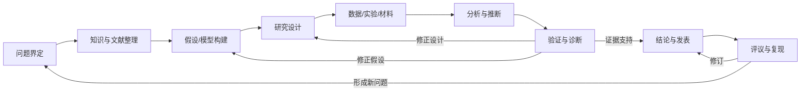
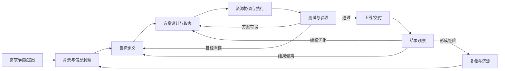
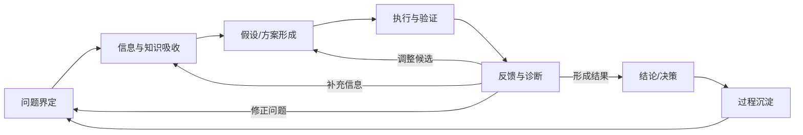
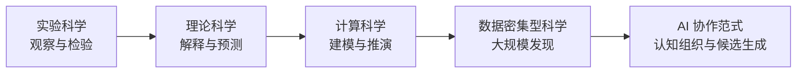
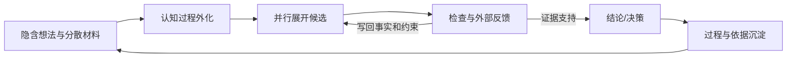
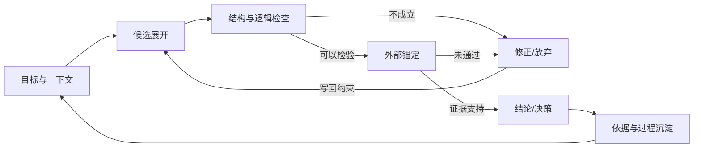

生成式 AI 正在降低信息整理、候选生成、代码实现和方案推演等认知劳动的成本，使原本依赖个人经验与时间投入的顺序推进的过程，转变为可以外化、并行和反复修正的人机协作过程。把这一变化放在实验、理论、计算与数据密集型科学的能力演进中看，可概括为第五范式，即 AI 协作范式。

<!--more-->

大语言模型的直接产物不自带真实性证明，生成结果只有接入来源、数据、工具和现实反馈等外部约束，才能在特定条件下获得可信度。在研究中，AI 生成的候选需要接受证据约束，逐步形成可信认识；在工作中，AI 带来的速度需要转化为更短的验证与反馈周期，在窗口期、资源和风险约束下推动结果落地。两类场景都要求人具备定向、编排、判断和沉淀能力。当生成不再稀缺，协作质量取决于能否建立更高密度的验证循环，同时守住证据、边界与终局责任。

## 传统问题求解的路径

这里所说的“传统”，是指生成式 AI 尚未进入问题界定、知识组织、候选提出与结果判断等认知环节的工作方式。在这种方式下，工具可以帮助人检索、计算、记录和执行，但这些环节仍主要依赖研究者或项目团队完成。

科学研究与工作项目追求的结果并不相同：前者希望形成经得起检验的认识，后者希望在现实约束下取得可验证的结果。但如果暂时放下场景差异，二者都从信息不完整、路径不确定的状态出发，逐步完成问题界定、信息吸收、候选形成、验证与修正。

### 科学研究的路线

科学研究通常始于某种尚未得到充分解释的现象。研究者先从宽泛的现象或问题出发，逐步明确研究对象、核心概念和问题边界；再通过检索和阅读文献，理解相关理论、方法、事实与争议。在此基础上，研究者会明确研究命题、提出假设并构建模型，选择与问题相匹配的检验方式，通过观察或实验取得证据，通过数据或材料分析比较不同解释，或者通过形式证明检验理论命题。最后综合这些证据或论证得出结论，并说明结论的成立条件与适用范围。

研究结论只是当前证据条件下的阶段性结论。一旦得到新的数据，已有判断往往会随之改变，反例可能削弱原有假设，复现失败有时会暴露研究设计或分析方法的问题。研究者需要根据这些新证据，重新检查问题、假设、方法和证据，必要时修改结论或启动下一轮研究。因此，科学研究并非以结论或发表为终点，而应该在持续检验和修正中逐步形成更可靠的认识。

这条路线能在持续检验中推进认识，但每一轮循环都需要较高的认知与执行成本。限制主要体现在：

- **知识吸收依赖长期积累**：检索只能找到材料；材料是否相关、主张能否迁移、证据是否冲突，仍要靠大量阅读，并依赖已有的领域知识来判断。相关研究分散在不同学科和主题中，并且持续更新，单个研究者很难及时识别所有可能影响当前问题的理论、证据与方法；
- **问题与方法受已有视野约束**：研究者提出的问题和采用的方法，往往受到自身知识背景与研究经历的影响；分散在其他学科和研究传统中的理论与方法，也可能因此被忽略或较晚才被注意到；
- **假设空间难以充分展开**：形成一条可讨论、可检验的假设需要阅读、推演和表述成本。资源有限时，研究者往往只能优先推进少数方向，也更容易受到早期判断和已有框架的路径依赖；
- **研究设计依赖显性规则与隐性经验**：变量如何选择、应当控制什么条件、容忍多大误差、如何在严格性与可行性之间取舍，既需要方法知识，也依赖长期积累的领域判断；
- **验证、复现与修正成本高**：数据收集、实验执行、代码复现和反例检查都需要时间与资源。问题发现得越晚，返回假设或设计层修改的代价通常越高；
- **过程知识不容易完整保留**：文献为何纳入或排除、某条假设为何放弃、参数为何这样设置，这些对后续研究很有价值的判断，往往散落在笔记、代码和个人记忆中，难以完整汇入最终成果。

这些限制共同决定了一项研究能够同时考察多少路径、在正式投入前能够排除多少错误，以及在有限时间内能够完成多少轮有证据约束的修正。传统科研的稀缺资源不只有信息，还包括把信息组织成问题、假设和研究设计的 **认知能力**。

### 工作项目的交付流程

工作项目面对的是另一类目标：在有限的时间、资源、技术和组织边界内，推动产品、运营或业务结果落地。项目可能源于外部变化，也可能出自组织判断，但很少就能够直接定义一个完整的问题。更多时候，问题、诉求与解决方案混在一起，团队接到的往往是“开发一个功能”、“开展一次活动”或“优化一个指标”的任务或需求。

工作项目通常先通过用户反馈、业务数据、市场信息和团队经验理解背景，进而定义目标、形成方案并评估投入。方案确定后，再经过资源协调、排期、开发或执行、测试验收和上线发布，最后根据结果数据判断效果。但项目并非到此为止：测试可能暴露目标或方案问题，上线结果可能否定原有判断，复盘所得经验也会影响下一次问题识别。

敏捷开发、MVP、A/B 测试、灰度发布和精益实验等方法已经在缩短反馈周期。但一轮“提出问题—形成方案—交付上线—获得反馈”仍可能跨越较长的协作链条。迭代周期一旦超过市场和用户变化的速度，项目就可能在获得充分反馈之前，耗尽最有价值的试错机会。

这套流程能在迭代中完善方案，但每一轮都要经过需求澄清、方案设计、资源协调、开发联调、测试与发布等相互依赖的环节，等待与返工成本都不低。限制主要体现在：

- **表层任务可能遮蔽真实问题**：工作通常以需求或任务的形式进入流程，但任务描述的往往只是“要做什么”，未必说明“为什么要做”以及“希望改变什么结果”。如果团队没有继续追溯任务背后的用户或业务问题，就可能准确完成一项交付，却没有改善真正需要改变的结果；
- **信息分散且性质不同**：用户反馈、行为数据、商业目标、系统状态和市场信号分别描述问题的一部分。它们可能相互冲突，也可能存在样本、口径和时间上的偏差，需要团队结合具体情境进行判断；
- **方案空间受经验和时间限制**：形成可执行方案不仅要有想法，还要补齐成本、收益、依赖、风险和验证方式。团队通常只能深入评估少数方案；某个方案一旦率先进入评审和排期，后续工作便容易转向细化与执行，其他可能的路径则较少得到充分比较；
- **跨角色协同容易产生信息差**：产品、研发、设计、测试、运营和数据等角色分别掌握不同的信息。信息同步不及时或不充分时，各方对问题、目标和取舍依据的理解容易出现偏差，进而造成重复沟通、返工或执行结果偏离预期；
- **前后依赖限制迭代频率**：即使项目采用敏捷开发或分阶段交付，需求澄清、方案评审、资源排期、开发联调和测试上线仍可能存在前后依赖。任何一环等待或返工，都会延长获得真实反馈的时间；项目周期越长，原有问题、用户需求和外部环境发生变化的概率越高；
- **交付节奏跟不上环境变化**：互联网项目处在用户需求、市场热点、运营节奏和竞争格局持续变动的环境中。功能最终完成，不代表仍具有最初预期的价值；如果迭代周期长于外部环境变化的速度，执行质量再高也难以挽回时机成本；
- **验证往往发生得较晚**：测试可以确认交付是否符合设计，却未必能证明设计解决了用户和业务问题。许多关键反馈只有进入真实环境后才会出现，此时资源与排期可能已经重新锁定，修正成本也随之升高；
- **项目结果容易留下，判断过程难以复用**：最终文档、代码和指标通常会被保存，但为什么选择某个方案、哪些前提曾被否定、什么反馈改变了判断，往往散落在会议和聊天记录中。

这些限制共同决定了一个项目能够同时评估多少方案、在投入资源前能够排除多少错误判断，以及在窗口期内能够完成多少轮有真实反馈的迭代。工作项目的稀缺资源不只有时间和人力，还包括把分散的用户、业务和市场信息整合成明确问题与可比较方案的 **判断能力**。

### 两条路径的共同结构

科学研究与工作项目分别面向可信认识和可验证结果，评价标准有所不同，但它们共享一条基本的问题求解循环：

| 维度 | 科学研究 | 工作项目 |
|:----:|:--------:|:--------:|
| 起点 | 现象、矛盾或研究问题 | 用户问题、业务目标或现实需求 |
| 候选 | 假设、模型、解释与方法 | 目标、方案、策略与执行路径 |
| 外部检验 | 文献、数据、实验、证明与复现 | 用户反馈、业务指标、系统状态与资源约束 |
| 结果 | 有边界、可辩护的知识主张 | 可执行、可验收的决策与交付结果 |

在生成式 AI 广泛应用之前，候选生产昂贵、验证资源有限，顺序推进、较早定下方向，是合理的取舍。传统路径的核心瓶颈在于每轮推进都高度依赖人的知识范围、经验判断、沟通能力和时间投入。能够完成多少轮高质量循环，以及每轮能够覆盖多少可能性，始终受到严格限制。

这一瓶颈可以归结为 **认知生产与反馈修正的成本**。人需要界定问题、组织分散信息、提出并补全候选路径，还要解释验证结果，并由此修正下一轮的问题、假设或方案。搜索、统计、开发和协作工具已经提高了局部效率，却没有一种工具能把贯穿全程的认知环节打通、串联起来，这条链路始终要靠人自己接续。

## 问题求解方式的演进

人类求解问题的方式从来不是静止的。每当研究对象、观测手段、知识规模或计算能力发生变化，人不仅获得新的工具，也会重新组织问题如何被提出、证据如何被取得、解释如何被建立，以及结论如何被检验。这种变化在科研和工作两条线上都在发生，并遵循同一个模式：新能力被叠进既有问题求解循环，缓解一部分约束，把主要瓶颈推向新的位置。

Jim Gray 曾将科学研究概括为四种范式：实验科学、理论科学、计算科学和数据密集型科学。这一划分适合用来理解不同能力如何进入研究过程，但不应被当作严格的科学史分期。观察与理论从来相互依赖，计算和数据也没有形成彼此隔离的时代。所谓范式演进，不是后一种方法废除前一种方法，而是新的能力被叠加到原有研究循环中。

### 四种既有范式

#### 第一范式：实验科学

实验科学以观察、测量和可重复检验为核心。研究者通过接触自然现象、控制条件、记录结果和重复实验，将关于世界的判断从个人经验、直觉和权威解释，转向能够被不同研究者验证的外部证据。

一项主张不再只因符合常识或出自权威而成立，而要面对可被他人重复的观察与测量。实验设计、仪器与记录方式，使事实获得更稳定的公共基础，也使错误有机会在不同条件、不同观察者那里被暴露。

但事实不会自动形成解释。随着观察和实验不断积累，研究者面对的不只是“有没有证据”，还包括不同事实如何关联、哪些现象具有共同机制，以及怎样从有限观察推断尚未发生的结果。实验可以说明在特定条件下发生了什么，却未必独立回答为什么发生，也很难仅凭事实堆积形成可以迁移的认识。

实验科学缓解了事实缺少外部检验的问题；随着观察结果不断积累，新的瓶颈也随之出现：**不断增长的观察结果需要被组织成解释与预测**。

#### 第二范式：理论科学

理论科学以概念、逻辑、数学和模型为核心。它将分散现象压缩为具有内在关系的解释结构，使研究者能够从已知事实推导新的结果，说明不同现象为什么共同出现，并在观察发生前提出可以接受检验的预测。

理论不只归纳已有事实，还会提出未必能直接看见的结构与机制，用它们说明现象为何共同出现，并在观察发生前给出可检验的预期。研究因此不再止于记录世界，而开始建立可推演、可比较、也可被反驳的解释体系。

理论与实验形成相互校正的关系。理论提出需要检验的预期，实验提供修正理论的证据；没有理论，事实容易彼此孤立，没有实验，理论也可能停留在内部自洽。二者共同构成科学研究最基本的反馈关系。

理论方法同样受到能力边界约束。面对变量众多、关系非线性、尺度跨度大或动态过程复杂的系统，即使基本规律已经明确，研究者也可能无法依靠手工推导得到可用结果。气候、流体、生命系统、材料、宇宙和社会网络等对象，都可能包含远超人工推演能力的计算规模。

理论科学缓解了事实彼此孤立、难以形成统一解释的问题；当模型所需推演超出人力所能完成的范围时，随之而来的限制是：**许多理论上可以表达的问题，无法仅靠人力完成复杂推演**。

#### 第三范式：计算科学

计算科学将数学模型、数值方法、算法和计算机带入研究过程。研究者可以把理论关系转化为可执行的计算，在虚拟环境中模拟系统演化、调整参数、比较情景，并研究现实中成本过高、风险过大或难以直接操控的问题。

数值方法把过去只能在高度简化条件下处理的模型逼近到可用精度；模拟则让研究者反复运行现实中成本过高或风险过大的实验。大量重复推演由此交给机器，理论获得了新的执行空间，观察结果也可以借助可运行模型得到进一步对照。

计算科学没有取代理论和实验。模型的结构来自理论，参数来自数据，结果仍要接受观察和实验的检查。计算能够扩大可处理问题的规模，却不能仅凭运行成功证明模型正确；仿真越复杂，模型假设、参数来源、数值误差和结果解释越需要审查。

与此同时，计算设备、实验仪器、传感器、望远镜、基因测序和互联网系统开始持续产生大规模数据。研究者逐渐从数据不足走向数据过载：数据量超过人工阅读和传统处理方式，许多有价值的结构无法通过预先指定的少数分析被看见。

复杂推演一旦可以交给机器执行，主要困难便不再停在计算本身，而转向：**如何从持续增长的数据中发现值得解释的模式和问题**。

#### 第四范式：数据密集型科学

数据密集型科学以大规模数据的采集、存储、处理、连接和模式发现为基础。研究者不仅可以从明确假设出发寻找证据，也可以先在海量数据中识别相关性、异常、结构和群体差异，再据此形成新的问题和假设。

统计计算、机器学习与分布式系统，使个体无法通读的数据仍可被检索与比较。研究入口因此不只来自少量观察和预设模型，也可以来自数据中尚未被解释的相关、异常与结构差异。

数据密集型研究并不意味着数据能够取代理论。数据的采集方式、测量口径、缺失机制和样本偏差会决定可以看到什么；一个稳定模式也不自动等于因果关系或可迁移规律。数据可以提出线索、检验假设和约束模型，但其意义仍要通过问题、理论、方法和现实条件来解释。

当数据、论文、模型、代码和分析工具同时快速增长后，新的困难逐渐从某个单点环节扩展到整个认知过程。研究者可能拥有远超以往的材料和计算能力，却难以在有限时间内完成以下工作：掌握相关文献，比较彼此冲突的证据，发现可以迁移的方法，提出足够多的竞争性假设，为不同方向设计验证路径，并把分散反馈持续写回研究过程。

模式发现的入口已经打开，困难却升到更高一层：**材料、方法、模型和工具越来越多，真正稀缺的仍是把它们组织成判断的认知能力**。

### 工作项目的平行演进

工作项目没有像科研那样被概括成几种范式，但同样经历了能力叠加、瓶颈转移的过程。

最早的工作几乎完全依赖个人经验与手工操作：老师傅凭记忆和手感判断，知识靠口耳相传，能处理的问题范围受限于个人的时间和经验。机械化、表格和流水线把一部分体力与记录工作交给机器和流程，局部效率提高，但环节之间的衔接、信息流转和异常处理仍要靠人串起来，瓶颈从“做不快”移向“组织不快”。

办公自动化、ERP、CRM 和 BI 等系统进一步把信息流通和数据处理交给软件：库存、订单、客户和指标可以被实时记录和查询，决策开始有了数据支撑。但每个系统只管一段，跨系统的口径对齐、跨角色的信息同步、从数据到判断的转化，仍要人来做，瓶颈从“信息不全”移向“把分散信息组织成判断”。

互联网时代的 A/B 测试、灰度发布和精益实验又把验证环节缩短：方案不必一次定死，可以先小范围试、再看数据调整。每一层都让某个局部更准更快，却没有一层把贯穿全程的认知链路打通——问题界定、信息组织、候选生成、结果解释和反馈修正，仍要人自己接续。这正回到上一章结尾留下的缺口。

### 第五范式：AI 协作范式

AI 最初也可以被看作数据密集型科学中的一种分析工具：它从大规模数据中学习模式，用于分类、预测、识别和优化（即机器统计学习）。但大语言模型与智能代理的发展，使 AI 开始越过单一分析环节，进入问题求解的更长链条。它可以参与问题表达、文献整理、知识压缩、假设生成、方案比较、代码实现、结果解释、验证辅助和过程记录，并根据反馈继续修改输出。

这种变化同时包含模型性能与交互方式的进步，AI 开始能够以更通用、低门槛的方式持续承担部分认知劳动。传统工具通常要求人先明确任务、方法和操作步骤，再执行某个局部功能；AI 则可以在目标尚未完全明确时参与澄清问题，在缺少既定路径时提出多个候选，并围绕同一目标连续完成整理、生成、比较和修正。它开始从单点工具变成问题求解过程中的协作层。

这种正在形成的方式称为 **第五范式**，也称为 **AI 协作范式**。关键在于，AI 贯通的是科研与工作共享的那条认知链路，即问题界定、信息组织、候选生成、结果解释与反馈修正。第五范式扩展的是人类 **组织认知过程与生成候选路径的能力**，它可以帮助研究者和知识工作者在更短时间内吸收更多材料，把隐约想法外化为可检查的表达，同时展开多个假设、方法和方案，并在反馈到来后快速形成新的版本。过去受个人时间和知识范围限制的候选生产，开始能够被外化到人机协作过程中持续展开。

但这并不意味着 AI 已经取代人的认识活动，也不等于模型生成的内容天然可靠。候选可以更快出现，却不会因为生成得快或数量众多而自动成立；知识、代码、分析和方案能否被采用，仍然需要文献、数据、实验、证明、测试和现实反馈加以约束。AI 缓解的是认知生产的部分成本，随之凸显的则是验证、判断、边界与责任。

第五范式保留了既有科学原则，同时改变研究分工和循环节奏：AI 提供探索广度、生成速度和候选空间；实验、理论、计算与数据继续提供观察、解释、执行和检验能力；人负责确定问题是否值得、证据是否充分、结论能够成立到什么范围，以及最终后果由谁承担。

### 能力叠加与瓶颈转移

上述每一种范式都把新能力叠加到既有研究循环，而不是取代前一层；旧的局限一旦被打破，新瓶颈又随之而来：

| 范式 | 扩展的主要能力 | 缓解的主要约束 | 进一步暴露的瓶颈 |
|:----:|:--------------:|:--------------:|:----------------:|
| 实验科学 | 观察、测量与检验 | 判断缺少外部证据 | 事实需要被组织和解释 |
| 理论科学 | 抽象、解释与预测 | 事实彼此孤立 | 复杂系统难以手工推演 |
| 计算科学 | 建模、仿真与运算 | 人工计算能力不足 | 海量数据难以有效处理 |
| 数据密集型科学 | 大规模分析与发现 | 人工处理数据能力不足 | 知识、方法和工具难以组织 |
| AI 协作范式 | 认知组织与候选生成 | 路径探索和认知生产昂贵 | 验证、判断、边界与责任成为主要约束 |

研究重心逐层转移：后一层着手处理前一层暴露出的瓶颈，并把能力边界推得更远。

进入第五范式之后，一项可靠研究仍可能同时依赖实验事实、理论结构、计算执行和数据证据；AI 的作用是把这些能力更快地调入同一问题求解循环，并帮助人展开、比较和修正原本难以同时处理的候选路径。

在科学研究与复杂工作中，主要瓶颈从生成转向验证与判断。当候选假设、代码草稿、分析框架和方案变体可以被快速生产，“能否生成”不再是唯一限制，“生成的内容能否进入证据链和决策链”变得更加重要。

## 认知生产与问题求解的新形态

第五范式进入日常研究与工作，最直接的表现是文字、代码、图表和方案生成得更快。但速度只是表层结果，更深的变化在于，一部分原本依赖人在头脑中完成、难以同时展开的认知过程，开始能够被表达、保存、比较和反复修改。问题求解因此不再只围绕最终成品组织，也开始围绕一条持续变化的候选流组织。

这里的“认知生产”并不只指生产知识。科研中的假设、解释和研究设计，工作中的问题定义、分析框架和业务方案，都属于尚待判断的认知产物。它们可能最终成为知识或决策，也可能在验证中被否定。AI 所改写的，正是这些中间产物的形成与流动。

### 从单点工具到认知协作

传统数字工具通常承担边界清楚的局部任务：搜索引擎帮助找到材料，数据库保存和查询数据，统计软件执行指定分析，开发工具把明确逻辑转化为程序，项目管理系统记录任务与进度。这些工具提高了局部环节的效率，却不负责组织整条问题求解过程。人需要先确定问题、选择方法、组织材料和设计步骤，再调用相应工具完成某个环节。

而 AI 能够通过通用交互方式参与比传统工具更长的问题求解链条。一个尚未完全明确的问题可以先被描述给 AI，再通过追问逐步补充对象、目标和约束；一组分散材料由此被整理为概念、主张和冲突，初步方向继续展开为多个假设、方法或方案。获得新反馈后，原有候选还可以被重新组织和修改。

AI 不只是加快某个固定动作，更开始连接原本需要人手动衔接的多个认知环节。它可以与搜索、数据库、代码执行、统计分析和文档系统结合，在同一个目标下连续参与吸收信息、生成候选、执行试探和整理反馈。工具仍然提供具体能力，AI 则逐渐承担在这些能力之间组织上下文和中间产物的协作作用。

但是这种协作不意味着问题求解会自动发生。目标是否清楚、材料是否可靠、步骤怎样安排、结果如何验收，仍需要有人组织。变化在于，许多过去只能在个体思考、会议讨论和反复手工整理中推进的过程，现在有机会被转化为可观察、可操作的协作对象。

### 外化、并行与高频反馈

#### 认知过程的外化

在传统问题求解中，大量认知活动停留在人的头脑和零散交流里。为什么认为某个方向值得继续、为什么排除另一种解释、某项分析还依赖哪些前提，这些内容往往只有在形成正式文档时才被部分写出。将一个想法整理成结构完整、可以被他人检查的表述时，本身就需要较高成本，因此许多中间判断来不及外化便被放弃或遗忘。

AI 降低了从模糊想法到可检查表达的转换成本。研究者可以把尚未成熟的研究兴趣展开为问题清单、概念关系和候选假设；工作团队可以把零散需求、用户反馈和业务限制整理为问题陈述、方案框架和验收条件；分析者可以把一条解释思路转化为查询逻辑、分析步骤和图表草稿。原本隐含的对象、前提和关系由此更早进入可讨论状态。

外化让思路获得可以被检查和修正的形态，其价值远高于单纯增加文字。一种想法只有被表达出来，才容易与其他解释比较，才可能暴露概念混淆、前提缺失和证据断点，也才有机会在团队之间传递。AI 生成的初稿可以作为认知过程的中间表示，让人更早看见自己究竟提出了什么。

外化也使过程记录获得新的可能。候选如何变化、哪些条件被补充、某条路径为何被否定，不必只依赖事后回忆。不过，保存对话和版本并不等于形成了可复用知识。只有来源、约束、取舍理由和验证结果被有意识地提取出来，外化才会从大量痕迹转化为可以继续使用的过程资产。

#### 候选路径的并行化

当形成一条完整候选的成本很高时，研究和项目都会倾向于尽早定下方向。研究者通常只能重点推进少数假设，团队也很难同时把多个方案补充到可比较的程度。第一条看起来合理的解释或可执行的方案，容易占据后续资源和注意力；其他路径未必更差，只是没有足够成本被展开。

AI 可以在同一问题下快速提出多个候选，并帮助补齐它们各自的前提、可能证据、实施条件和风险。在研究中，相互竞争的解释、不同理论路径和多种研究设计得以同时展开；在工作中，功能开发、流程优化、运营调整、低成本试验乃至暂不行动等选择也能进入同一比较框架。过去难以被完整表达的替代路径，可以更早接受取舍。

并行化的价值已经超出了“多想几个点子”。有效的候选空间应当包含能够被区分的路径：它们依赖不同前提，对结果作出不同预测，需要不同证据，或者在成本、收益和风险上形成真实取舍。如果多个候选只是相同思路的措辞变化，数量增长不会带来新的认识，反而可能增加筛选负担，使人被大量结构完整但差异有限的版本淹没。因此，并行展开应当与比较标准相连：哪些候选值得进入下一步，什么证据能够区分它们，验证成本是否合理，失败后能够获得多少信息。AI 扩大可见空间，人仍需决定有限的验证资源投向何处。

#### 反馈循环的高频化

外化使候选可以被检查，并行化使多条路径可以被比较；当新的材料、数据或现实反馈到来后，AI 还可以迅速把修正要求写回候选，形成下一轮版本。问题求解由此有机会从少数长周期尝试，转向更高频的生成、检查、验证与修正。

高频反馈要求新证据和约束持续进入上下文。若上一轮的失败原因没有被说明，只要求 AI “再写一版”或“换一个方案”，得到的仍可能是同一分布中的重复抽样。版本数量增加了，问题空间却没有缩小，认知也没有前进。

有效迭代需要每一轮都接收能够改变下一轮的反馈。它可能来自原始文献与研究数据，也可能来自代码执行、测试结果、用户反应、业务指标和系统状态；还可能是人对概念、逻辑、成本或风险作出的否定判断。关键在于把这些反馈转化为新的事实、约束和排除条件，使下一轮候选建立在比上一轮更窄、更明确的空间上。

AI 在这里提高的是修正过程的响应速度，并不直接提高结论成立的概率。过去一次反馈可能需要重新阅读材料、改写代码、重组文档和协调多人沟通；现在部分修改可以更快完成，使同样时间内进行更多轮试探成为可能。

### 从生产成品到管理候选流

传统认知生产通常围绕最终成品组织：科研关注论文、模型和正式结论，工作关注报告、方案、功能和上线结果。由于形成完整版本的成本较高，人们往往先集中资源打磨少数路径，再在相对靠后的阶段进行评议、测试或结果观察。

AI 降低生成成本后，问题求解的基本单位开始发生变化。完整、流畅的版本不再稀缺，管理重心转向从问题出发不断产生、接受检查、被否定或被修正的候选流。论文段落、代码草稿、数据解释和业务方案都只是候选的不同形态；完成度和外观本身不足以让它们进入知识或决策。

候选流中的内容需要经历不同状态：

| 状态 | 核心问题 | 可能的处理 |
|:----:|:--------:|:----------:|
| 生成 | 是否形成了值得讨论的候选 | 补充前提、去除重复、明确差异 |
| 检查 | 结构、逻辑和方法是否基本成立 | 查找矛盾、遗漏、不可检验之处 |
| 锚定 | 是否接入原文、数据、执行结果或现实反馈 | 核对来源、运行代码、开展试验或收集反馈 |
| 取舍 | 证据是否足以支持继续投入或正式采用 | 接受、修正、降级表述或放弃 |
| 沉淀 | 结果和取舍依据能否进入下一轮 | 保存来源、约束、失败原因和适用边界 |

这套变化并没有否定最终成果，反而提高了成果形成过程的要求。过去容易被最终文档遮蔽的失败路径、修改理由和证据边界，开始成为候选流中需要被管理的对象。最终结果说明“留下了什么”，候选流则说明“为什么留下它，又为什么放弃其他路径”。

### 稀缺从生成转向验证和判断

认知过程外化、候选路径并行、反馈修正更加频繁之后，认知生产的成本开始下降。研究者能够更快形成假设和分析草稿，工作团队能够更快展开方案和交付材料，个人也能调用过去难以独立完成的知识与技术能力，问题求解的覆盖范围和启动速度也得到进一步扩大和提升。

生产能力的扩张不会自动带来同等规模的可信结果。候选生成速度的提高，既不能改变原始文献的实际主张，也不会改善数据质量、代替实验执行或决定用户与市场的反应。生成内容迅速增加，能够用于严格验证的注意力、时间和现实资源却仍然有限。

生产与验证之间因此出现新的不对称。过去因为候选少，验证通常围绕少数成品展开；现在如果仍把验证集中在流程末端，大量未经锚定的中间产物就会持续堆积。它们可能表现得完整、专业且彼此一致，却没有获得与其外观相匹配的证据。生成越容易，把表达质量误当成认知质量的风险越高。

AI 时代的稀缺重心逐渐转向筛选与验证：哪些候选值得投入，选择什么方式验证，如何解释结果，以及证据不足时是否愿意停止。生成端提高的是可能性供给，验证和判断决定哪些可能性能够升格为知识、代码、分析结论或业务决策。

认知生产的变化可以概括为：外化降低了表述成本，并行化扩大了候选空间，高频反馈加快了修正；但验证能力没有随生成能力同步增长，瓶颈转向筛选与判断。
