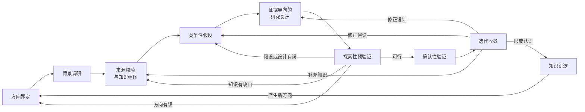
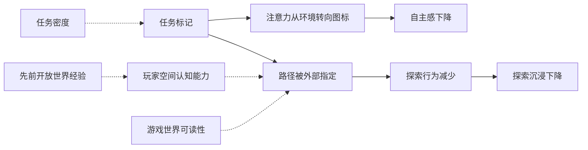
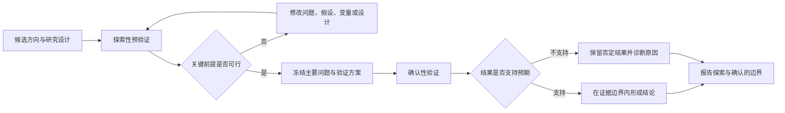

研究要求在证据约束下形成经得起检验的认识。AI 降低了文献调研、假设展开与方法比较的成本，使研究者能更早检验关键前提、更快修正下一轮研究。AI 生成的研究问题、机制解释与文献线索，在对照真实来源与原始数据之前，仍是待验证的候选。探索面广却未做来源核验，或者生成流畅却证据不实，同样不构成可信认识。

<!--more-->

这种方式重新安排了探索与收敛的节奏，AI 让研究者更早看到多条路径，人则守住问题价值、证据标准与验证要求。探索可以快速试探，结论仍须满足相应学科的检验。

## 协作流程与案例

本文给出的流程主要面向假设驱动、能借助数据或实验检验的研究，尤其适合实证、因果与数据密集型问题。数学与纯理论研究、质性研究、人文学科以及部分工程探索，未必能直接套用“探索—确认”的阶段划分；但仍可借鉴其中的问题分解、候选展开、来源管理、反例搜索与过程留痕，只是证据表现为形式证明、理论一致性、材料解释、案例比较或原型测试，流程须按研究对象与学科规范调整。

下面使用一个假想研究问题贯穿本文：

开放世界游戏里的任务标记，是否降低了玩家的自主感和探索沉浸？
{:.info}

这个问题用于展示流程，不代表本文已经核验相关领域文献、获得真实数据或形成研究结论。案例中的机制、变量和方法都属于待检验候选，需要在实际研究中重新确认。

完整流程可以组织为九个相互联系的阶段：





流程关注四个问题：候选怎样产生、依据来自哪里、什么能够区分候选、结果如何改变下一轮。不同学科的证据形态与步骤交叉方式各异，但四点记录要求通用。

## 方向、背景与知识建图

### 方向界定

研究可以从一个尚不完整的方向开始，但这个方向应有现实或理论来源，不能只是听起来新颖。方向界定需要回答：观察到了什么现象，研究对象是谁，问题发生在什么条件下，为什么值得研究，哪些还只是推测。

在本案例中，最初的方向可能来自一种观察：同一款开放世界游戏，关闭标记的玩家似乎更愿意偏离主路、自行探索；而开启标记的玩家则更倾向于沿图标直奔目标。这时候，“任务标记削弱了自主感”只是待澄清的方向，距定义充分的研究问题与结论尚远。

研究者至少需要暂时界定几个基本维度：

- “任务标记”指地图目标点、路径指引线、任务追踪列表，还是全部；处理取“有无”还是“标记程度”；
- “自主感”与“探索沉浸”是一个构念还是两个：前者出自自我决定理论，后者更偏空间体验，可能相关但并不相同；
- 研究对象是新手还是老手，是招募的测试志愿者还是全体活跃玩家；
- 游戏阶段聚焦新手期、探索期，还是覆盖全程；
- 研究目标是描述相关性、识别机制，还是估计标记对自主感的因果效应。

在界定方向阶段，AI 可以帮助列出追问、识别概念歧义、提出初步边界，但模型呈现的创新性不等于方向的研究价值。研究者仍要结合现实观察、专业知识、已有争议与可获得证据，判断问题是否值得进入下一阶段。

这一阶段需要形成一份可修改的方向说明，包含研究什么、为什么研究、如何暂时定义，以及最关键的未知，而暂不追求完整研究方案。

### 背景调研

方向初步明确后，AI 可以帮助研究者快速打开问题周围的知识与方法空间。它可以扩展检索词，发现同一现象在不同学科中的表述，整理可能机制、数据来源与研究方法，并提醒研究者哪些相邻问题可能影响当前判断。

围绕案例，背景调研可能涉及：

- 自我决定理论中的自主感作为基本心理需要；
- 开放世界设计中对“跟着点走”、waypoint fatigue 和 GPS 式游玩的批评；
- 寻路与空间认知研究中的环境可读性、wayfinding 与探索行为；
- 玩家体验测量中的 Player Experience of Need Satisfaction（PENS）自主子量表与沉浸量表；
- 相邻领域里现实 GPS 对空间认知影响的研究，可作为机制参考；
- 实验设计与因果推断中的随机分派、操纵检验和选择效应处理方法。

AI 可扩大检索范围，帮助研究者看到“任务标记—注意力—自主感”之间的多条潜在关系；它还可以生成关键词组合、代表性理论名称与量表清单，使研究者更快判断哪些领域需要深入。

但模型生成的文献信息只能作为检索线索，研究者应进入真实文献系统确认来源是否存在、原文证据是否支持模型概括。背景调研追求覆盖面，不承担结论成立的责任。

这一阶段也有助于尽早停止或调整不可行的方向。如果检索发现该问题已被充分回答、核心概念无法操作化，或关键数据不可获得，停止或调整可避免把资源投入缺少研究价值或可行性的路径。

### 来源核验与知识建图

背景调研带来大量材料，但材料堆积不等于形成知识。研究者需要把文献、事实、理论、方法与争议组织为可追溯的结构，明确当前有哪些主张、每项主张由什么证据支持、证据适用于什么条件，以及不同主张之间是什么关系。

案例中的核心叙述可以拆成下面这一条待验证的证据链：





证据链中的关系需要分别核验，尚不构成成立的因果模型。任务标记把注意力从环境拉向图标，不等于已经证明自主感下降；路径被外部指定也不自动说明探索沉浸受损。玩家空间认知能力、世界可读性与任务密度还可能同时影响标记的依赖程度与自主感，形成混杂。

知识地图中的每个节点都应当连接到真实来源，并尽量记录，例如：

- 原始主张是什么，而不是模型怎样概括；
- 研究采用了什么对象、样本、变量和方法；
- 证据支持相关、机制还是因果结论；
- 结果适用于哪些地区、人群和时间条件；
- 是否存在相反发现、未解决争议和方法限制；
- 当前研究准备怎样使用这项证据。

从文献中提取候选主张、聚类主题、比较研究设计与发现表面冲突，都可由 AI 辅助完成。知识地图用于暴露尚未接通的证据环节，复杂本身并不构成价值。

## 竞争性假设与研究设计

### 竞争性假设

知识地图形成后，研究者不应立即把最符合直觉的解释当作唯一主线。AI 的候选生成能力更适合用于展开一组可被证据区分的竞争性假设，再由研究者删除概念重复、逻辑不成立、无法检验或缺少价值的方向。

本案例可以形成至少以下几类候选：



| 候选假设 | 关键机制 | 可以观察的差异 | 主要替代解释 |
|:--------:|:--------:|:--------------:|:--------------:|
| 注意力转移 | 图标把注意力从环境拉走 | 即使标记不指路，只要图标在视野就有效应 | 效应可能来自路径指定而非注意力本身 |
| 路径指定 | 标记指定了“正确路径” | 无标记组在岔路口停留更久、回头更多 | 停留差异可能来自空间能力而非自主感 |
| 能力暴露 | 无标记时玩家发现自己能导航 | 无标记组自主感随时间上升 | 上升可能来自熟悉度而非能力感知 |
| 挫败反转 | 无标记时部分玩家迷路挫败 | 效应方向因玩家空间能力而异 | 分组结果可能来自样本不足或多重比较 |
| 选择效应 | 喜欢自主探索的人本就关标记 | 关标记是自选行为，样本不再可比 | 若默认设置分派则选择效应被切断 |
| 任务密度代理 | 标记只是任务密度的代理 | 控制任务密度后效应减弱 | 仍可能存在标记与密度不可分离的部分 |



一份假设清单只有在能指导验证时才有价值。每项假设需要进一步说明依赖什么前提、预测什么结果、什么证据会削弱它，以及验证成本有多高。多个假设之间还应形成真实竞争，同一结果可能支持哪些解释，什么额外证据能把它们区分开。

借助 AI，研究者可以更快提出反例、转换视角与补充遗漏机制。人需要识别哪些假设只是同义改写，哪些包含可观察差异，哪些即使成立也缺少研究价值。最终进入研究设计的，应是一组有限、明确且可被证据约束的候选。

### 证据导向的研究设计

研究设计不应从“AI 能生成什么分析”或“手上有什么模型”出发，而应从“什么证据能区分当前假设”出发。研究目标不同，所需设计也不同：描述标记与自主感的相关性，不能直接回答标记是否造成自主感下降；识别机制、估计因果效应与理解个体体验，也需要不同材料与方法。

案例可能需要组合多种证据：

- 招募玩家参与测试，随机分派到标记开与标记关两组，游玩固定时长；
- 主结局为自主感，游玩后以 PENS 自主子量表测量；
- 次级指标为探索沉浸量表得分与探索行为（岔路口停留、回头率、地图查看频率），单独报告，不混入主结论；
- 关键混杂包括先前开放世界经验、空间认知能力、游戏时长与任务密度；
- 若游戏本身允许手动开关标记，分派不再随机，应以默认设置分派并禁用手动切换，以切断选择效应；
- 若想区分“注意力转移”与“路径指定”两种机制，可加第三组“标记在但路径线关”；
- 行为日志与访谈材料帮助理解玩家为何偏离或卡关。

研究者应根据问题选择随机实验、自然实验、观察比较或混合方法，避免默认某一种统计模型足以解决所有问题。若希望作因果解释，还需要明确处理选择偏差、混杂与操纵有效性的策略；若只能完成描述性研究，就应在问题和结论中保持相应边界。招募的玩家与全体玩家不同，结论首先成立在样本上，推广到全体玩家需额外论证，研究场景的这一边界应在方向定界中写清。

研究设计中的数据字典、方法比较、模拟与分析代码、变量检查与反例设计，都适合由 AI 提供辅助。模拟数据还可以用于检查预期模型是否可识别、代码流程是否能执行。但变量能否代表概念、数据能否合法使用、样本能否支持目标人群，以及设计允许得出多强的结论，都需要研究者判断。

涉及玩家行为记录、问卷作答与个人体验时，知情同意、隐私保护、数据匿名与伦理审查须在研究设计阶段处理，不能等到结果发布时补救；AI 参与数据处理亦须遵守相应机构、平台与法律要求。

## 探索性预验证与确认性验证

### 探索性预验证

研究设计形成后，不必立即投入全部资源。可以先用成本较低、信息增益较高的方式检查方向与设计中最脆弱的前提。这些工作包括确认文献是否真实支持关键机制、数据是否存在且能合法取得、变量质量是否足够、样本量能否满足分析、代码与数据管道能否运行，以及小规模材料是否暴露明显反例。

在案例中，预验证可以优先检查：

- PENS 自主子量表在该游戏情境下是否具有足够信度；
- 操纵检验是否成立，即玩家是否真的注意到标记开关；
- 无标记组能否继续推进游戏，而不因迷路出现大规模退出；
- 样本量估计所需的效应量从何处获得，是否有相近研究的可参考值；
- 行为日志中的岔路口停留、回头率等代理变量是否可稳定提取。

预验证用于判断这项研究怎样才可行。它可以促使研究者修改变量、缩小问题范围、放弃某条机制或重新设计数据收集，但其灵活性也意味着结果易受反复尝试与选择性保留的影响。

因此，探索性预验证与确认性验证必须被明确区分：





AI 加快了预验证中的代码修改、变量比较与结果整理，也放大了未记录尝试被事后包装成预设验证的风险。哪些分析属于探索、哪些假设由结果启发，须在进入确认阶段前说明。

### 确认性验证

当关键前提通过预验证，研究须进入标准更明确的确认阶段。研究者应在看到主要结果前，尽可能固定核心问题、主要假设、关键变量、样本规则、分析方法与判断标准。不同学科可以通过预登记、分析计划、实验方案、证明框架或其他方式保存这些约定。

确认性验证允许研究过程因数据错误、仪器故障与现实条件变化而调整，但修改需有明确理由、留下记录，并与原计划结果区分报告。AI 生成的新解释或新分析可以进入后续探索，但不能因其更符合当前数据而悄悄替换原来的确认目标。

在案例中，确认阶段需要特别检查：

- 主要结论是否建立在预先确定的自主感比较上，而非事后挑选的子群；
- 操纵检验、退出和缺失数据是否得到合适处理；
- 结果是否对合理的量表条目、样本范围和模型设定保持稳定；
- 多重比较、分组分析和异质性解释是否受到约束；
- 选择效应是否被默认设置分派有效切断，而非被忽视；
- 替代解释（如任务密度代理）是否仍能说明相同结果；
- 分析代码、问卷数据和关键输出是否可以复核；
- 结论表述是否超出研究设计能够支持的强度，是否把行为代理误当自主感本身。

在确认阶段，AI 适合辅助执行预定分析、生成测试、复查代码、比较结果与整理异常。代码要回到执行环境，统计结果要回到数据与方法，定性解释要回到材料，理论推导要回到可检查的论证。必要时可由独立研究者、不同方法或新数据复核。

确认性验证可以产生多种有效研究信息，包括不支持原假设、只支持部分机制或暴露测量不足。这些结果应当改变知识地图与后续问题，不应因不符合预期而被排除在研究叙述之外。

## 迭代收敛与知识沉淀

### 迭代收敛

研究迭代应当根据证据减少不确定性；反复要求 AI 生成新版本直到出现满意答案，无法实现这一目标。每一轮结果都应帮助研究者判断：问题是否值得继续，哪些事实已经相对稳定，哪些假设被削弱，哪些方法不适用，以及下一轮最有信息价值的行动是什么。

如果预验证发现量表在该情境下不可靠，应返回设计层更换或修订测量；如果确认结果无法区分“注意力转移”与“路径指定”两种机制，应补充第三组或更有区分力的证据；如果结果只适用于特定空间能力或任务密度的玩家，结论边界也应相应收缩。一个方向被否定、一个假设被排除或一种方法被证明不可行，都意味着研究空间得到有效收缩。

版本比较、假设追踪、正反证据整理以及基于新约束提出下一步候选，都可以由 AI 辅助完成。但迭代方向仍要由研究问题与外部结果决定。

收敛并不意味着获得永远不变的答案，而是形成当前证据能够支持的最清楚认识：哪些主张较为可靠，哪些只在特定条件下成立，哪些仍缺少区分性证据，以及什么新结果可能改变当前判断。

### 知识沉淀

一项研究最终留下的不应只有论文、报告或结论，还应包括它如何从初始方向逐步收敛的判断路径。在本案例中，需要保存的内容至少包括：

- 方向来源和问题定义的变化；
- 检索策略、原始来源和知识地图；
- 候选假设及其支持、反对和证伪条件；
- 游戏版本、标记设置、量表版本、数据、代码、提示与运行环境版本；
- 探索性尝试和确认性分析的边界；
- 被放弃的路径、失败原因和设计修改依据；
- 结论适用范围（针对哪类玩家、哪个阶段）、未解决问题和后续观察条件。

沉淀虽然位于流程末端，但是记录需要贯穿整个研究过程。若等到结论形成后再回忆哪些假设最初存在、为什么改变分析，最终文档很容易成为一条比真实过程更整齐的事后叙述。AI 可以帮助维护日志、整理版本差异与生成结构化记录，但记录是否完整、是否准确反映实际决策仍需研究者负责。

有价值的沉淀应让下一轮研究能够重新调用已经确认的事实、有效方法、失败原因与判断边界，仅原样保存所有对话与文件，达不到这一目的。一次未得到预期结果的研究，也可能留下可复用的数据处理方式、被证伪的假设与更准确的问题定义，从而提高后续研究的起点。

## 流程中的人机分工

九个阶段可以进一步压缩为三种相互配合的作用：AI 展开和组织候选，外部材料与工具提供证据，人负责方向、判断与责任。



| 阶段 | AI 的主要作用 | 人的主要责任 | 关键外部锚点 |
|:----:|:--------------:|:------------:|:--------------:|
| 方向界定 | 提出追问、发现歧义、补充视角 | 判断问题价值、对象与边界 | 现实观察、理论争议、实践需要 |
| 背景调研 | 扩展检索、概括领域、提出候选 | 选择深入方向、识别无效展开 | 文献系统、领域资料 |
| 知识建图 | 提取主张、聚类证据、发现冲突 | 核对来源、评价证据和适用条件 | 原始论文、数据与方法 |
| 竞争性假设 | 生成解释、反例和可观察预测 | 去重、筛选并建立真实竞争 | 理论逻辑与已有证据 |
| 研究设计 | 比较方法、模拟流程、辅助编码 | 判断可识别性、伦理和结论强度 | 数据条件、方法规范、伦理要求 |
| 预验证 | 执行试探、检查代码、整理异常 | 区分探索与确认、决定是否继续 | 小规模数据、执行结果、可行性反馈 |
| 确认性验证 | 执行预定分析、辅助复核 | 守住分析承诺、解释结果和结论边界 | 正式数据、实验、证明与独立复核 |
| 迭代收敛 | 比较版本、整理失败、提出下一步 | 决定反馈返回哪一层 | 否定结果、反例和新证据 |
| 知识沉淀 | 维护日志、整理版本和材料 | 保证可追溯、可复用和诚实披露 | 来源、代码、数据、决策记录 |



这套流程把原本昂贵且容易丢失的探索过程组织起来，更早展开竞争性路径，提前暴露脆弱前提，更清楚地区分探索与确认，并让每轮反馈缩小不确定性。它追求的远不止更快写出一篇研究报告。AI 提高研究循环的广度与速度，外部证据决定候选能否成立，人则守住研究价值、方法边界与终局责任。

正式学术研究须服从具体学科与机构的研究伦理、数据治理、署名规范、同行评议与复现要求。个人研究即使不进入正式发表体系，也应保持来源核验与结论边界。无论场景如何，可信认识都要求候选接受证据约束、研究过程能暴露错误，并清楚说明结论成立的范围。
