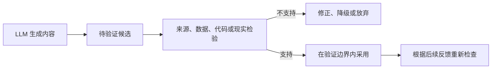
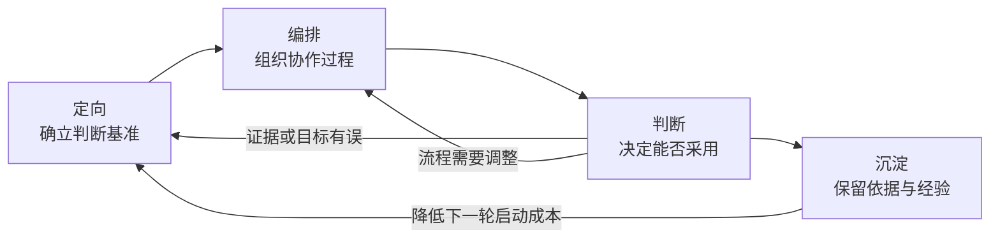
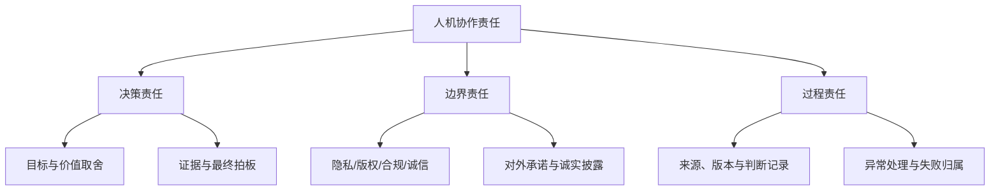

生成式 AI 可以快速写出事实陈述、研究假设、代码和业务方案，输出往往完整、连贯，并具有表面上的合理性。表述完整并不等于可以被采信，模型仅将内容组织为可供阅读的文本，并未为其提供可独立核实的根据。

<!--more-->

独立核实仅能支持相应范围内的采信，该范围取决于核实所覆盖的前提、材料与目的。同一段文字之内，已经核实的部分与尚未核实的部分并不具有同等地位。结果一经采用，其影响就不能再归于生成过程本身。目标如何确定，采用范围止于何处，以及失败之后的责任由谁承担，均须有明确归属。

## LLM 的生成机制与可信边界

LLM 可以生成事实陈述、研究假设、数据解释、代码和业务方案，其输出在形式上通常完整、连贯且具有合理性。但能够输出完整的内容，并不等于能够证明这些结果是正确的，生成过程本身不会为输出附带真实性证明。讨论 LLM 的可信边界，重点不在于判断模型有没有"真正的智能"，而在于确定生成结果在问题求解中应当处于什么位置，以及需要经过怎样的验证才能被采用。

### 生成不等于求真

当前主流 LLM 大多以 Transformer 为架构基础。模型根据已有上下文逐步生成后续内容，Attention 用于关联其中的信息，以保持主题、追踪条件并组织较长的回答。训练所强化的是生成内容在上下文中的合理性，而不是它与外部事实的相符程度。

因此，一段回答可以结构清楚、术语准确、论证连贯，却建立在错误事实、不完整材料或不成立的前提上。

### 模型输出为何难以直接信任

直接信任模型的输出之所以困难，是因为可信度无法从输出本身读出。依据是否可见、内部是否自洽、表达是否笃定，均不能保证结果正确。

模型所依据的知识存在边界，训练材料不可能覆盖所有事实，也可能包含错误、冲突、偏见和过时信息。遇到新近事实、狭窄领域、仅存在于特定组织内部的信息，或必须依据当前现场情况才能回答的问题时，模型仍可能根据相邻模式补全缺失部分。因此仅凭回答本身，使用者很难判断它是依据扎实材料得出的，还是在材料不足时生成的合理猜测。

即便转而考察回答是否自洽，仍不能保证结果正确。如果输入的数据、口径、前提或背景不完整，模型仍能在这些条件上构造自洽答案；如果回答前段出现错误数字、虚构来源或不成立的假设，后续内容也可能把它们作为既定事实继续展开。内部一致只能说明内容彼此连贯，不能证明起点符合现实。

表达方式同样不能作为判据，确定的语气可能只是常见回答风格，谨慎的措辞也不代表模型准确识别了不确定性。要求模型解释理由、自我检查或重新生成，可以发现部分问题，但这些结果仍由同一生成过程给出，不能视为独立证据。

因此生成内容可能正确，甚至非常有价值，但使用者很难仅凭结果本身去稳定区分“已经成立”、“大概率合理”和“只是看起来合理”。模型原始输出因而更适合作为待验证候选。

### 信任如何建立

待验证候选要转为可被采用的结果，就不能再向模型本身索取证明，而必须接入独立于生成过程的检验。这一步就是 **外部锚定**。不同产物接入的对象不同：事实概括要回到原始来源，数据分析要回到数据、口径和方法，代码要进入执行环境与测试流程，研究结论要接受实验、证明或材料检验，工作方案则要对照用户反馈、业务指标和系统状态。





搜索、数据库、代码环境和验证工具可以提高可靠性，但不能把模型直接从“不可信”变为“可信”。模型可能选择错误来源、生成错误查询、使用不合适的数据口径、设计覆盖不足的测试，或者误读工具返回的结果。因此，调用工具只是进入了验证过程，不等于完成验证。

信任也不是一次性给予整个模型，而是针对具体产物、验证条件和使用目的建立起来的。通过测试的代码，采用范围限于测试所覆盖的部分；概括与原文核对之后，其可采信的范围仍限于这些来源；可复现的数据分析，则只能在既定数据、口径和方法条件下成立。环境、数据或目标发生变化后，原有结果仍可能需要重新检查。

因此，“不直接信任 AI”并不意味着拒绝采用 AI 参与产生的结果。更准确的原则是：模型原始输出默认是候选，候选的可信度由后续证据和验证过程建立。即使通过验证，其可信范围也受验证条件限制。

总之，最终值得信任的不是某次流畅回答，而是由人、模型、数据、工具、验证步骤和现实反馈共同组成的协作系统。AI 可以承担检索、整理、生成、编码和计算等认知劳动，而目标确定、验证设计、结果解释、采用边界与最终责任仍需由明确的人或组织角色承担。

## 人机协作的能力结构与责任边界

协作系统要稳定运转，就要拆解它的内部结构：人、AI、数据、工具与组织流程分别承担什么作用，哪些结果能够进入下一环节，以及最终责任落在何处。

模型、工具和自动验证都会变化，人机之间的能力边界也会随之改变。同一任务换到不同环境，风险可以相差很大。因此，能力边界不宜只按模型眼下能做什么，而要看目标是否已经清楚、结果是否容易核实、错误是否可以挽回，以及这一结果是否会进入证据、决策或实际执行。

这里的“人”可以是多个承担不同职责的角色。角色与责任有明确归属，可靠性才能建立。

### 人机协作的基本分工

AI 的优势在于能够快速处理大量符号材料，反复执行明确任务，并以较低成本展开多个候选。接入工具之后，检索、计算和测试也可以纳入同一过程。

人更关键的作用集中在目标、取舍和责任上。现实问题很少只由文字本身定义，什么值得解决、什么结果算成功、什么风险可以承受、什么证据足以支持行动，都与具体环境、价值和影响有关。人需要为协作系统确立判断基准，判断外部反馈意味着什么，并决定结果是否能够进入下一步。



| 协作对象 | 主要作用 | 不能仅靠自身完成的部分 |
|:--------:|:--------:|:----------------------:|
| 人 | 目标定向、价值取舍、证据验收、边界控制、最终担责 | 难以独立覆盖海量信息与大量候选，也会受到经验和认知偏差限制 |
| AI | 信息压缩、候选生成、实现辅助、重复执行、过程整理 | 不能仅凭生成确定目标是否值得、证据是否充分和影响是否可承受 |
| 数据与工具 | 提供检索、计算、执行、测试和现实状态 | 不能自动保证问题、输入、口径和结果解释正确 |
| 组织与流程 | 配置权限、标准、角色、检查点及交由人处理的条件 | 需要持续根据能力、风险和反馈更新，不能依赖一次设计永久有效 |



上述分工流程贯穿协作全程。人在前端定义问题和验证标准，在中间安排步骤、工具和反馈，在后端进行验收与拍板；AI 也可以在多个环节接受反馈并继续工作。协作的关键，是让候选生产与证据约束在同一个循环中反复连接。

### 四层能力结构

要组织这套协作系统，人需要的不只是某款产品的操作技巧或一组固定提示词。模型和界面会变化，但只要 AI 仍以理解目标、处理信息、生成候选、调用工具和接受反馈的方式参与工作，四类底层能力就会持续存在，可以概括为 **定向、编排、判断与沉淀**。





四层能力首尾相接，构成不断回到起点的循环。各层核心任务不同，所要解决的系统问题也不相同。



| 能力层 | 核心任务 | 解决的系统问题 |
|:------:|:--------:|:--------------:|
| 定向 | 界定问题、表达目标、补充上下文、设定成功标准与边界 | 防止系统在错误或含混方向上高效运行 |
| 编排 | 拆解任务、安排顺序、选择模型和工具、设置检查点与反馈入口 | 把单次问答组织成可推进、可验证的过程 |
| 判断 | 核对来源、检查前提、寻找反例、解释结果、完成方案取舍 | 决定候选能否进入证据链、决策链或现实行动 |
| 沉淀 | 保存来源、版本、约束、失败路径、验证结果和取舍依据 | 让一次协作成为下一轮可以调用的经验 |



**定向** 决定系统朝哪里运行。目标不明确时，AI 往往还能生成结构完整的内容，这会使错误方向比以往更快形成完整文本。定向需要明确要解决什么、为什么值得解决、做到什么算有效、允许使用哪些材料，以及哪些边界不能突破。

**编排** 决定协作如何推进。复杂任务不能只依赖一次生成，还要明确候选的扩展与收敛，哪些结果需要检查，以及失败之后回到问题、材料还是方案。编排使反馈能够进入过程，也使错误在结果被最终采用之前得到处理。

**判断** 决定什么能够被采用。它要求区分事实、假设、解释和结论，检查证据是否支持相应强度的主张，并在多个候选之间权衡价值、成本和风险。AI 可以辅助寻找问题和反例，但证据是否足够、此刻应否行动，仍须依据实际影响作出决定。

**沉淀** 决定能力能否跨轮次积累。仅保存最终文档并不够，还需要留下为什么采用某项内容、为什么否定另一条路径、验证在什么条件下通过，以及哪些风险需要继续观察。能够重新进入下一轮的判断依据，才构成协作系统的记忆。

这四层能力构成相互连接的循环。定向为编排提供目标，编排为判断准备材料和检查点，判断产生的反馈会反过来修正定向与流程，沉淀则把已经确认的事实和经验带入下一轮。系统可靠性由此逐步形成。

### 按风险决定委托边界

一项任务能否交给 AI，需要综合考虑模型能力、错误是否容易发现、影响是否可逆、验收标准是否清晰，以及结果将进入什么环节。同一项能力在不同风险下可能对应不同的委托方式：生成内部讨论提纲与对外发布结论都涉及写作，但二者需要的验证和责任完全不同。

可以把任务分为三种委托方式：

- **可委托**：风险低、结果可逆、验收标准清楚，输出可以直接作为下一环节的中间输入；
- **须人审**：AI 可以完成主要准备或分析，但内容将进入证据链、决策链或正式交付，采用前必须核对来源、方法、约束与主张；
- **最终责任不可委托**：AI 可以准备材料、模拟选项和提示风险，但涉及目标价值、重大取舍、红线、对外承诺和后果归属的最终判断，必须由明确的人或组织角色承担。





按这一流程，任务可归入其中一种委托方式。研究与工作中的具体情形并不相同，但都可以对应这三种方式之一。



| 委托方式 | 研究中的例子 | 工作中的例子 |
|:----:|:------------:|:------------:|
| 可委托 | 检索词扩展、提纲草稿、代码脚手架、格式整理 | 会议材料整理、文案变体、测试用例草稿、常规代码补全 |
| 须人审 | 文献主张抽取、方法比较、分析代码、结果解释 | 数据分析解读、需求拆解、方案比较、上线说明 |
| 最终责任不可委托 | 选题价值、结论成立、署名与研究诚信决定 | 是否上线、对外承诺、合规红线、重大资源投入与失败归属 |



“最终责任不可委托”限制的是最终判断的归属，而不是 AI 可否参与形成判断的过程。模型可以帮助列出选项、检查遗漏、模拟反对意见和整理风险，但最终决定只能由人来做出。

上述三种委托方式并非固定不变。当测试覆盖提高、流程更加成熟、错误更容易回滚时，部分"须人审"任务可以转为自动执行和抽样验收；当任务进入高风险环境，原本低风险的操作也可能需要改为人工审核。模型能力、验证条件和现实影响共同决定委托边界。

人的主要作用是设计与风险相匹配的控制方式。低风险、标准明确的任务可以自动执行并抽样检查；能够由编译器、测试、规则或数据约束判断的结果，应优先建立机器验证；影响重大、难以形式化的情形，以及必须作出价值取舍之处，则需要人来判断。可靠系统应把人的注意力集中在机器难以稳定判断的部分。

人的监督不必体现为每一步都当场批准。目标、权限、验收标准，以及何种情况必须交由人处理，都可以预先规定。系统在边界内自行运转，遇到把握不足、工具异常、结果越界或环境变化时，再交由人来处理。边界如何设定、运行中如何监督，只能由人负责。

### 决策、边界与过程责任

协作系统中的人类责任可以归纳为三类：决策责任、边界责任和过程责任。三类责任不要求同一个人全部承担，但必须在团队或组织中找到明确归属。





**决策责任** 在于确定目标与价值，并在证据面前作出最终决定。AI 可以提出值得研究的问题，也可以给出可能有利的方案，但哪一个优先、投入多少、风险可否承受，只能由人取舍。模型可以整理证据、生成解释，证据是否足以支持结论、方案是否值得付诸实行，仍须由明确的人判断。

**边界责任** 涉及输入和输出两端。输入阶段需要判断用户数据、内部资料和受限信息是否可以进入模型或外部服务；输出阶段需要处理版权、学术诚信、业务合规、安全红线和对外承诺。诚实披露也属于边界责任：不必机械标注每一句由谁生成，但不能让读者、评审、同事或用户对人类贡献、证据来源和可复核性产生实质性误判。

**过程责任** 确保协作能够被复核和修正。一个结果为什么被采用，使用了哪些数据和工具，AI 的哪些内容被否定，验证覆盖了什么范围，环境变化后由谁重新检查，都需要留下必要记录。出了问题时，不能简单归结为“AI 说错了”，而应定位是目标、材料、生成、工具、验收还是执行环节失守。

AI 无法成为替罪羊或挡箭牌。选择把模型纳入工作流程，就意味着需要对权限、使用方式、验收标准和最终采用承担相应责任。清楚的责任结构还能支持自动化：系统可以据此区分能够自动修正的错误、必须交由人处理的异常，以及有权决定继续或停止的角色。

强调人的判断与责任，容易滑向另一种误解：既然 AI 可能出错，所有内容都应由人重新做一遍。如果人工验收等同于重复完成全部工作，AI 就很难提高协作效率，验证本身也会成为无法扩展的瓶颈。

随着模型和验证工具的进步，人机分工会继续变化。以下几项原则需要保持稳定：目标有人定义，证据能够追溯，异常可以交由人处理，最终责任具有明确归属。

研究与工作都会用到这套结构，但所需证据、失败代价和最终责任并不相同。无论场景如何，模型原始输出默认是候选；可信度由外部锚定建立。
