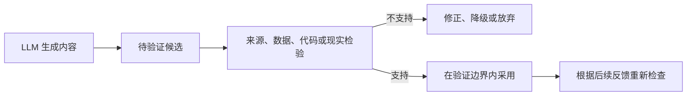
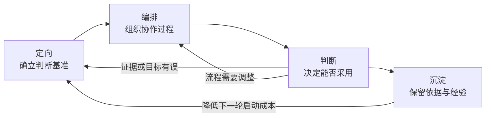
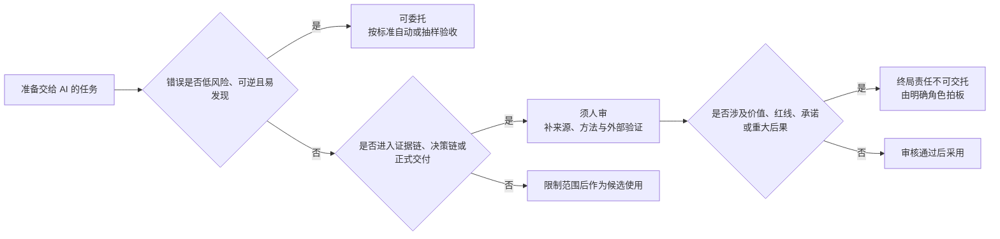
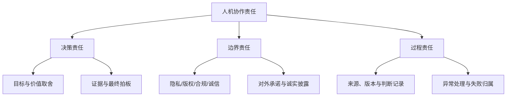

生成式 AI 可以快速写出事实陈述、研究假设、代码和业务方案，输出往往完整、连贯，看起来合理。但生成过程本身不附带真实性证明。本文讨论两件事：模型输出为何不能直接当作知识，候选怎样接入来源、数据、工具和现实反馈，才能在特定条件下获得可信度；以及人、AI、数据、工具与组织流程分别承担什么作用，终局责任落在何处。

<!--more-->

这里把候选接入独立于生成过程的检验，称为 **外部锚定**：事实概括要回到原始来源，数据分析要回到数据、口径和方法，代码要进入执行环境与测试流程，研究结论要接受实验、证明或材料检验，工作方案则要接触用户反馈、业务指标和系统状态。锚定之后，人仍需决定证据是否充分、结果能否采用，以及后果由谁承担。

## LLM 的生成机制与可信边界

LLM 可以生成事实陈述、研究假设、数据解释、代码和业务方案，其输出在形式上通常完整、连贯且具有合理性，其中不少确实正确且有价值。但能够输出完整的内容，并不等于能够证明这些结果是正确的，因为生成过程本身不会为输出附带真实性证明。讨论 LLM 的可信边界，重点不在于判断模型有没有"真正的智能"，而在于确定生成结果在问题求解中应当处于什么位置，以及需要经过怎样的验证才能被采用。

### 生成不等于求真

当前主流 LLM 大多以 Transformer 为架构基础。模型根据已有上下文逐步生成合理的后续内容，Attention 帮助模型关联上下文中的信息，保持主题、追踪条件并组织较长的回答。这套机制使模型能够组织知识性内容、编写代码、展开推理并组合新的解决路径，但不会自动核对每项内容是否符合外部事实。

因此，模型生成的是在当前上下文中最具合理性的内容，而不是自带真实性证明的知识。合理性不保证真实性：一段回答可以结构清楚、术语准确、论证连贯，却建立在错误事实、不完整材料或不成立的前提上。

### 模型输出为何难以直接信任

直接信任模型的输出之所以困难，是因为可信度无法从输出本身读出：使用者可能借以判断的几条线索，即是否有依据、是否自洽、表达是否笃定，没有一条能担保结果正确。

模型所依据的知识存在边界。训练材料不可能覆盖所有事实，也可能包含错误、冲突、偏见和过时信息。面对最新、狭窄、组织内部或依赖现场状态的问题时，模型仍可能根据相邻模式补全缺失部分。因此，仅凭回答本身，使用者很难判断它是依据扎实材料得出的，还是在材料不足时生成的合理猜测。

即便转向内部，自洽也不构成保证。如果输入的数据、口径、前提或背景不完整，模型仍能在这些条件上构造自洽答案；如果回答前段出现错误数字、虚构来源或不成立的假设，后续内容也可能把它们作为既定事实继续展开。内部一致只能说明内容彼此连贯，不能证明起点符合现实。

表达方式同样不能作为判据。确定的语气可能只是常见回答风格，谨慎的措辞也不代表模型准确识别了不确定性。要求模型解释理由、自我检查或重新生成，可以发现部分问题，但同一模型的再次回答仍不构成独立证据。

因此，生成内容可能正确，也可能非常有价值，但使用者很难仅凭结果本身稳定区分“已经成立”、“大概率合理”和“只是看起来合理”。模型原始输出因而更适合作为待验证候选。

### 信任如何建立

前面已经说明，依据、自洽和语气都不能从输出内部担保正确。待验证候选要升格为可被采用的结果，就不能再向模型本身索取证明，而必须接入独立于生成过程的检验。这一步就是外部锚定。不同产物接入的对象不同：事实概括要回到原始来源，数据分析要回到数据、口径和方法，代码要进入执行环境与测试流程，研究结论要接受实验、证明或材料检验，工作方案则要接触用户反馈、业务指标和系统状态。

搜索、数据库、代码环境和验证工具可以提高可靠性，但不能把模型直接从“不可信”切换为“可信”。模型可能选择错误来源、生成错误查询、使用不合适的数据口径、设计覆盖不足的测试，或者误读工具返回的结果。因此，调用工具只是进入了验证过程，不等于完成验证。

信任也不是一次性授予整个模型，而是针对具体产物、验证条件和使用目的建立起来。通过测试的代码，可以在已有测试覆盖范围内采用；经过原文核对的概括，可以在相应来源范围内采用；可复现的数据分析，也只能在既定数据、口径和方法条件下成立。环境、数据或目标发生变化后，原有结果仍可能需要重新检查。

因此，“不直接信任 AI”并不意味着拒绝采用 AI 参与产生的结果。更准确的原则是：模型原始输出默认是候选，候选的可信度由后续证据和验证过程建立；即使通过验证，其可信范围也受验证条件限制。

总之，最终值得信任的不是某次流畅回答，而是由人、模型、数据、工具、验证步骤和现实反馈共同组成的协作系统。AI 可以承担检索、整理、生成、编码和计算等认知劳动，目标确定、验证设计、结果解释、采用边界与终局责任仍需由明确的人或组织角色承担。

## 人机协作的能力结构与责任边界

协作系统要稳定运转，就要拆开它的内部结构：人、AI、数据、工具与组织流程分别承担什么作用，哪些结果能够进入下一环节，以及终局责任落在何处。

人机协作的能力边界会随模型、工具和自动验证的发展而变化，同一任务在不同环境中的风险也不相同。较为稳定的划分依据包括目标是否清楚、结果是否容易验证、错误是否可逆，以及结果是否进入证据链、决策链或现实执行。

这里的“人”可以是多个承担不同职责的角色。在正式研究和组织项目中，它可能包括研究者、评审者、产品负责人、数据分析师、工程师、合规人员和决策者。角色与责任的明确配置才能建立可靠性。

### 人机协作的基本分工

AI 的优势主要体现在可以快速处理大量符号材料，反复执行明确任务，并以较低成本展开多个候选。它适合参与信息压缩、材料整理、初稿生成、方案变体、代码实现、对照检查和过程记录；接入工具后，还可以执行检索、查询、计算和测试。

人更关键的作用集中在目标、取舍和责任上。现实问题很少只由文字本身定义，什么值得解决、什么结果算成功、什么风险可以承受、什么证据足以支持行动，都与具体环境、价值和后果有关。人需要为协作系统确立判断基准，判断外部反馈意味着什么，并决定结果是否能够进入下一步。

| 协作对象 | 主要作用 | 不能仅靠自身完成的部分 |
|:--------:|:--------:|:----------------------:|
| 人 | 目标定向、价值取舍、证据验收、边界控制、最终担责 | 难以独立覆盖海量信息与大量候选，也会受到经验和认知偏差限制 |
| AI | 信息压缩、候选生成、实现辅助、重复执行、过程整理 | 不能仅凭生成确定目标是否值得、证据是否充分和后果是否可承受 |
| 数据与工具 | 提供检索、计算、执行、测试和现实状态 | 不能自动保证问题、输入、口径和结果解释正确 |
| 组织与流程 | 配置权限、标准、角色、检查点和升级机制 | 需要持续根据能力、风险和反馈更新，不能依赖一次设计永久有效 |

这种分工贯穿协作全程。人在前端定义问题和验证标准，在中间安排步骤、工具和反馈，在后端进行验收与拍板；AI 也可以在多个环节接受反馈并继续工作。协作的关键，是让候选生产与证据约束在同一条循环中反复连接。

### 四层能力结构

要组织这套协作系统，人需要的不只是某款产品的操作技巧或一组固定提示词。模型和界面会变化，但只要 AI 仍以理解目标、处理信息、生成候选、调用工具和接受反馈的方式参与工作，四类底层能力就会持续存在：**定向、编排、判断与沉淀**。

四层能力首尾相接，构成不断回到起点的循环；下表分别给出每层的核心任务和它所要解决的系统问题。

| 能力层 | 核心任务 | 解决的系统问题 |
|:------:|:--------:|:--------------:|
| 定向 | 界定问题、表达目标、补充上下文、设定成功标准与边界 | 防止系统在错误或含混方向上高效运行 |
| 编排 | 拆解任务、安排顺序、选择模型和工具、设置检查点与反馈入口 | 把单次问答组织成可推进、可验证的过程 |
| 判断 | 核对来源、检查前提、寻找反例、解释结果、完成方案取舍 | 决定候选能否进入证据链、决策链或现实行动 |
| 沉淀 | 保存来源、版本、约束、失败路径、验证结果和取舍依据 | 让一次协作成为下一轮可以调用的经验 |

**定向** 决定系统朝哪里运行。目标含混时，AI 往往仍能生成结构完整的内容，这会使错误方向比过去更快获得成品外观。定向需要明确要解决什么、为什么值得解决、做到什么算有效、允许使用哪些材料，以及哪些边界不能突破。

**编排** 决定协作如何推进。复杂任务不能只依赖一次生成，需要安排何时展开候选、何时收敛，何时调用搜索、数据库和代码环境，哪些结果需要检查，以及失败后返回问题、材料还是方案层。编排使反馈有入口，也使错误能够在进入终局之前被拦截。

**判断** 决定什么能够被采用。它要求区分事实、假设、解释和结论，检查证据是否支持相应强度的主张，并在多个候选之间权衡价值、成本和风险。AI 可以辅助寻找问题和反例，但“证据是否足够”“现在是否应该行动”仍需要结合现实后果作出决定。

**沉淀** 决定能力能否跨轮次积累。保存最终文档并不足够，还需要留下为什么采用某项内容、为什么否定另一条路径、验证在什么条件下通过，以及哪些风险需要继续观察。能够重新进入下一轮的判断依据，才构成协作系统的记忆。

四层能力构成相互连接的循环。定向为编排提供目标，编排为判断准备材料和检查点，判断产生的反馈会反过来修正定向与流程，沉淀则把已经确认的事实和经验带入下一轮。系统可靠性由此逐步形成。

### 按风险决定委托边界

一项任务能否交给 AI，需要综合考虑模型能力、错误是否容易发现、影响是否可逆、验收标准是否清晰，以及结果将进入什么环节。同一项能力在不同风险下可能对应不同的委托方式：生成内部讨论提纲与对外发布结论都涉及写作，但二者需要的验证和责任完全不同。

可以把任务分为三档：

- **可委托**：风险低、结果可逆、验收标准清楚，输出可以直接作为下一环节的中间输入；
- **须人审**：AI 可以完成主要准备或分析，但内容将进入证据链、决策链或正式交付，采用前必须核对来源、方法、约束与主张；
- **终局责任不可交托**：AI 可以准备材料、模拟选项和提示风险，但涉及目标价值、重大取舍、红线、对外承诺和后果归属的最终判断，必须由明确的人或组织角色承担。

按这一流程，任务可归入三档；下表分别给出研究和工作中的典型例子。

| 档位 | 研究中的例子 | 工作中的例子 |
|:----:|:------------:|:------------:|
| 可委托 | 检索词扩展、提纲草稿、代码脚手架、格式整理 | 会议材料整理、文案变体、测试用例草稿、常规代码补全 |
| 须人审 | 文献主张抽取、方法比较、分析代码、结果解释 | 数据分析解读、需求拆解、方案比较、上线说明 |
| 终局责任不可交托 | 选题价值、结论成立、署名与研究诚信决定 | 是否上线、对外承诺、合规红线、重大资源投入与失败归属 |

"终局责任不可交托"并非不允许 AI 参与准备。模型可以帮助列出选项、检查遗漏、模拟反对意见和整理风险，但最终拍板和相应的组织、法律、伦理后果，仍须由明确的人或组织角色承担。

上述三档的划分并非固定不变。当测试覆盖提高、流程更加成熟、错误更容易回滚时，部分"须人审"任务可以转为自动执行和抽样验收；当任务进入高风险环境，原本低风险的操作也可能需要升级审核。模型能力、验证条件和现实影响共同决定委托边界。

人的主要作用是设计适合风险的控制方式。低风险、标准明确的任务可以自动执行并抽样检查；能够由编译器、测试、规则或数据约束判断的结果，应优先建立机器验证；影响重大、难以形式化或涉及价值取舍的异常，则需要更深的人工判断。可靠系统应把人的注意力集中在机器难以稳定判断的部分。

"人在回路中"可以通过预先定义目标、权限、验收标准和升级条件来实现，无需每一步都实时批准。系统在边界内自主运行，遇到置信不足、工具异常、结果越界或环境变化时再升级给相应角色。人的责任体现在边界设计与监督上。

### 决策、边界与过程责任

协作系统中的人类责任可以归纳为三类：决策责任、边界责任和过程责任。三类责任不要求同一个人全部承担，但必须在团队或组织中找到明确归属。

**决策责任** 首先包括确定目标和价值。AI 可以提出值得研究的问题或看似有收益的方案，但优先级、资源投入和风险承受本身就是取舍。其次是证据与最终拍板：模型可以整理证据和生成解释，仍需要明确角色判断证据强度是否支持相应结论，方案是否值得进入现实执行。

**边界责任** 涉及输入和输出两端。输入阶段需要判断用户数据、内部资料和受限信息是否可以进入模型或外部服务；输出阶段需要处理版权、学术诚信、业务合规、安全红线和对外承诺。诚实披露也属于边界责任：不必机械标注每一句由谁生成，但不能让读者、评审、同事或用户对人类贡献、证据来源和可复核性产生实质性误判。

**过程责任** 确保协作能够被复核和修正。一个结果为什么被采用，使用了哪些数据和工具，AI 的哪些内容被否定，验证覆盖了什么范围，环境变化后由谁重新检查，都需要留下必要记录。出了问题时，不能简单归因为“AI 说错了”，而应定位是目标、材料、生成、工具、验收还是执行环节失守。

AI 无法成为替罪羊或免责盾。选择把模型纳入工作流程，就意味着需要对权限、使用方式、验收标准和最终采用承担相应责任。清楚的责任结构还能支持自动化：系统可以据此区分能够自动修正的错误、必须升级的异常，以及有权决定继续或停止的角色。

强调人的判断与责任，容易滑向另一种误解：既然 AI 可能出错，所有内容都应由人重新做一遍。如果人工验收等同于重复完成全部工作，AI 就很难提高协作效率，验证本身也会成为无法扩展的瓶颈。

随着模型和验证工具进步，人机分工会继续变化。四项原则需要保持稳定：目标有人定义，证据能够追溯，异常可以升级，终局责任具有明确归属。

研究与工作都会用到这套结构，但所需证据、失败代价和终局责任并不相同。无论场景如何，模型原始输出默认是候选；可信度由外部锚定建立，采用边界和终局责任仍由明确的人或组织角色承担。
