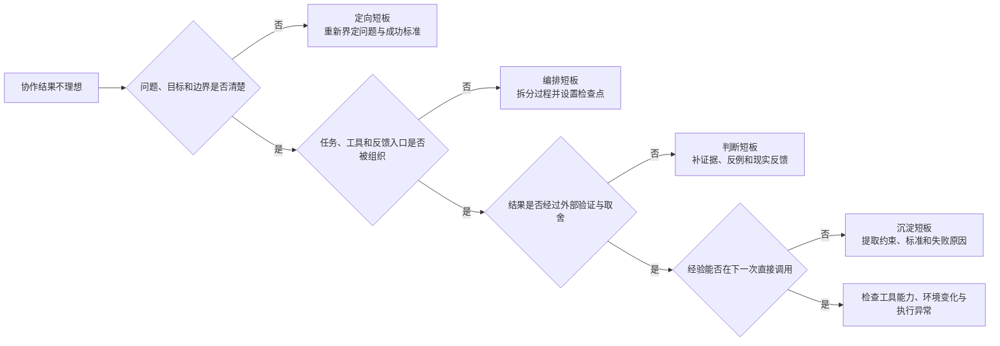
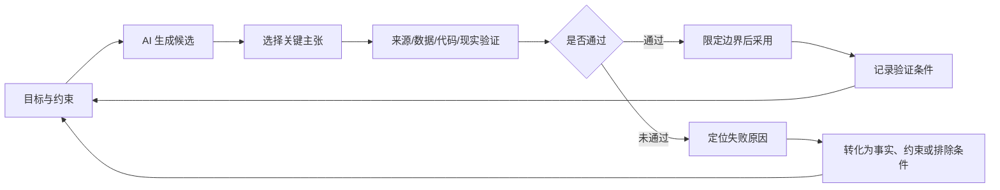
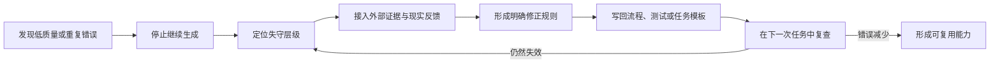
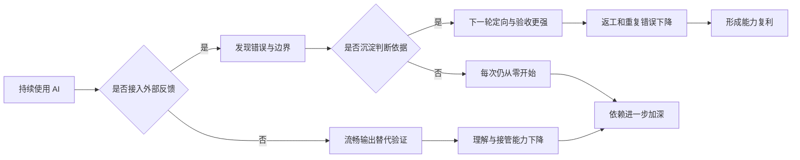

协作框架逐步稳定后，瓶颈从系统能否组织转向使用者能否随之成长。调用效率的提升不等于协作能力的增长，会用与用得好的差别，在于结果是否受到外部反馈约束，错误是否改写下一轮的行为，判断能否跨任务复用。生成更快、文档更完整，并不构成能力进步。

<!--more-->

定向、编排、判断、沉淀四层能力，可以作为诊断协作短板的坐标。任一层失守，都会让生成投入掩盖方向、证据与责任上的缺口。把验证结果转化为下一轮的约束，让稳定有效的经验沉淀为模板、测试和规则，协作才不会停留在更快的重复，而是开始形成可迁移的能力。

## 定位当前短板

协作结果不理想时，最直接的反应往往是换模型、改提示、增加上下文或重新生成。这些调整有时有效，却也可能掩盖根本问题，如方向未定义、任务未编排、验收未发生或错误未沉淀。

可以沿四层能力逐步诊断，从问题与目标是否清楚开始，依次检查任务编排、结果验证与经验沉淀，找到最先出现问题的环节：





不同短板会表现出不同症状，应优先检查的内容也有所不同：



| 短板 | 常见表现 | 应优先检查什么 |
|:----:|:--------:|:--------------:|
| 定向 | 输出很多却始终不解决真实问题，目标在对话中不断变化 | 对象、目标、成功标准、材料范围和禁止边界 |
| 编排 | 依赖一次长回答，失败后只会要求再生成一版 | 任务顺序、工具选择、检查点、反馈入口和停止条件 |
| 判断 | 因结构完整、语气专业而直接采用，出错后才寻找证据 | 来源、前提、反例、执行结果、现实约束和结论强度 |
| 沉淀 | 相似任务反复从零开始，同类错误和争论持续出现 | 决策记录、失败路径、稳定约束、验收问题和适用边界 |



诊断需要从真实结果反推，而不是根据使用感受判断。觉得模型“不够懂业务”，可能是上下文没有补齐；觉得提示“不够强”，可能是任务根本缺少验证标准；觉得每次都需要人工重做，可能是没有把常见错误转化为自动测试。只有定位薄弱层级，改进才不会变成盲目增加生成投入。

在上述四层能力之外，工具能力和执行环境也可能构成限制。模型不支持所需上下文、工具连接不稳定、数据权限不足，都是真实问题。但这些应在定向、编排、判断和沉淀均已检查之后再单独处理，而不是成为解释所有失败的默认答案。

## 最小协议、验证反馈与沉淀

找到问题所在只是第一步。诊断能指出短板在哪一层，但真正改善协作，需要在每一轮中保护关键动作、接通外部反馈，并把有效判断保留到下一轮。否则即便找到了问题，改进也容易回到旧习惯。

### 建立最小协作协议

我们自己不必为每项任务设计复杂流程，但应建立一套最小协作协议，确保关键步骤在时间紧张或输出流畅时仍被执行。协议贯穿开始前、进行中、采用前和结束后四个环节。



| 时点 | 最小动作 | 需要留下的内容 |
|:----:|:--------:|:--------------:|
| 开始前 | 写清问题、目标、约束、成功标准和风险等级 | 一份简短任务卡 |
| 进行中 | 区分事实、假设、候选和已验证结果，安排工具与检查点 | 候选状态和待验证清单 |
| 采用前 | 接回来源、数据、执行或现实反馈，判断适用边界 | 验证结果和采用理由 |
| 结束后 | 记录采用、否定、失败及其原因 | 可复用约束、标准和决策记录 |



开始前的任务卡不需要很长，但至少应回答以下几个问题：

- 要解决的实际问题是什么，而不是准备生成什么文档；
- 结果将用于内部探索、正式分析、对外发布还是现实决策；
- 模型可以使用哪些材料，哪些数据和信息不能进入模型；
- 什么结果算有效，什么错误不可接受；
- 哪些内容可以自动验收，哪些必须人工判断；
- 最终由谁决定采用，失败后怎样停止或回滚。

任务卡写清之后，需要在任务进行中维护候选状态。AI 提出的事实尚未找到来源，应标为待核验；一项解释能够说明数据，但存在其他可能解释，应标为候选假设；一段代码通过有限测试，只能说明在当前覆盖内可用。明确状态可以防止内容在多轮对话中悄然从“可能”变成“已经确认”。

最小协议旨在保护最容易在追求速度时消失的判断动作，同时控制记录负担。对于低风险、重复性任务，协议可以固化为模板、自动检查和抽样验收；对于高风险任务，则需要更完整的来源、版本和决策记录。

### 接通验证反馈

与模型进行多轮对话并不等于迭代。迭代要求每一轮都比上一轮更接近事实，而不只是产出更多文字。模型可以围绕同一材料不断生成新版本，但如果没有新的来源、数据、执行结果或人工判断进入，协作也只是在已有材料中反复重组，而并未触及现实。有效迭代需要离开对话，接触能够支持或否定候选的外部反馈。

个人反馈循环可以表示为：





验证失败后，应当把失败原因转化为下一轮可以使用的信息。例如：

- 原始论文不支持模型概括，应记录正确主张和误读发生的位置；
- SQL 因口径错误产生偏差，应把字段定义和分母规则写入任务约束；
- 代码在边界输入下失败，应将该输入转化为长期测试用例；
- 方案受到资源限制，应把实际排期、权限和成本加入后续比较；
- 用户反馈否定某项假设，应调整问题定义，而不是只修改表达方式。

把这些反馈带入下一轮后，候选空间应当比上一轮更窄，已经确认的事实成为固定输入，被否定的路径不再无谓重复，新的候选须满足更强约束。每轮范围如果没有收缩，增加的可能只是生成频率，协作质量却没有进一步提高。

验证也需要考虑成本。检查应优先覆盖最可能改变决策、最难回滚和错误影响最大的部分。低风险内容可以抽样，高风险主张需要更强证据；机器能够稳定检查的部分，应转化为测试、规则和自动化验证，把人的注意力留给难以形式化的异常与取舍。

### 沉淀可复用判断

协作痕迹不等于下一轮能力。有价值的沉淀需要从过程材料中提取可复用的判断，包括什么目标和约束反复有效，哪些问题能够拦住常见错误，什么路径已经被证伪，以及结论在哪些条件下失效。

可以将最小决策记录压缩为以下内容：



| 字段 | 需要记录什么 |
|:----:|:------------:|
| 问题与目标 | 当时实际解决什么，成功标准是什么 |
| 已确认事实 | 哪些内容已经由来源、数据或执行结果确认 |
| 候选与取舍 | 考虑过哪些路径，最终采用或放弃什么 |
| 判断依据 | 哪项证据、约束或反馈改变了决定 |
| 失败与异常 | 哪里出错，根因是什么，怎样被发现 |
| 适用边界 | 当前结果在什么条件下成立，什么变化需要重验 |
| 下一轮入口 | 哪些约束、测试和问题应直接带入相似任务 |



沉淀应尽量与判断同时发生，避免在项目结束后依靠回忆补写。做出关键取舍时记录一句理由，发现错误时保存触发样本和修正规则，往往比事后整理完整对话更有价值。AI 可以帮助归纳和结构化，但哪些内容实际改变了决策仍由人判断。

可复用性是沉淀的检验标准。有些记录只能还原当时过程，无法帮助下一轮更快地定向、验证和避错，它们主要承担档案作用；有些记录能够直接转化为任务模板、数据口径、测试用例、评审问题和停止条件，才开始让能力持续积累。

但是可复用不等于永远有效，要避免把过时经验固化为永久规则。模型、数据、组织和市场都会变化，沉淀内容需要携带适用条件和复查时间。值得复用的是形成、验证和修正答案的方法与理由，某个具体答案只在相应条件下有效。

## 自主能力与假进步

协作能力能否真正留下，还取决于人是否保持必要的自主判断，以及能否识别那些看似进步、实为退化的迹象。

### 保留必要的自主能力

AI 可以承担越来越多的检索、编码、分析和表达工作，但有效委托要求使用者仍具备最低限度的理解、异常识别和接管能力。如果一个人完全无法解释结果如何产生，也无法识别明显错误，那么所谓委托更接近失去控制。

需要保留多少自主能力，取决于任务风险和验证条件。低风险、可逆、已有稳定自动检查的任务，可以降低人工参与；涉及重要数据、复杂方法、外部承诺或不可逆后果的任务，则要求使用者或团队中有人能够理解关键原理、检查核心假设，并在系统失效时接管。

保留自主能力并非要求凡事亲力亲为、与 AI 较量速度。更有效的做法包括以下几项：

- 对关键代码和分析抽样进行独立解释，而不是逐行重写；
- 在采用结果前，先自行列出可能错误和验证标准，再查看模型输出；
- 定期选择少量任务不依赖完整生成，检查是否仍能界定问题和设计方法；
- 对高风险环节实行交叉审核、独立复算或不同工具验证；
- 记录哪些任务已无法由当前人员接管，并补充培训或降低自动化范围。

自动化程度越高，能力校准越重要。长期没有异常不一定说明系统不会失败，也可能只是问题尚未被发现。定期抽查、故障演练和边界测试可以确认人是否仍理解系统，以及升级机制能否有效运行。

人的专业价值也会随分工变化。过去大量时间用于亲自检索、计算和起草，未来可能更多用于定义问题、设计验证、处理例外和整合跨领域判断。保留自主能力，是为了确保劳动重新分配后仍有人理解关键链路并承担责任，不必固守所有旧操作。

### 识别假进步

人机协作中的退化通常并非完全不会使用 AI，反而可能表现为产出越来越快、文档越来越完整。问题在于，速度和完整度掩盖了一个更深的问题，定向、判断和反馈正在弱化，却不容易被察觉。

常见反模式及其纠正方式包括：



| 反模式 | 表面表现 | 实际缺口 | 纠正动作 |
|:------:|:--------:|:--------:|:--------:|
| 转发者化 | 稍作整理便把 AI 输出作为自己的结论交付 | 判断和证据责任退出 | 要求每项关键主张具有来源、验证状态和采用理由 |
| 单轮闭合幻想 | 追求一次生成完整解决复杂任务 | 缺少编排和反馈入口 | 将任务拆成候选、检查、外部验证和修正阶段 |
| 验收塌缩 | 因结构清楚、语气专业而降低检查标准 | 表达质量替代认知质量 | 在生成前确定验收标准，对关键内容独立核验 |
| 工具归因 | 结果不好只换模型、插件或提示 | 未诊断定向、流程和判断短板 | 先沿四层能力定位，再决定是否升级工具 |
| 痕迹当沉淀 | 保存大量聊天和文件，下一次仍从零开始 | 没有提取可调用判断 | 抽取约束、测试、失败原因、边界和决策记录 |



这些反模式表面各不相同，根源都在于跳过了定向、判断或反馈中的某个关键动作，因此可以用一条共同的纠正路线处理：





纠正的第一步是”停止继续生成“。当问题来自方向、证据或流程时，更多文本只会增加噪声。跳出当前对话惯性，重新检查问题和外部世界，下一轮协作才可能发生实质变化。

## 用结果而不是使用量衡量成长

模型调用次数、对话长度、生成文件数量和表面上节省的工时，都可以描述使用强度，却不足以证明协作能力提高。能力成长应当反映在问题求解结果和下一轮成本上。

以下几个指标更能反映能力的真实变化：

- **错误重复率**：已经发现并解释的同类错误是否继续发生；
- **有效反馈周期**：从提出候选到获得能够改变决策的外部反馈，需要多长时间；
- **返工位置**：问题是否更早在方向、设计和验证阶段暴露，而不是总在交付末端返工；
- **可追溯性**：关键结论能否找到来源、验证条件和采用理由；
- **判断一致性**：面对相似风险时，是否能够稳定使用相同标准，而不是受输出语气影响；
- **启动成本**：下一次同类任务是否能够直接调用已有约束、数据口径、测试和失败经验；
- **接管能力**：模型或工具异常时，是否有人能够理解问题并采取替代方案；
- **现实结果**：研究认识是否更可靠，工作是否在窗口期内取得了可验证改善。

这些指标不一定都要量化为正式数字，也可以通过定期复盘观察成效。关键是衡量对象从“AI 帮助生成了多少”转向“协作系统减少了多少重复错误、缩短了多少有效反馈周期，并留下了多少可复用判断”。

能力提升最终可以归结为一条循环：定位短板、建立最小协议、接入外部反馈、沉淀有效判断、校准自主能力，再用下一次真实结果检验改进是否成立。衡量依据包括重复错误是否减少、反馈是否提前、接管能力是否仍在，以及下一轮是否站在更高的起点上，AI 使用量本身并不构成能力指标。

## 当生成不再稀缺

当文字、代码、分析和方案能够被快速生成，生成本身就不再稀缺了。过去限制问题求解的候选生产成本大幅下降，在同样时间内可以提出、比较和修正更多假设、代码草稿与方案变体，这为个体和组织带来了新的认知杠杆。

但与此同时，验证能力、专业判断和责任结构并未自动扩张，审查、测试和现实验证仍是相对有限的资源。生产与验证之间出现新的不对称，判断与责任的分配开始重新排列。第五范式的收益、代价与长期影响，正发生在这两种变化的落差中。

### 认知杠杆与验证缺口

#### 认知杠杆的作用

认知杠杆最直接的作用，是让更多人能够着手原本启动成本较高的问题。陌生领域可以先建立知识地图，模糊想法可以较早形成可检查的表达，缺少局部技能的人也能借助 AI 搭建代码、分析或原型。AI 没有让专业知识失去价值，但是降低了开始探索的门槛，也让人更容易跨越局部能力的缺口。

这种杠杆也扩大了个人和小团队能够承担的任务范围。过去需要多人协作才能形成的初步方案，现在可能先由较少的人完成探索、实现和验证准备，再把稀缺的专业注意力集中到关键难点上。跨领域的方法和经验也更容易进入视野，从偶然发现转变为可以主动提出、比较和试用的候选。

更重要的是，失败可以更早发生。草稿、代码和原型形成得更快，意味着问题有机会更早接触文献、数据、测试和用户反馈。真正的收益是在同样时间里完成更多轮有信息价值的尝试，让错误更早暴露，让下一次行动建立在更明确的事实和约束上。

#### 验证缺口

生成变得容易之后，人们容易产生一种错觉：把模型的流畅输出误当作自己的理解、判断与知识。能够迅速获得一份完整回答，似乎就已经理解了问题；能够生成多个方案，似乎就完成了充分比较；能够调用专业术语和引用，似乎就拥有了相应知识。

候选数量与知识数量并不是同一件事。一个候选只有在来源、逻辑、方法和现实反馈的约束下，才能获得相应可信度。未经验证的版本再多，也只是扩大了待处理的不确定性。表达越完整，这种不确定性反而越容易被隐藏，因为人会自然地把结构完整感当作思考完成度。

由此产生的是一种 **验证缺口**。团队可以在短时间内生成大量需求、代码、分析和方案，却没有同步增加审查、测试和现实验证能力。未经锚定的中间产物不断流向后续环节，后续角色便要在更大规模的内容中寻找错误；如果没有发现，错误还可能被包装进更正式的交付物，最终在上线、决策或公开传播后暴露。

验证缺口不会因为暂时没有报错而消失，只会在后续修改和责任追溯中以更高成本弥补。它不仅存在于代码，也存在于事实、数据口径、因果解释、用户判断和业务承诺中。内容生产越快，团队越需要知道哪些部分已经验证，哪些只是暂时借用的假设。

候选数量增多还会消耗人的注意力。每个版本都可能结构清楚、理由充分，于是筛选本身成为新的劳动。若缺少目标和评价标准，AI 提供的广度可能从探索优势变成认知噪声，人不断阅读和比较新版本，却没有任何一条路径更接近现实。

因此，信息过载在 AI 时代获得了新的形态。过去的困难是材料太多、来不及阅读；现在还包括生成物太多、来不及判断。AI 可以继续帮助压缩和筛选，但筛选标准来自哪里、什么证据足以停止探索，仍需由问题和现实结果决定。

知识更加丰富，意味着更多主张能够找到依据，更多假设能够接受区分性验证，更多错误能够被记录和排除，远不止随时得到一个答案。生成扩大的是可能性空间，证据和判断才决定其中有多少能够成为稳定认识。

### 判断升值与能力分化

#### 判断能力重新升值

当 AI 能够完成越来越多检索、计算、编码和表达工作时，人们容易认为专业能力会因此贬值。但变化更可能发生在专业性的表现形式上，某些中间劳动的稀缺性会同时下降。与此同时，定义问题、设计验证、处理例外和承担取舍的能力变得更重要。

过去，专业性常常通过“能够亲手完成什么”表现出来。熟悉资料、掌握工具、记住方法和独立产出，是完成任务的必要条件。AI 介入后，一个人可以在不完全掌握所有局部操作时推动更复杂的工作，专业性的表现形式因此转移：能被快速生成的环节越多，越需要有人识别哪些任务被错误定义、哪些方法不适用、哪些结果虽然正确却回答了错误问题。

判断能力的建立需要在具体知识之上。发现模型误读论文依赖对证据和研究语境的理解，检查数据分析依赖对指标、样本和方法的掌握，决定方案是否值得上线则离不开用户、系统和业务约束。AI 可以降低调用知识和执行方法的门槛，却无法让缺少相应理解的人稳定完成高风险判断。

专业能力从而可能由大量直接产出，转向几个更高杠杆的位置：

- 从接受任务转向界定核心问题；
- 从记忆答案转向判断来源和适用条件；
- 从执行既定步骤转向设计验证与反馈；
- 从打磨单一方案转向比较竞争性路径；
- 从处理常规操作转向识别异常和边界；
- 从交付内容转向说明为什么可以采用并承担后果。

但这并不要求所有人都成为管理者，基础能力同样需要保留。没有对关键过程的理解，就难以设计有效验收，也无法在自动化失效时接管。越来越重要的判断能力，仍需要建立在专业知识、现实经验和反馈之上，对 AI 输出的主观偏好无法替代这些基础。

当生成变得普遍，稀缺的专业性越来越体现在：能否提出有价值的问题，能否在大量可能中找到值得验证的少数路径，能否在证据不足时保持克制，以及能否清楚说明结论的边界。

#### 能力可能分化为两条路径

同一种工具可以产生相反的长期结果，例如：AI 可以承担低价值重复劳动，让人把时间投入更高层判断；也可以因为输出过于方便，使人逐渐放弃理解、验证和记录。短期效率相似，长期的能力走向却可能完全不同。





能力放大的路径依赖现实反馈。AI 让人更快完成一项工作，外部结果帮助人发现哪些判断正确、哪些前提遗漏，再通过沉淀把这些经验带入下一轮迭代。随着循环持续，AI 不只是替代劳动，也成为暴露短板和加速学习的工具。

能力替代的路径则通常更隐蔽，本质是前述假进步在长期固化为路径依赖。输出能够满足眼前交付，人便减少检查；检查减少后，对错误和边界的敏感度下降；下一次任务更加依赖模型生成完整过程。使用次数不断增加，熟悉感也不断增强，但个体越来越难解释结果、发现异常和独立接管。

两条路径的区别不在于是否使用 AI，也不在于是否亲手完成所有步骤，而在于人是否仍参与目标、证据和反馈。可靠自动化可以减少人工操作，却应增强对系统边界的理解；失控依赖则是在没有相应验证与接管能力的情况下，把越来越多最终判断交给 AI，自己逐渐退出决策。

组织层面也会出现类似分化。能够积累评测、错误样本、决策记录和升级机制的团队，会随着使用次数建立更可靠的协作基础；只积累提示、聊天和生成文件的团队，可能获得越来越高的产出吞吐量，却持续出现相同的目标偏差和验收疏漏。

AI 是能力放大器还是能力替代品，是由反馈能否进入、判断是否留下以及责任是否清楚决定。

### 责任与新范式分界线

#### 劳动可以转移，责任不会自动转移

AI 可以承担越来越多过去由人完成的劳动，包括搜集材料、编写代码、分析数据、生成方案、执行测试，甚至在授权范围内调用系统采取行动。劳动分配发生变化后，责任却不会以相同方式自动转移给模型。

模型没有组织中的职位、法律义务和现实利益，也不会独立承受一次错误决策带来的后果。即使某项内容主要由 AI 生成，决定采用它、配置权限、降低审核或对外发布的仍然是具体的人和组织。出了问题后，“AI 是这样回答的”只能描述错误来源之一，责任不能到此为止。

自动化越强，这种不对称越值得警惕。系统影响现实的速度和范围扩大，人却可能因为远离执行过程而更难发现异常。任务可以按风险分成可委托、须人审，以及最终责任不可交托；决策、边界和过程责任也要有明确归属。更重要的是，效率提高不会减轻责任，反而要求人在更早的阶段说明为什么授权系统行动，以及出了偏差如何停止、修正和承担。

当 AI 越来越像协作者时，“它决定”、“它认为”、“它负责”只是便于交流的拟人化表达，不能替代真实的责任结构。AI 可以参与建议和执行，劳动也可以重新分配，但后果仍会回到使用、部署和管理它的人与组织。

#### 新范式的分界线

AI 时代最表面的差距，可能是谁更早使用模型、谁拥有更强工具、谁生成得更快。但随着能力扩散和使用门槛下降，这些优势会逐渐缩小。更持久的差距可能来自：谁能把生成速度转化为更高密度的可信循环。

这条分界线以问题是否更接近现实来衡量，而非候选数量。关键主张有没有接触外部证据，失败有没有改变下一轮，判断有没有被保留，责任是否具有明确归属。每一轮都可以很短，却应推动系统接近现实，而不只是接近一份完整文本。

生成不再稀缺之后，昂贵的是为判断保留时间、为验证配置资源、为失败留下记录，并在追求效率的同时守住责任。能够持续完成这些动作，生成速度才会转化为认知杠杆；否则，更多生成只会积累更多未经锚定的内容和更难弥补的验证缺口。

人与 AI 协作的关键，是借助模型看到更多可能性，同时建立持续排除错误、接近事实和积累判断的系统。生成能力可以被调用，判断能力需要保留；劳动可以重新分配，责任不会因此消失。能在追求效率的同时守住这几条，才构成第五范式更持久的分界线。
