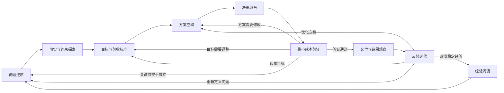
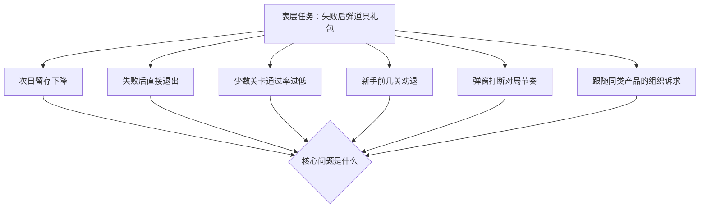
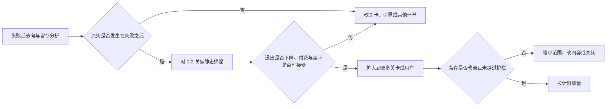

工作项目要求在时间、资源、组织和风险约束下取得可验证的结果。AI 降低了问题还原、方案展开和反馈处理的成本，使团队能更早检验关键前提、更快修正下一轮行动。生成的方案在对照用户反馈、业务指标和系统状态之前，仍是待验证的候选。分析严密却错过窗口，或者按时上线了但却没有解决真实问题，同样不构成有效交付。

<!--more-->

敏捷开发、MVP、A/B 测试、持续交付与灰度发布已是互联网行业的常规做法，AI 有效降低了每轮迭代的成本，使团队能够以最小资源在窗口期内完成更多轮检验与修正，项目迭代频率因而提升。

## 协作流程与案例

下面以一个假想项目为例，说明 AI 进入工作流程后带来的改变：

某休闲消除小游戏团队收到“过关失败时弹出道具礼包，以提高留存”的要求。
{:.info}

围绕这一任务，工作协作流程可以被组织为九个相互循环的阶段：





九个阶段把从接到任务到沉淀经验的过程拆分为可单独审视的环节，分别确认问题是否成立、目标是否清晰、方案是否值得投入、验证是否通过。每个环节的判断都须可追溯，使反馈能回到对应层级加以修正，而非只在执行端修补。

低风险任务可快速通过多个阶段，高风险项目则需在每个环节提供更充分的证据，由更高层级确认关键判断，并预设升级与回滚机制，以便出现异常时及时停止或调整。这套流程的价值在于更早暴露方向错误，而非徒增无决策价值的形式。

## 问题还原与事实探索

### 问题还原

工作任务经常以解决方案的形式出现，问题、诉求与手段通常交织在一起。案例中的“过关失败时弹出道具礼包，以提高留存”指向准备采取的行动，却没说清要解决的矛盾是否就在失败这一环。若直接进入设计与排期，团队易将提出者的初步解释误作既定事实。

“过关失败时弹出道具礼包，以提高留存”同时包含了目标和方案，但至少有几项内容尚未确认：留存是否真的在跌，流失是否集中在失败之后，卡住的是少数关还是前几关就走了，以及弹窗本身会不会造成新的退出。

表层任务背后，可能潜藏不止一种问题：





这些问题可能同时存在，也可能只有一部分成立。若流失主要发生在进入对局之前，失败弹窗难以发挥作用；若大量玩家卡在同一两关，调整关卡可能比增设付费入口更直接；若玩家失败后更愿意重开，多一次弹窗打断反而可能提高退出率。

AI 可以帮助团队整理已有描述，生成待追问清单，并指出可能被表层方案遮蔽的替代解释。但它无法仅凭一项任务描述获知真实留存、关卡手感与付费承受力。问题还原仍需要回到分析对局日志、关卡数据、用户反馈，或者依靠团队成员的经验去评估问题。

这一阶段需要形成一份初步的问题陈述：谁在什么场景遇到什么问题、造成什么影响、目前有哪些事实与推测、以及为何要在当前窗口期解决。问题陈述可继续修订，但内容不应止于“上线某个功能”这类行动指令。

### 事实与约束探索

问题初步还原后，团队需要同时探索内部事实与外部经验。内部材料说明当前系统如何运行，外部材料帮助团队理解可选择的技术与行业做法。若不加区分，AI 容易以通用做法填补组织内部的未知，形成一份看似完整却不符合现实的方案。

案例中需要优先了解的内部事实包括：

- 次日留存是否在跌，跌在哪些关卡、会话与人群；
- 失败后玩家是重开、购买道具、看广告，还是直接退出；
- 失败集中在少数关，还是前几关就开始流失；
- 当前失败界面有哪些按钮，是否已有礼包或广告入口；
- 道具库存、价格与付费点是否还允许再增加一次付费；
- 能否只对部分关卡或部分用户打开弹窗，并随时关闭；
- 弹窗的后果是否可逆：会不会增加强制付费感、差评，或使后续关卡更难通过。

在权限允许的前提下，AI 可以帮助整理失败日志、比较不同关卡与用户群体，并生成数据查询与分析代码。它还可以检索同类产品的失败挽回做法和常见副作用，帮助团队建立更广的认知范围。

探索结果应区分三种状态：已由内部数据或可靠来源确认的事实、基于当前材料形成的解释、以及仍待验证的可能性。涉及用户隐私、商业机密或受限数据的材料，在确认权限与处理规则之前不得进入外部服务。

约束探索与机会探索同样重要。除了探究礼包弹窗能做什么，团队还要明确可用资源、目标上线时间、暂不可改的关卡、不可接受的体验底线，以及暂停或回滚条件，这些约束将决定方案是否可行。

## 目标、方案与决策取舍

### 目标和验收标准

"提高留存"尚不足以构成完整目标。它没有说明提高哪一段留存、允许付出什么代价，也没有界定体验与付费底线。目标越模糊，AI 越容易生成一套看似周全却无法验收的方案，团队也越容易在上线后各自挑选有利指标来解释结果。

案例中的目标可重新表述为：

在不过度打断对局、不把失败变成强制付费点的前提下，降低玩家因连续失败而退出的比例，使目标关卡失败后的次日留存上升。
{:.info}

这仍然只是目标方向，还需转化为可观察的标准，例如：

- 哪些关卡、哪些玩家会看到弹窗，失败几次后才出现；
- 失败后退出率、重开率与道具使用率期望如何变化；
- 次日留存期望如何变化，三日留存是否一并观察；
- 道具付费、广告体验与差评允许恶化到何种程度；
- 出现哪些指标异常时必须关闭弹窗；
- 项目需要在哪个版本窗口前获得足够反馈，以支持后续投入。

AI 可以帮助把目标拆成指标、护栏与检查项，也可以通过历史数据模拟不同阈值下的覆盖率与风险。但什么结果值得追求、哪类用户损失不可接受、短期成本与长期体验如何权衡，属于团队须承担的业务与责任判断。

验收标准应尽可能在选择最终方案、获得结果前确定。对于无法直接量化的体验与风险，也应提前约定观察方式、评审角色与决策机制。

### 方案空间

目标明确后，团队不应立即把最初提出的礼包弹窗细化成型，AI 的候选生成能力更适合用来展开多条能够满足目标的路径。

案例中的候选方案可能包括：

- 降低通过率异常关卡的难度，从源头减少失败；
- 失败若干次后赠送一个免费道具，而非弹出付费礼包；
- 失败界面只保留重开，不增加新入口；
- 仅在少数关、失败多次后才弹出道具礼包；
- 按原需求，失败后立即弹出付费礼包；
- 暂不上新弹窗，先确认留存变化是否来自投放或新手引导。

不同方案也可以组合。例如，先调整一两关难度，再对仍失败的玩家赠送免费道具，最后再决定是否加付费弹窗。展开方案空间是为了避免"加一个礼包"成为未经比较的默认答案，仅罗列更多名称本身并无价值。

补充方案变体、模拟失败情形、提取依赖关系与整理比较框架，都可以交给 AI 辅助完成。团队则需剔除只在文字上不同的方案，确认每条路径如何作用于目标，以及什么反馈能够证明其值得继续。

方案还应包含"不做"与"延后"的选择。互联网强调快速行动，但这并不意味着所有机会都值得投入。若窗口过短、失败并非主要流失点，或付费打断体验的风险过高，暂不上弹窗可能比仓促上线更合理。

### 决策取舍

方案比较不是让 AI 为每个选项打分，再自动选择总分最高的一项。许多关键维度难以直接简单量化，比如短期过关率上升可能损害公平感与后续留存，付费增加可能加剧差评，快速上线可能带来每关都需配置礼包的维护负担。决策需要把事实、预测、价值与风险分开。

团队可以从以下维度比较候选：



| 维度 | 需要回答的问题 |
|:----:|:--------------:|
| 用户价值 | 是否减少无效挫败，是否增加付费打断和理解成本 |
| 业务收益 | 留存和付费能改善多少，收益来自哪里，能否持续 |
| 风险 | 失败影响是否可逆，是否会变成强制付费或引发差评 |
| 可行性 | 关卡配置、客户端弹窗、数据和运营能力是否具备 |
| 验证难度 | 能否在较低成本下获得区分性反馈，成功标准是否清楚 |
| 可逆性 | 是否能够小范围试验、暂停或关闭弹窗 |
| 时间窗口 | 多久能够交付第一轮价值，届时版本机会是否仍然存在 |
| 长期成本 | 关卡配置、礼包更换和监控是否会形成持续负担 |



AI 可以根据现有材料生成比较表、寻找遗漏风险、模拟不同角色的反对意见，并指出结论依赖哪些未经验证的前提。人需要判断这些维度的优先级，识别哪些风险不能由平均收益抵消，并决定有限资源投向哪条路径。

决策结果未必是一个完整方案，也可以是一组分阶段推进的承诺。例如，先验证失败后流失是否足够集中，再决定是否做弹窗；先对一两关试用免费道具或静态礼包，再决定是否扩大范围。把大决策拆成能获得新信息的小决策，有助于同时控制风险与交付周期。

每次取舍都应留下依据：采用了什么事实，接受了哪些假设，为什么放弃其他方案，什么结果会改变当前决定。这样后续反馈才能修正判断，而不是只评价执行团队是否按时完成任务。

## 最小成本验证与交付观察

### 最小成本验证

互联网项目的一种常见低效方式是把完整功能开发完成后，才在真实环境中检验它是否解决问题。需求澄清、方案评审、资源排期、开发联调与测试上线依次推进，等真实反馈出现时，团队已投入大量成本，市场与用户窗口也可能发生变化。

最小成本验证要求先找出最可能推翻方案的关键前提，再用尽可能小的投入回答一个足以影响决策的问题。外观简陋的完整产品未必是最低成本的验证方式。

在失败礼包案例中，关键前提可能包括：

- 次日流失是否主要由失败后退出驱动，而非引导、体力或投放质量；
- 玩家失败后是否需要额外干预，还是本就会重开；
- 小范围弹出礼包能否降低退出，同时不明显增加差评与强制付费感；
- 只改一两关、用现成弹窗组件，是否就足以得出判断；
- 预期留存提升是否只是把挫败推迟到后续关卡。

这些前提不必在一次完整上线中验证。团队可以逐步提高真实程度与影响范围：





AI 可以整理失败样本、辅助搭建原型、编写分析与监控代码，并根据结果提出修正方向。但样本必须代表真实关卡与玩家分布，付费与差评需要单独检查，模型对弹窗效果的判断亦须接受外部验证。

快速验证的关键是可逆与可观察。每一步都要知道验证什么、成功标准是什么、失败后如何停止，以及结果将支撑哪一项后续决定。不断生成演示与文档而不接入用户、数据或系统反馈，并不构成有效迭代。

这种方式也直接回应窗口期问题。与其等待完整商店与运营配置上线后再判断方向，团队可以在较短周期内获得足以决定继续、缩小或停止的反馈。即使最终不上礼包弹窗，早期验证亦可能帮助团队发现关卡难度、失败界面或新手流程中的真实问题。

### 交付与结果观察

最小验证通过后，项目才逐步进入正式交付。此时的任务不只是把原型扩展为功能，还要建立事件上报、关卡配置、开关、异常处理与回滚。弹窗的文案、价格、出现时机与覆盖的关卡，任一项变化都可能改变结果。

在交付阶段，AI 可以帮助拆解开发任务、生成代码与测试、整理接口文档、分析日志并维护上线清单。生成代码仍须进入正常工程流程，数据访问须遵守前述数据规则。引入 AI 并不会降低对稳定性与可维护性的要求。

测试验收需要区分两层：

- **交付是否符合设计**：弹窗能否在指定关卡出现，购买、关闭与回滚是否生效；
- **设计是否解决问题**：失败后退出是否下降、次日留存是否上升、付费与差评是否受到影响。

前一层可以在上线前大量验证，后一层通常依赖于真实环境观察。项目上线是获取现实证据的重要阶段，并衔接后续反馈。

结果观察应同时覆盖支持与质疑方案的指标。过关率提高，可能伴随后续关卡更难通过或差评增加；付费上升，亦可能只是将失败转化为付费门槛。团队需要观察目标指标、护栏指标、分群差异、异常案例与配置维护负担，并保留与上线前基线或适当对照的对比。

为保护窗口期与控制风险，可采用分关卡发布、小流量灰度、明确回滚阈值与持续监控。快速交付追求尽早获得真实、可解释且不会造成不可逆损害的反馈，避免过早将全部玩家暴露于新弹窗。

## 反馈迭代与经验沉淀

### 反馈迭代

结果偏离预期时，团队需要判断问题发生在哪一层，而非立即让 AI 重写方案。若弹窗弹出却无人点击，可能是问题定义或出现时机有误；若过关率上升而次日留存未动，失败可能并非主要流失点；若次日上升、三日下降，难度可能被推迟；若仅某几关有效，可能是关卡选择或配置存在偏差。

反馈可以返回不同层级：

- **问题层**：原先认为的主要矛盾并不存在，或主要损失发生在其他环节；
- **目标层**：成功标准不完整，某些护栏或长期成本被遗漏；
- **方案层**：技术路径、作用范围、人工分工或产品形态需要调整；
- **执行层**：数据、配置、代码、监控或运营过程存在缺陷。

AI 可以归类失败样本、比较版本差异、生成故障假设与整理下一轮测试，但诊断仍要接回日志、用户反馈、系统状态与业务数据。模型对失败原因的解释仅为候选，证据仍来自这些外部对象。

有效迭代会使下一轮目标更明确、方案范围更窄、验证标准更强。无效迭代则仅产生更多版本：换礼包组合、调整文案、加更多弹窗，却未说明上一轮为何失败。有效迭代缩短的是行动到反馈再到决策的周期，而非产物的更新频率。

当市场、用户或组织条件已改变时，迭代亦可能意味着停止。继续投入未必比承认窗口期消失更合理。能及时停止一条不再创造价值的路径，同样属于高质量反馈。

### 经验沉淀

项目结束或进入稳定阶段后，若只留下功能、代码、报告与最终指标，团队下次仍可能重复相同的探索。可复用的经验通常存在于问题如何被还原、方案为何被选择、哪些假设被证伪，以及什么反馈改变了决定。

案例中值得沉淀的内容包括：

- 哪些失败值得打断，哪些关卡不应插入付费弹窗；
- 失败后去向、留存与付费的观察口径；
- 各阶段采用、缩小或放弃方案的理由；
- 关键指标、护栏、告警与回滚条件；
- 弹窗配置、礼包内容与关卡版本的对应关系；
- 用户反馈、差评与未解决风险；
- 哪些经验能够迁移到其他关卡或下一款消除游戏，哪些只适用于当前经济体系。

在经验沉淀阶段，AI 可以维护决策日志、整理会议与版本差异、把错误样本转化为测试，并帮助形成下一轮可直接调用的检查清单。保存全部聊天记录仅留下协作痕迹，能在下一轮重新注入的约束、标准、失败原因与判断依据，才能降低未来项目的启动与试错成本。

经验亦需保留适用边界。一次项目中有效的弹窗时机、价格与关卡范围，可能随用户结构、关卡曲线与经济设计的变化而失效。沉淀内容应说明当时为何这样判断，以及哪些变化会触发重新验证，而非将结果当作“永久正确答案”。

## 流程中的人机分工

九个阶段可以概括为：AI 帮助团队展开问题、材料与方案，数据与现实反馈推动候选收敛，人负责目标、取舍、边界与最终决策：



| 阶段 | AI 的主要作用 | 人的主要责任 | 关键外部锚点 |
|:----:|:--------------:|:------------:|:--------------:|
| 问题还原 | 整理描述、提出追问、展开替代解释 | 判断真实问题、影响对象与机会窗口 | 用户反馈、留存与关卡数据 |
| 事实与约束探索 | 分类材料、生成查询、检索案例和风险 | 确认事实、权限、内部条件与未知 | 对局日志、通过率、失败后去向 |
| 目标与验收 | 拆解指标、护栏和检查问题 | 完成价值取舍并定义成功与红线 | 业务目标、玩家体验、版本窗口 |
| 方案空间 | 生成变体、补充依赖、模拟失败 | 筛选真实可行且有差异的路径 | 关卡配置、客户端能力、历史活动 |
| 决策取舍 | 整理比较、寻找遗漏和反对意见 | 确定优先级、风险承受和阶段性承诺 | 留存、付费、差评和可逆性 |
| 最小验证 | 辅助原型、分析、代码和错误聚类 | 选择关键前提、标准和停止条件 | 历史对局、小流量弹窗、有限真实反馈 |
| 交付与观察 | 辅助实现、测试、日志和监控 | 验收工程质量、结果与边界 | 弹窗行为、留存付费、系统运行状态 |
| 反馈迭代 | 聚类问题、比较版本、提出诊断候选 | 判断反馈返回哪一层，决定继续或停止 | 异常关卡、用户反馈、指标变化 |
| 经验沉淀 | 整理记录、生成测试和检查清单 | 确保依据可追溯、经验可复用 | 决策日志、配置版本与复盘材料 |



表中的分工并非硬性划分。高风险、不可逆或目标尚不清楚的阶段，人的判断比重应相应提高；低风险、可回滚且标准明确的环节，可让 AI 承担更多生成与整理。真正决定每个阶段质量的，不是人或 AI 投入了多少，而是该阶段的关键外部锚点是否被接通：问题还原是否回到真实数据，方案比较是否进入可行性与风险检验，交付是否进入真实环境观察。跳过锚点，无论由人还是由 AI 完成，都只是把判断推迟到代价更高的环节。

这套流程帮助团队在正式投入前识别核心问题、充分比较替代路径，并通过低成本验证尽早获得现实反馈。AI 提高候选生成与执行速度，互联网项目则须将这种速度转化为更短的有效反馈周期，避免只提高需求、文档与功能的产出量。

工作协作的成效体现在同样时间与资源下，能否更早发现错误方向、在窗口期内取得可验证结果并控制风险。

九个阶段首尾相接，构成不断回到问题起点的循环。每一轮的目标不是产出一个完整方案，而是让下一轮建立在更窄的事实、更明确的标准与更可信的判断之上。
