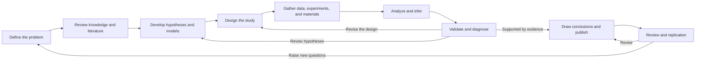
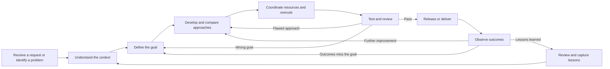
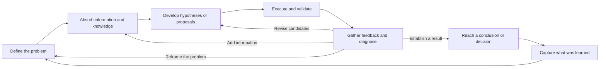

Generative AI is reducing the cost of cognitive work: organizing information, generating possibilities, writing code, and working through plans. Activities that once depended on individual experience and time can now become a shared process in which people and AI make ideas explicit, explore several paths at once, and revise them repeatedly. Seen alongside the expanding problem-solving capabilities of experimental, theoretical, computational, and data-intensive science, this shift can be understood as a fifth paradigm: the AI collaboration paradigm.

<!--more-->

What a large language model produces does not come with proof that it is true. Its output becomes credible only under particular conditions, when it is checked against sources, data, tools, and feedback from the real world. In research, AI-generated hypotheses need to be tested against evidence before they can contribute to reliable understanding. At work, AI-generated proposals need shorter cycles of validation and feedback before they can support practical decisions within the time, resources, and risks a project allows. When generating content is no longer the scarce resource, the quality of collaboration depends on how many meaningful validation cycles we can sustain, while keeping evidence, limits, and final responsibility in view.

## Traditional problem solving

Here, "traditional" refers to ways of working in which generative AI has not yet entered the cognitive work of defining problems, organizing knowledge, proposing possibilities, and judging results. Conventional tools can help people search, calculate, record, and execute, but researchers and project teams still have to do that cognitive work themselves.

Research and work projects pursue somewhat different outcomes. Research aims to develop understanding that stands up to scrutiny; projects aim to achieve results that can be verified under real-world constraints. Both, however, begin with incomplete information and an uncertain path. They move through defining a problem, organizing information, developing possible answers, testing them, and making revisions.

### Research

Research often begins with something that has not yet been adequately explained. Researchers start with a broad phenomenon or question, gradually identifying what they are studying, the central concepts, and the scope of the problem. They search and read the literature to understand relevant theories, methods, findings, and disputes. From there, they formulate research propositions, develop hypotheses and models, and choose appropriate ways to test them. They may gather evidence through observation or experiments, assess competing explanations by analyzing data or source material, or test theoretical propositions through formal proof. Finally, they bring the evidence or arguments together into a conclusion, stating the conditions under which it holds and how far it applies.

A research conclusion is a provisional judgment based on the evidence currently available. New evidence can change that judgment. Counterexamples may weaken a hypothesis, and failures to replicate a result may expose problems in the design or analysis. Researchers need to revisit their questions, hypotheses, and methods in light of those findings, revising the conclusion or beginning another study when necessary. Research should therefore continue beyond a conclusion or publication, building more reliable understanding through ongoing testing and revision.





This process advances understanding through repeated testing, but every cycle requires substantial thought and practical effort. Its main limitations include:

- **Absorbing knowledge takes sustained effort.** A search can find material, but deciding whether it is relevant, whether a claim carries over to a new setting, and whether evidence conflicts still requires extensive reading and knowledge of the field. With so much research being published and updated, one person can rarely identify every theory, finding, or method that might matter to a question in time.
- **Questions and methods are shaped by what researchers already know.** Their background and experience influence what they ask and how they investigate it. Theories and methods scattered across other disciplines and research traditions may be overlooked or discovered only later.
- **It is difficult to explore the full range of hypotheses.** Developing even one hypothesis that can be discussed and tested takes considerable reading, reasoning, and writing. With limited resources, researchers tend to prioritize a few directions, making it easier to become locked into early judgments and familiar frameworks.
- **Research design depends on both explicit rules and tacit experience.** Choosing variables, deciding what to control, setting acceptable error levels, and balancing rigor with feasibility all require methodological knowledge as well as judgment built over time.
- **Validation, replication, and revision are expensive.** Collecting data, running experiments, reproducing code, and checking counterexamples all take time and resources. The later a problem is discovered, the more costly it usually becomes to revisit the hypothesis or design.
- **Knowledge of the process is hard to preserve.** Why a paper was included or excluded, why a hypothesis was abandoned, or why a parameter was set a certain way can be valuable to later work. Yet these judgments often remain scattered across notes, code, and personal memory, with little room for them in the final publication.

Together, these limitations determine how many paths a study can examine at once, how many errors it can rule out before committing substantial resources, and how many rounds of revision informed by evidence it can complete in the available time. Information is not the only scarce resource in traditional research. So is the **capacity to turn information into questions, hypotheses, and research designs**.

### Work projects

Work projects have a different aim: to deliver product, operational, or business results within limits on time, resources, technology, and organizational scope. A project may arise from an external change or an internal judgment, but it rarely arrives as a fully defined problem. More often, problems, requests, and proposed solutions are mixed together. The team receives a task such as "build a feature", "run a campaign", or "improve a metric".

Teams usually begin by gathering context from user feedback, business data, market information, and their own experience. They then define goals, develop a plan, and assess the investment required. Once a plan is chosen, they coordinate resources, schedule the work, develop or execute it, test and approve the result, and release or deliver it. They then use outcome data to assess its effect. The process does not end there: testing may expose a problem with the goal or plan, live results may challenge the original judgment, and lessons from a retrospective may shape how the next problem is recognized.





This process improves a plan through iteration, but every round depends on requirements clarification, design, resource coordination, development and integration, testing, and release. Waiting and rework can be costly. The main limitations include:

- **The stated task can obscure the real problem.** Work often enters the process as a request or task describing what to do, without explaining why or what outcome should change. Unless the team looks for the user or business problem behind it, they may deliver exactly what was requested without improving the result that actually matters.
- **Information is scattered and varies in kind.** User feedback, behavioral data, commercial goals, system status, and market signals each describe part of the problem. They may conflict or differ in samples, measurement definitions, and timing. The team has to interpret them in context.
- **Experience and time limit the range of options.** A workable proposal needs more than an idea: costs, benefits, dependencies, risks, and a way to validate it all need to be worked out. Teams can usually assess only a few options in depth. Once one reaches review and scheduling, attention tends to shift toward refining and executing it, leaving other paths insufficiently explored.
- **Coordination across roles creates gaps in understanding.** Product, engineering, design, testing, operations, and data teams each hold different information. When it is shared too late or incompletely, their understanding of the problem, goals, and reasons for decisions can diverge, causing repeated discussions, rework, or outcomes that miss expectations.
- **Iteration may lag behind changes in the environment.** Even agile delivery has dependencies. A delay or rework in one stage postpones real feedback. Meanwhile, user needs, markets, and competitors keep changing. When the iteration cycle is longer than the pace of change, a completed feature may no longer have the value originally expected.
- **Validation often comes late.** Testing can establish whether a delivery matches its design, but it cannot establish whether the design solves the user or business problem. Much of the decisive feedback arrives only in a live setting, after resources and schedules have already been committed again, making correction more expensive.
- **Results are easier to retain than the reasoning behind them.** Final documents, code, and metrics usually survive. Why one approach was chosen, which assumptions were rejected, and what feedback changed a decision often remain buried in meetings and chat histories.

Together, these limitations determine how many options a project can assess at once, how many mistaken judgments it can rule out before committing resources, and how many iterations informed by real feedback it can complete while the opportunity remains open. Time and staffing are not the only scarce resources. So is the **judgment needed to turn scattered user, business, and market information into a clear problem and comparable options**.

### A shared cycle

Research seeks reliable understanding; work projects seek verifiable outcomes. Their standards differ, but they share a basic problem-solving cycle:





The cycle is shared, but each stage takes a different form:



| Dimension | Research | Work projects |
|:----:|:--------:|:--------:|
| Starting point | A phenomenon, contradiction, or research question | A user problem, business goal, or practical need |
| Candidates | Hypotheses, models, explanations, and methods | Goals, proposals, strategies, and courses of action |
| External checks | Literature, data, experiments, proofs, and replication | User feedback, business metrics, system status, and resource constraints |
| Outcome | Defensible knowledge claims with a stated scope | Actionable decisions and deliverables that can be assessed against agreed criteria |



Before generative AI became widely available, producing possible answers was expensive and validation resources were limited. Advancing step by step and settling on a direction early were reasonable compromises. The central bottleneck was the **cost of developing ideas and revising them in response to feedback**: every round relied heavily on human knowledge, experienced judgment, and substantial time. Search, statistical, development, and collaboration tools improved individual stages, but none connected the cognitive work across the whole process. People still had to carry that thread themselves.

## How problem solving evolves

The ways people solve problems have never stood still. Changes in what we study, how we observe it, how much knowledge exists, and what we can compute give us more than new tools. They also change how questions are posed, evidence is obtained, explanations are developed, and conclusions are tested. This happens in both research and work. As a new capability enters the existing cycle, it removes some limitations and moves the main bottleneck elsewhere.

Jim Gray described four forms of scientific research: experimental, theoretical, computational, and data-intensive science. This is a useful way to understand how different capabilities enter research, but it should not be treated as a strict chronology of scientific history. Observation and theory have always depended on each other, and computation and data did not belong to separate eras. An evolving paradigm adds capabilities to the existing research cycle rather than simply rejecting or replacing earlier methods.

### Four established paradigms

#### First paradigm: experimental science

Experimental science centers on observation, measurement, and repeatable tests. By controlling conditions, recording results, and repeating experiments, researchers move judgments about the world beyond personal experience, intuition, and authority toward external evidence that others can reproduce. Experiments can show what happened under particular conditions, but do not automatically explain how different facts relate, why something happened, or how to infer outcomes that have not yet been observed.

Experimental science addressed the lack of external checks on factual claims. In doing so, it exposed a new bottleneck: **the growing body of observations needed to be organized into explanations and predictions**.

#### Second paradigm: theoretical science

Theoretical science centers on concepts, logic, mathematics, and models. It brings scattered observations into a connected explanatory structure, allowing researchers to derive new results from known facts and make testable predictions before observations are available.

Theoretical science overcame the difficulty of relating isolated facts through a common explanation. But when a problem involves many variables, nonlinear relationships, or complex dynamics, even known laws may be too difficult to work through by hand. The bottleneck becomes this: **many problems that can be expressed in theory are too complex for people to calculate unaided**.

#### Third paradigm: computational science

Computational science brings mathematical models, numerical methods, algorithms, and computers into research. Researchers can turn theoretical relationships into executable calculations, simulate a system's evolution, adjust parameters, and compare scenarios. Problems once constrained by manual calculation gain new room for exploration.

Once machines can carry out complex calculations, the volume of data begins to exceed what people can read and conventional methods can process. The central difficulty shifts from calculation itself to **finding patterns and questions in all that data that are worth explaining**.

#### Fourth paradigm: data-intensive science

Data-intensive science builds on collecting, storing, processing, connecting, and finding patterns in large amounts of data. Researchers can begin with a hypothesis and seek evidence, but they can also start by identifying correlations, anomalies, structures, and differences between groups, then use these to develop new questions and hypotheses.

As data, papers, models, code, and analytical tools all grow rapidly, the difficulty extends beyond any single stage to the cognitive process as a whole. Researchers may have more material and computing power than ever, yet lack the time to absorb the literature, compare conflicting evidence, identify methods that might transfer, develop enough competing hypotheses, design tests for different directions, and continually bring scattered feedback back into the research process.

Pattern discovery has opened new possibilities, but the difficulty has moved up a level: **the scarce resource is increasingly the capacity to organize materials and methods into sound judgments**.

### How work evolved

Work projects have not been divided into paradigms in quite the same way, but they have followed a similar pattern of expanding capabilities and shifting bottlenecks.

Early ways of working depended almost entirely on personal experience and manual effort. Judgment relied on memory and intuition, knowledge passed by word of mouth, and the scope of work was limited by individual time and experience. Mechanization and assembly lines transferred some physical work to machines and improved local efficiency. But people still had to connect the stages, move information between them, and handle exceptions. The bottleneck shifted from slow execution to poor coordination.

Office automation, ERP, CRM, and BI systems then transferred more information handling and data processing to software, giving decisions a stronger basis in data. Yet each system covered only part of the process. People still had to reconcile definitions across systems, share information across roles, and turn data into judgment. The bottleneck shifted from incomplete information to making sense of scattered information.

A/B testing, staged rollouts, and lean experiments further shortened validation in the internet era. Each addition made part of the process faster or more accurate, while people still had to connect problem definition, information organization, idea generation, interpretation, and revision from beginning to end.

### Fifth paradigm: AI collaboration

AI was initially also seen as an analytical tool within data-intensive science: it learned patterns from large datasets for classification, prediction, recognition, and optimization, through statistical machine learning. The development of large language models and intelligent agents has begun to take AI beyond individual analytical tasks and into a longer stretch of problem solving. It can help articulate questions, organize literature, condense knowledge, generate hypotheses, compare proposals, write code, interpret results, assist with validation, and keep records. It can then revise its output in response to feedback.

This change reflects progress in both model performance and interaction. AI can now sustain some cognitive work through a more general and accessible interface. Conventional tools usually require people to specify a task before carrying out a bounded function. AI can help clarify a goal that is still taking shape, suggest several paths when none has been settled on, and keep organizing, generating, comparing, and revising around the same objective. It is beginning to serve as a means of coordinating problem solving across stages.

This emerging way of working is what this series calls the **fifth paradigm**, or the **AI collaboration paradigm**. It expands our **capacity to organize thinking and generate possible paths forward**. Researchers and knowledge workers can absorb more material in less time, explore several hypotheses, methods, and proposals at once, and quickly revise them when feedback arrives. Work that was once limited by one person's time and knowledge can increasingly be made explicit and developed through ongoing collaboration with AI.

This does not mean AI has replaced human understanding, or that generated content is inherently reliable. Possibilities can emerge faster without becoming valid simply because they are plentiful or quick to produce. Whether knowledge claims, code, analyses, or proposals can be used still depends on literature, data, experiments, proofs, tests, and real-world feedback. AI lowers some of the cost of cognitive work; validation, judgment, limits, and responsibility still rest with people. The fifth paradigm does not rewrite the basic principles of research. Models can broaden exploration and accelerate hypothesis generation, while observation, explanation, reasoning, and testing still depend on experiment, theory, computation, and data.

### New capabilities, new bottlenecks

The five paradigms can be compared in terms of the capabilities they add and the bottlenecks they reveal:



| Paradigm | Main capability added | Limitation addressed | Bottleneck revealed |
|:----:|:--------------:|:--------------:|:----------------:|
| Experimental science | Observation, measurement, and testing | Judgments lack external evidence | Facts need to be organized and explained |
| Theoretical science | Abstraction, explanation, and prediction | Facts remain isolated | Complex systems are difficult to work through by hand |
| Computational science | Modeling, simulation, and calculation | Human calculation is too limited | Large volumes of data are difficult to process effectively |
| Data-intensive science | Large-scale analysis and discovery | People cannot process enough data | Knowledge, methods, and tools are difficult to organize |
| AI collaboration | Organizing cognitive work and generating possibilities | Exploring paths and developing ideas is expensive | Validation, judgment, limits, and responsibility become the main constraints |



Research in the fifth paradigm may still depend on experimental facts, theoretical structures, computation, and data evidence at the same time. AI helps bring those capabilities into one problem-solving cycle more quickly, while helping people develop, compare, and revise paths that would otherwise be difficult to consider together.

In research and complex work, hypotheses, code drafts, analytical frameworks, and variations on a proposal can now be produced quickly. The ability to generate them is no longer the only constraint. Whether they can become part of a defensible body of evidence or a sound decision matters increasingly.

## New ways of thinking and working

The most visible effect of the fifth paradigm in everyday research and work is faster production of text, code, charts, and plans. Speed, however, is only the surface. A deeper change is taking place in the basic unit of problem solving: a few finished products are giving way to a continuing stream of possibilities that can be examined, rejected, and revised.

"Cognitive production" here means more than producing knowledge. Hypotheses, explanations, and research designs, as well as problem definitions, analytical frameworks, and business proposals, are all products of thought awaiting judgment. They may become knowledge or decisions, or they may be rejected during validation. AI is changing how these intermediate products are formed and developed.

### From tools to collaboration

Conventional digital tools usually carry out clearly bounded tasks. Search engines find material, databases store and query data, statistical software runs a specified analysis, development tools turn explicit logic into programs, and project management systems track tasks and progress. They improve individual stages without organizing the whole problem-solving process. People first have to define the problem, choose methods, organize materials, and design the steps before calling on a tool for one part of the work.

AI can participate in a longer stretch of that process through a general interface. Someone can describe a question that is not yet fully formed, then clarify its subject, goals, and constraints through follow-up discussion. Scattered material can be organized into concepts, claims, and disagreements, and an initial direction can be developed into several hypotheses, methods, or proposals. When new feedback arrives, the candidates can be reorganized and revised.

AI is beginning to connect cognitive activities that people previously had to link by hand. Combined with search, databases, code execution, statistical analysis, and document systems, it can help absorb information, generate possibilities, run preliminary tests, and organize feedback around the same goal. Tools still supply specific capabilities; AI increasingly helps carry context and intermediate work between them.

This does not make problem solving automatic. Someone still has to ensure that the goal is clear, the material is reliable, the steps make sense, and the results are properly assessed. What changes is that processes once confined to individual thought, meetings, and repeated manual organization can become visible and available for joint work.

### Three shifts in how we work

#### Making ideas visible

In traditional problem solving, much of the thinking stays in people's heads or in scattered conversations. Why a direction seems worth pursuing, why another explanation was rejected, or what assumptions an analysis still depends on may only be partly written down when a formal document is produced. Turning an idea into a coherent account that others can inspect takes effort. Many intermediate judgments are abandoned or forgotten before they can be expressed.

AI lowers the cost of turning a vague idea into something that can be examined. Researchers can develop an early interest into questions, conceptual relationships, and tentative hypotheses. Teams can organize scattered requests, user feedback, and business constraints into a problem statement, a proposal, and acceptance criteria. Analysts can turn a line of explanation into query logic, analytical steps, and draft charts. Subjects, assumptions, and relationships that were implicit become available for discussion earlier.

Making thinking explicit gives it a form that others can examine. Its value goes well beyond producing more words. Once an idea is expressed, it is easier to compare with other explanations, expose confused concepts, missing assumptions, and gaps in evidence, and share across a team. An AI-generated draft can serve as an intermediate expression of thought, helping people see sooner what they have actually proposed.

Saving conversations and versions, however, does not by itself create reusable knowledge. Sources, constraints, reasons for choices, and validation results need to be deliberately extracted before a mass of records becomes something useful for future work.

#### Exploring paths in parallel

When it is expensive to develop even one complete option, research and projects tend to settle on a direction early. Researchers can usually focus on only a few hypotheses, and teams struggle to develop several proposals far enough to compare them properly. The first plausible explanation or workable plan easily captures resources and attention. Other paths may be just as good; there may simply be too little capacity to develop them.

AI can quickly suggest several possibilities for the same problem and help spell out their assumptions, potential evidence, implementation requirements, and risks. Researchers can develop competing explanations, theoretical approaches, and study designs side by side. Teams can compare feature development, process improvements, operational changes, low-cost experiments, and even taking no action within a common framework. Alternatives that were once too costly to articulate can be considered earlier.

The value of parallel exploration goes beyond having more ideas. A useful set of candidates contains paths that can actually be distinguished: they depend on different assumptions, predict different results, need different evidence, or involve real trade-offs in cost, benefit, and risk. If several candidates merely rephrase the same idea, having more of them adds little understanding. It may instead increase the filtering burden and overwhelm people with polished but barely different versions. Parallel exploration therefore needs criteria for comparison: which candidates deserve the next step, what evidence could distinguish them, whether validation is affordable, and how much could be learned from failure. AI broadens the visible range; people still decide where to spend limited validation resources.

#### Shorter feedback cycles

Making ideas explicit allows them to be examined, and developing them in parallel allows them to be compared. When new material, data, or real-world feedback arrives, AI can also incorporate the required changes quickly. Problem solving can move from a few long attempts toward more frequent rounds of generation, checking, validation, and revision.

Frequent feedback requires new evidence and constraints to keep entering the context. If the reason for the last failure is never explained and AI is simply asked to "write another version" or "try a different plan", the result may amount to another sample from the same distribution. The number of versions grows, but the problem has not become more focused and understanding has not advanced.

Each productive iteration needs feedback capable of changing the next one. That may come from original literature or research data, code execution, test results, user feedback, business metrics, and system status. It may also come from a person's reasoned objection about concepts, logic, cost, or risk. What matters is turning feedback into new facts, constraints, and reasons to exclude certain paths, so the next set of candidates occupies a narrower, clearer space.

AI makes revision more responsive; it does not directly make a conclusion more likely to hold. Responding to one piece of feedback once meant rereading material, rewriting code, reorganizing documents, and coordinating several people. Some of that work can now happen faster, making more rounds of investigation possible in the same time.

### From finished work to candidate streams

Traditional cognitive work is usually organized around finished products: papers, models, and formal conclusions in research; reports, proposals, features, and releases at work. Because developing a complete version costs so much, people tend to concentrate on a few paths, leaving review, testing, or observation of outcomes until relatively late.

As AI reduces the cost of generation, the basic unit of problem solving begins to change. Complete, fluent versions are no longer scarce. Attention shifts to a stream of candidates developed from the problem, checked, rejected, or revised. A paragraph in a paper, a code draft, an interpretation of data, and a business proposal are different forms of such candidates.

Candidates pass through different states:



| State | Central question | Possible action |
|:----:|:--------:|:----------:|
| Generation | Is there a candidate worth discussing? | Add assumptions, remove duplicates, and clarify differences |
| Checking | Do the structure, logic, and method basically hold up? | Look for contradictions, omissions, and claims that cannot be tested |
| Anchoring | Has it been checked against original sources, data, execution results, or real-world feedback? | Verify sources, run code, conduct trials, or collect feedback |
| Selection | Is the evidence sufficient to justify further investment or adoption? | Accept, revise, qualify the claim, or abandon it |
| Learning and retention | Can the result and the reasons for the decision inform the next round? | Preserve sources, constraints, reasons for failure, and limits of applicability |



These states do not form a strictly linear sequence. Feedback between checking, anchoring, and retaining what was learned creates a recurring process.

This change does not diminish the importance of final results. It raises expectations for how they are reached. Failed paths, reasons for revisions, and limits of evidence, once easily hidden by the final document, become things that need to be managed throughout the stream of candidates. The final result shows what was kept; the process shows why it was kept and why other paths were set aside.

### Validation and judgment

The cost of developing ideas is beginning to fall. Researchers can form hypotheses and draft analyses faster; teams can develop proposals and delivery materials more quickly. Individuals can draw on knowledge and technical capabilities they once struggled to use alone. More problems become accessible, and work can begin sooner.

But a new imbalance emerges between production and validation. When candidates were few, validation could focus on a small number of finished products. If it remains concentrated at the end now, large amounts of unchecked intermediate work will accumulate. That work may look complete, professional, and internally consistent without having comparable evidence behind it. The easier generation becomes, the greater the risk of mistaking quality of expression for quality of thought. Generation has expanded dramatically, while validation has not kept pace. The bottleneck is shifting toward selection and judgment.
