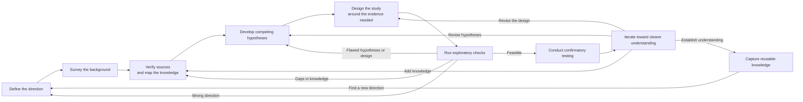
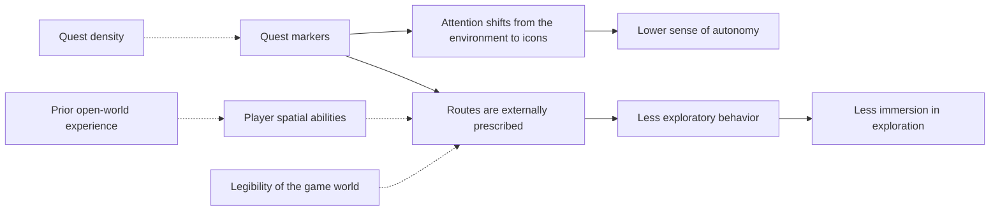
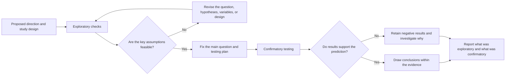

Research aims to develop understanding that is supported by evidence and can withstand scrutiny. AI reduces the effort required to survey literature, develop hypotheses, and compare methods, allowing researchers to test key assumptions earlier and revise the next round of work faster. Until they have been checked against real sources and original data, AI-generated research questions, proposed mechanisms, and literature leads remain candidates awaiting validation. Broad exploration without source verification, or fluent writing without sound evidence, does not produce reliable understanding.

<!--more-->

This way of working changes the rhythm of exploration and convergence. AI helps researchers see several paths earlier, while people remain responsible for the value of the question, standards of evidence, and requirements for validation. Exploration can move quickly; conclusions still need to meet the standards of the relevant discipline.

## Workflow and example

The workflow here is primarily intended for hypothesis-driven research that can be tested with data or experiments, particularly empirical, causal, and data-intensive questions. Mathematics and purely theoretical research, qualitative research, the humanities, and some forms of engineering exploration may not fit neatly into an "exploratory–confirmatory" sequence. They can still draw on its approaches to breaking down questions, developing possibilities, managing sources, searching for counterexamples, and keeping records. Evidence may instead take the form of formal proof, theoretical consistency, interpretation of source material, case comparison, or prototype testing. The process needs to fit the subject and the discipline's practices.

A hypothetical research question will run through this article:

Do quest markers in open-world games reduce players' sense of autonomy and their immersion in exploration?
{:.info}

This question is used to illustrate the process. It does not mean that the relevant literature has been verified, real data collected, or research conclusions established for this article. The mechanisms, variables, and methods in the example are all possibilities to be tested and would need to be examined afresh in an actual study.

The full process can be organized into nine connected stages:





The workflow focuses on four questions: how candidates are generated, where their support comes from, what could distinguish them, and how results change the next round. Disciplines differ in the form their evidence takes and how their steps overlap, but these four questions are useful to record across settings.

## Direction, background, and the knowledge map

### Setting the direction

Research can begin with an incomplete direction, but it should arise from a practical or theoretical issue rather than merely sounding novel. Defining the direction means asking what has been observed, who or what is being studied, under what conditions the problem occurs, why it is worth investigating, and what is still speculation.

In this example, the initial direction might come from an observation: in the same open-world game, players who turn markers off seem more willing to leave the main route and explore, while those who leave them on tend to follow the icons straight to their goals. At this point, "quest markers weaken autonomy" is a tentative idea to clarify, still far from a well-defined research question or conclusion.

Researchers need at least provisional answers on several dimensions:

- Does "quest marker" mean a destination icon on the map, a route guidance line, a quest tracker, or all of these? Is the treatment defined as markers on versus off, or as a degree of guidance?
- Are "sense of autonomy" and "immersion in exploration" one construct or two? The former comes from self-determination theory; the latter is more concerned with spatial experience. They may be related without being identical.
- Are the participants novices or experienced players, recruited volunteers or the entire active player base?
- Does the study focus on onboarding, the exploration phase, or the whole game?
- Is the aim to describe an association, identify a mechanism, or estimate the causal effect of markers on autonomy?

AI can suggest follow-up questions, identify conceptual ambiguity, and propose an initial scope. But novelty as presented by a model is not the same as research value. Researchers still need to consider real observations, knowledge of the field, existing disputes, and available evidence before deciding whether the question deserves further work.

This stage should produce a revisable statement of direction: what to study, why it matters, provisional definitions, and the most important unknowns. A complete study plan is not yet necessary.

### Surveying the field

Once the direction is tentatively clear, AI can quickly open up the surrounding knowledge and methods. It can expand search terms, identify how different disciplines describe the same phenomenon, organize possible mechanisms, data sources, and methods, and flag neighboring questions that might affect the current thinking.

For this example, the background survey might cover:

- Autonomy as a basic psychological need in self-determination theory.
- Critiques of "following the dots", waypoint fatigue, and GPS-style play in open-world design.
- Environmental legibility, wayfinding, and exploratory behavior in navigation and spatial cognition research.
- The autonomy subscale of Player Experience of Need Satisfaction (PENS), along with measures of immersion.
- Research on real-world GPS use and spatial cognition as a possible reference for mechanisms.
- Random assignment, manipulation checks, and methods for handling selection effects in experimental design and causal inference.

AI can broaden the search and help researchers see several possible relationships among quest markers, attention, and autonomy. It can generate keyword combinations, names of relevant theories, and lists of measures, making it easier to identify areas that need deeper reading.

Model-generated bibliographic information, however, is only a search lead. Researchers need to use actual literature databases to establish whether a source exists and whether its evidence supports the model's summary. A background survey aims for coverage; it does not establish the conclusion.

This stage can also help stop or redirect an infeasible line of inquiry early. If the question has already been adequately answered, central concepts cannot be operationalized, or essential data are unavailable, stopping or adjusting can prevent investment in a path with little value or prospect of success.

### Checking sources and mapping knowledge

A background survey produces material, but a pile of material is not yet knowledge. Researchers need to organize literature, facts, theories, methods, and disputes into a traceable structure. What claims currently exist? What evidence supports each one? Under what conditions does it apply? How do the claims relate?

The central account in this example can be broken into the following proposed chain of evidence:





Each relationship needs separate verification; the diagram is not an established causal model. Showing that markers draw attention away from the environment does not establish that autonomy declines. Externally prescribed routes do not automatically mean reduced immersion in exploration. Spatial ability, world legibility, and quest density may affect both reliance on markers and the sense of autonomy, creating confounding.

Each node in the knowledge map should connect to a real source, with records that cover, where possible:

- What the original claim says, rather than how the model summarizes it.
- The population, sample, variables, and methods used.
- Whether the evidence supports an association, a mechanism, or a causal conclusion.
- The regions, populations, and time periods to which the result applies.
- Contrary findings, unresolved disputes, and methodological limits.
- How the current study intends to use the evidence.

AI can help extract possible claims, group themes, compare study designs, and identify apparent conflicts. The purpose of the map is to expose missing links in the evidence. Complexity alone adds no value.

## Competing hypotheses and study design

### Competing hypotheses

Once the knowledge map begins to take shape, researchers should resist treating the most intuitive explanation as the only path. AI's ability to generate possibilities is better used to develop competing hypotheses that evidence could distinguish. Researchers can then remove those that repeat the same idea, fail logically, cannot be tested, or have little value.

This example allows at least the following candidates:



| Hypothesis | Proposed mechanism | Observable distinction | Main alternative explanation |
|:--------:|:--------:|:--------------:|:--------------:|
| Attention shift | Icons draw attention away from the environment | Visible icons have an effect even when they do not prescribe a route | The effect may come from route prescription rather than attention itself |
| Route prescription | Markers specify the "correct route" | Players without markers pause longer at junctions and backtrack more | The difference may reflect spatial ability rather than autonomy |
| Discovery of ability | Without markers, players discover they can navigate | Autonomy rises over time in the no-marker group | The increase may come from familiarity rather than perceived ability |
| Reversal through frustration | Some players become lost and frustrated without markers | The direction of the effect varies with spatial ability | Subgroup results may reflect small samples or multiple comparisons |
| Selection effect | People who enjoy autonomous exploration already turn markers off | Turning markers off is self-selected, so the groups are no longer comparable | Assigning default settings removes this selection route |
| Proxy for quest density | Markers stand in for quest density | The effect weakens after controlling for quest density | Some aspects of markers and density may remain inseparable |



A list of hypotheses is useful only if it guides testing. Each needs its assumptions, predictions, potentially weakening evidence, and validation cost spelled out. There should also be real competition between hypotheses: which explanations could the same result support, and what further evidence would distinguish them?

AI can help produce counterexamples, shift perspectives, and identify missing mechanisms. People need to distinguish synonyms from different hypotheses, identify observable differences, and assess whether a finding would matter even if it held. The set carried forward into study design should be limited, explicit, and open to challenge by evidence.

### Evidence-led study design

Study design should start with the evidence needed to distinguish the current hypotheses. It should not start with whatever analysis AI can generate or whatever model happens to be available. Different aims need different designs. Describing an association between markers and autonomy cannot directly answer whether markers cause autonomy to decline. Identifying mechanisms, estimating causal effects, and understanding individual experiences also require different material and methods.

The example may call for several kinds of evidence:

- Recruit players for a test, randomly assign them to markers-on and markers-off groups, and have them play for a fixed period.
- Use autonomy as the primary outcome, measured after play with the PENS autonomy subscale.
- Treat immersion scale scores and exploratory behavior—time at junctions, backtracking, and map-checking frequency—as secondary measures. Report them separately rather than folding them into the main conclusion.
- Consider prior open-world experience, spatial ability, playtime, and quest density as key potential confounders.
- If players can switch markers themselves, exposure to markers becomes self-selected rather than purely assigned. Assign the default setting and disable manual switching to remove this selection route.
- To distinguish attention shift from route prescription, add a third group with markers visible but route lines disabled.
- Use behavioral logs and interviews to understand why players deviate from a route or get stuck.

The question should guide the choice among randomized experiments, natural experiments, observational comparisons, or mixed methods. No single statistical model should be assumed to solve everything. A causal interpretation requires an explicit strategy for selection bias, confounding, and whether the manipulation works. If only a descriptive study is feasible, the question and conclusion should stay within that scope. Recruited players are not the full player population. Findings apply first to the sample; extending them to all players requires additional justification. This limitation should be stated when defining the study's scope.

AI can assist with data dictionaries, method comparisons, simulations, analysis code, variable checks, and counterexample design. Simulated data can help check whether the proposed model is identifiable and whether the code pipeline runs. Researchers still need to judge whether variables represent the intended concepts, data may be used lawfully, the sample supports claims about the target population, and the design permits the proposed strength of conclusion.

When research involves player behavior, questionnaires, and personal experiences, informed consent, privacy, anonymization, and ethics review belong in the design stage. They cannot be repaired as an afterthought at publication. AI-assisted data processing must also follow the relevant institutional, platform, and legal requirements.

## Exploratory and confirmatory testing

### Exploratory checks

A study design does not require an immediate commitment of all available resources. Low-cost checks with a high potential to inform the decision can first test the most vulnerable assumptions in the direction and design. These include whether the literature really supports the proposed mechanisms, whether data exist and can be obtained lawfully, whether variables are good enough, whether the sample size can support the analysis, whether code and data pipelines run, and whether small-scale material reveals obvious counterexamples.

In this example, early checks could prioritize:

- Whether the PENS autonomy subscale is sufficiently reliable in this game context.
- Whether the manipulation check succeeds—that is, whether players actually notice the marker setting.
- Whether the no-marker group can keep progressing without large numbers quitting because they are lost.
- Where the effect-size assumptions for sample-size estimation come from, and whether similar studies offer useful reference values.
- Whether proxies such as time at junctions and backtracking can be extracted consistently from logs.

These checks establish how the study might be made feasible. They may lead to revised variables, a narrower question, an abandoned mechanism, or redesigned data collection. Their flexibility also leaves them vulnerable to repeated experimentation and selective retention of results.

Exploratory checks must therefore be clearly distinguished from confirmatory testing:





AI accelerates code changes, comparisons of variables, and organization of results during exploration. It also increases the risk that unrecorded attempts will later be presented as tests planned in advance. Before confirmation begins, researchers need to state which analyses were exploratory and which hypotheses arose from seeing the results.

### Confirmatory testing

Once the key assumptions pass the preliminary checks, the study needs a confirmatory stage with more explicit standards. Before seeing the main results, researchers should fix, as far as possible, the core question, primary hypotheses, key variables, sample rules, analysis methods, and decision criteria. Different disciplines may record those commitments through preregistration, analysis plans, experimental protocols, proof frameworks, or other means.

Confirmatory work can still change because of data errors, equipment failure, or changing practical conditions. Changes need clear reasons and records, and their results should be reported separately from those of the original plan. New explanations or analyses suggested by AI may inform further exploration, but must not quietly replace the original confirmatory goal simply because they fit the current data better.

In this example, the confirmatory stage needs particular attention to:

- Whether the main conclusion rests on the prespecified autonomy comparison rather than a subgroup chosen after seeing the results.
- Whether manipulation checks, dropout, and missing data have been handled appropriately.
- Whether results are stable across reasonable choices of scale items, sample boundaries, and model specifications.
- Whether multiple comparisons, subgroup analyses, and interpretations of heterogeneous effects are controlled.
- Whether assigning default settings has actually removed the selection effect, rather than leaving it unexamined.
- Whether alternative explanations, such as markers acting as a proxy for quest density, still account for the same result.
- Whether analysis code, questionnaire data, and key outputs can be checked.
- Whether the wording of the conclusion exceeds what the design supports, or mistakes a behavioral proxy for autonomy itself.

AI is well suited to assisting with planned analyses, generating tests, reviewing code, comparing results, and organizing anomalies. Code must be checked by running it; statistical results against data and methods; qualitative interpretations against the material; and theoretical reasoning through arguments others can inspect. Independent researchers, different methods, or new data can be used for further checks where needed.

Confirmatory testing can produce useful knowledge even when it does not support the original hypothesis, supports only part of a mechanism, or reveals inadequate measurement. Those findings should change the knowledge map and future questions. They should not disappear from the account simply because they were unexpected.

## Iteration and knowledge retention

### Iterating toward clarity

Research iteration should reduce uncertainty in response to evidence. Repeatedly asking AI for another version until a satisfying answer appears does not accomplish that. Each round should help establish whether the question remains worth pursuing, which facts are relatively stable, which hypotheses have weakened, which methods are unsuitable, and which next action would be most informative.

If preliminary checks show that a scale is unreliable in this setting, the work should return to design to replace or revise the measure. If confirmatory results cannot distinguish attention shift from route prescription, a third group or more discriminating evidence may be needed. If the result applies only to players with particular spatial abilities or at a particular quest density, the conclusion needs to narrow accordingly. Ruling out a direction, rejecting a hypothesis, or finding a method infeasible all reduce the space that research needs to explore.

AI can compare versions, track hypotheses, organize supporting and opposing evidence, and suggest next steps under the new constraints. The research question and external results must still determine where iteration goes.

Convergence does not mean reaching an answer that will never change. It means arriving at the clearest understanding the current evidence can support: which claims are relatively dependable, which hold only under particular conditions, which still lack evidence that distinguishes competing explanations, and what new result could change the present judgment.

### Capturing knowledge

A study should leave more than a paper, report, or conclusion. It should also preserve the reasoning through which an initial direction gradually became clearer. In this example, the record should include at least:

- Where the direction came from and how the problem definition changed.
- Search strategies, original sources, and the knowledge map.
- Candidate hypotheses, evidence for and against them, and conditions that could falsify them.
- Versions of the game, marker settings, scales, data, code, prompts, and execution environment.
- The boundary between exploratory attempts and confirmatory analyses.
- Abandoned paths, reasons for failure, and the basis for design changes.
- The scope of the conclusions—which players and which stage of play—along with unresolved questions and conditions requiring further observation.

Although retaining knowledge appears at the end of the workflow, recordkeeping needs to run throughout the study. Trying to recall the initial hypotheses and reasons for analytical changes only after reaching a conclusion can produce a retrospective account much tidier than the real process. AI can maintain logs, organize version differences, and structure records. Researchers remain responsible for whether those records are complete and accurately represent the decisions made.

Useful records should allow later studies to draw on established facts, effective methods, reasons for failure, and the limits of previous judgments. Saving every conversation and file unchanged does not achieve that by itself. Even a study that fails to find the expected result may leave reusable data-processing methods, rejected hypotheses, and a more precise problem definition, giving the next study a better starting point.

## Human–AI roles

The nine stages can be understood through three complementary contributions: AI develops and organizes candidates; external material and tools supply evidence; and people are responsible for direction, judgment, and consequences.



| Stage | AI's main role | People's main responsibility | Key external anchors |
|:----:|:--------------:|:------------:|:--------------:|
| Define the direction | Suggest questions, identify ambiguity, and add perspectives | Judge the question's value, subject, and scope | Real observations, theoretical disputes, and practical needs |
| Survey the background | Expand searches, summarize fields, and propose possibilities | Choose where to look deeper and recognize unproductive exploration | Literature databases and material from the field |
| Map the knowledge | Extract claims, group evidence, and identify conflicts | Verify sources and assess evidence and applicability | Original papers, data, and methods |
| Develop competing hypotheses | Generate explanations, counterexamples, and observable predictions | Remove duplicates, select hypotheses, and establish real competition | Theoretical reasoning and existing evidence |
| Design the study | Compare methods, simulate workflows, and assist coding | Assess identifiability, ethics, and the strength of permissible conclusions | Available data, methodological standards, and ethical requirements |
| Exploratory checks | Run preliminary tests, check code, and organize anomalies | Separate exploration from confirmation and decide whether to continue | Small-scale data, execution results, and feasibility feedback |
| Confirmatory testing | Run planned analyses and assist review | Honor analytical commitments and interpret results within their limits | Formal study data, experiments, proofs, and independent checks |
| Iterate toward clarity | Compare versions, organize failures, and suggest next steps | Decide which level feedback should return to | Negative results, counterexamples, and new evidence |
| Capture knowledge | Maintain logs and organize versions and material | Ensure traceability, reuse, and honest disclosure | Sources, code, data, and decision records |



This workflow organizes exploration that was once expensive and easily lost. It brings competing paths into view earlier, exposes fragile assumptions sooner, separates exploration from confirmation more clearly, and lets each round of feedback reduce uncertainty. Its purpose goes well beyond writing a research report faster. AI expands the breadth and pace of the research cycle, external evidence determines whether candidates hold up, and people remain responsible for the value of the research, the limits of its methods, and its final conclusions.

Formal academic research must follow the ethics, data governance, authorship practices, peer review, and replication requirements of its discipline and institution. Personal research outside formal publication still needs source verification and care about the scope of conclusions. In either setting, reliable understanding requires testing candidates against evidence, a process capable of exposing errors, and a clear account of where the conclusions hold.
