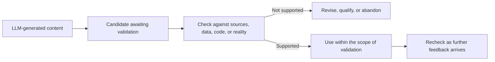
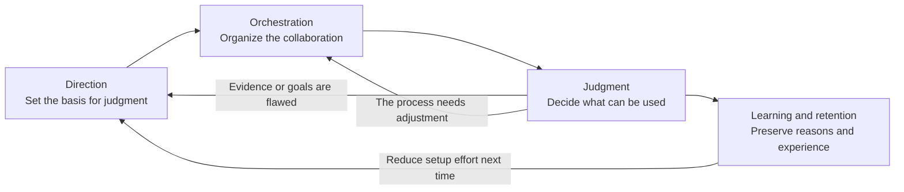
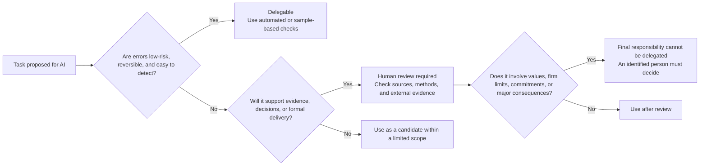
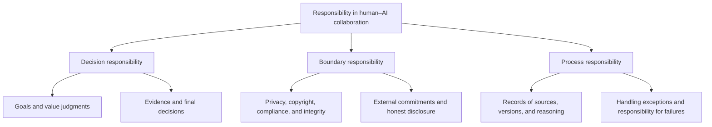

Generative AI can quickly produce factual statements, research hypotheses, code, and business proposals. Its output often looks complete, coherent, and plausible. But a complete account is not necessarily one we can rely on. The model has organized content into readable text; it has not supplied independently verifiable grounds for believing it.

<!--more-->

Independent verification supports reliance only within a particular scope, defined by the assumptions, materials, and purposes it covers. Even within a single passage, verified and unverified claims do not have the same standing. Once a result is put to use, its consequences cannot be attributed solely to the process that generated it. Someone must be responsible for setting the goal, deciding how far the result can be used, and bearing responsibility if it fails.

## LLMs and the limits of trust

LLMs can generate factual statements, research hypotheses, interpretations of data, code, and business proposals. Their output usually looks complete, coherent, and plausible. Producing a complete answer, however, does not prove that it is correct. The generation process provides no accompanying proof of truth. In discussing the limits of trust in LLMs, the useful question is where their output belongs in problem solving and what validation it needs before it can be used. Whether a model has "real intelligence" is not the issue here.

### Generation and truth

Most mainstream LLMs today are built on the Transformer architecture. They generate subsequent content step by step from the existing context. Attention connects information within that context, helping the model stay on topic, track conditions, and organize longer responses. Training reinforces the plausibility of generated content in context, rather than its correspondence with external facts.

An answer can therefore be clearly structured, use the right terminology, and present a coherent argument while resting on incorrect facts, incomplete material, or invalid assumptions.

### Why AI output can mislead

The difficulty is that credibility cannot be read directly from the output. Visible reasoning, internal consistency, and a confident tone do not guarantee correctness.

The knowledge a model draws on has limits. Training material cannot cover every fact and may contain errors, contradictions, biases, and outdated information. When asked about recent events, a narrow field, information known only within an organization, or something that depends on conditions on the ground, a model may fill the gaps using related patterns. From the answer alone, users often cannot tell whether it rests on solid material or is a plausible guess made with insufficient information.

Checking internal consistency is not enough either. A model can construct a consistent answer from incomplete data, metric definitions, assumptions, or background. If it introduces an incorrect number, invented source, or invalid assumption early in a response, it may then build on it as an established fact. Internal consistency shows that the parts fit together; it does not show that the starting point matches reality.

Tone is no better as a criterion. Certainty may simply reflect a common style of answering, while cautious wording does not mean the model has accurately recognized uncertainty. Asking it to explain its reasons, check its work, or generate another answer may reveal some problems. But those responses still come from the same generation process and cannot count as independent evidence.

Generated content may be correct and even highly valuable. Yet users cannot reliably distinguish an established claim from a likely explanation or a merely plausible one by examining the output alone. Raw model output is therefore better treated as a candidate awaiting validation.

### Earning trust

For a candidate to become something we can use, it needs a check independent of the process that generated it. Asking the model itself for proof is not enough. This is **external anchoring**. Different kinds of output need different anchors: factual summaries must be checked against original sources; data analyses against the data, definitions, and methods; code in an execution environment with tests; research conclusions through experiments, proofs, or examination of source material; and work proposals against user feedback, business metrics, and system status.





Search, databases, code environments, and validation tools can improve reliability, but do not turn a model directly from "untrustworthy" into "trustworthy". A model may choose the wrong source, write the wrong query, use unsuitable metric definitions, design tests with inadequate coverage, or misread a tool's result. Calling a tool begins a validation process; it does not complete it.

Trust is established for a particular output, under particular validation conditions, and for a particular use. It is not granted to an entire model once and for all. Passing tests supports the use of code within the coverage of those tests. Checking a summary against the original supports its claims only to the extent covered by those sources. A reproducible analysis holds only under its given data, definitions, and methods. If the environment, data, or goal changes, the result may need to be checked again.

"Do not trust AI output directly" therefore does not mean refusing to use anything produced with AI. A more precise principle is that raw model output starts as a candidate, and its credibility is established by subsequent evidence and validation. Even after validation, the scope of that credibility remains limited by the conditions of the checks.

What ultimately deserves trust is the collaboration system made up of people, models, data, tools, validation steps, and real-world feedback. A fluent answer alone does not earn it. AI can take on cognitive work such as retrieval, organization, generation, coding, and calculation. Setting goals, designing validation, interpreting results, defining acceptable uses, and bearing final responsibility still require clearly assigned human or organizational roles.

## Human–AI roles and responsibilities

For a collaboration system to work reliably, its internal structure needs to be clear. What do people, AI, data, tools, and organizational processes each contribute? Which results are ready to move to the next stage? Where does final responsibility lie?

Models, tools, and automated checks keep changing, and so does the division of capabilities between people and AI. The same task can carry very different risks in different settings. The limits of delegation should therefore depend on more than what a model can currently do. They should also reflect whether the goal is clear, whether the result is easy to verify, whether an error can be reversed, and whether the output will be used as evidence, inform a decision, or trigger action.

"People" here may mean several roles with different duties. Reliability depends on knowing who holds each role and responsibility.

### Dividing the work

AI is well suited to handling large amounts of symbolic material quickly, repeating well-defined tasks, and developing several possibilities at low cost. With tools, retrieval, calculation, and testing can also become part of the same process.

People play a more decisive role in goals, trade-offs, and responsibility. Real problems are rarely defined by their wording alone. What is worth solving, what counts as success, how much risk is acceptable, and what evidence is enough to act on all depend on context, values, and consequences. People need to establish the standards for judgment, interpret external feedback, and decide whether a result is ready for the next step.



| Participant | Main contribution | What it cannot ensure on its own |
|:--------:|:--------:|:----------------------:|
| People | Set direction, weigh values, assess evidence, enforce limits, and take final responsibility | Cannot individually cover vast amounts of information and many candidates; are also affected by experience and cognitive bias |
| AI | Condense information, generate candidates, assist implementation, repeat tasks, and organize records | Cannot establish through generation alone whether a goal is worthwhile, evidence is sufficient, or consequences are acceptable |
| Data and tools | Provide retrieval, calculation, execution, testing, and information about real conditions | Cannot automatically ensure that the question, inputs, definitions, or interpretation are correct |
| Organizations and processes | Establish permissions, standards, roles, checkpoints, and conditions for human intervention | Must keep adapting to capabilities, risks, and feedback; one design cannot remain valid forever |



This division of work runs through the whole process. People define the problem and validation standards at the beginning, arrange steps, tools, and feedback along the way, and assess and approve results at the end. AI can also receive feedback and continue working at multiple stages. Collaboration depends on repeatedly connecting candidate generation with evidence in the same cycle.

### Four capability layers

Organizing this system takes more than knowing how to operate a particular product or use a fixed set of prompts. Models and interfaces will change. But as long as AI participates by interpreting goals, processing information, generating possibilities, using tools, and responding to feedback, four underlying capabilities will remain relevant: **direction, orchestration, judgment, and learning and retention**.





The four layers form a cycle that repeatedly returns to its starting point. Each has a different central task and addresses a different problem in the system.



| Layer | Central task | Problem it addresses |
|:------:|:--------:|:--------------:|
| Direction | Define the problem, express goals, supply context, and set success criteria and limits | Prevent the system from moving efficiently in a mistaken or unclear direction |
| Orchestration | Break down tasks, order the work, choose models and tools, and set checkpoints and ways to receive feedback | Turn a single question and answer into a process that can advance and be validated |
| Judgment | Verify sources, examine assumptions, seek counterexamples, interpret results, and weigh options | Decide whether a candidate can support evidence, decisions, or real action |
| Learning and retention | Preserve sources, versions, constraints, failed paths, validation results, and reasons for choices | Turn one collaboration into experience that can be used in the next |



**Direction** determines where the system goes. AI can produce polished, complete content even when the goal is unclear, allowing a mistaken direction to take shape faster than before. Setting direction means clarifying what needs to be solved, why it matters, what would count as a useful result, which materials may be used, and which limits must not be crossed.

**Orchestration** determines how the work proceeds. A complex task cannot rely on a single response. Someone needs to plan when to expand or narrow the options, which results need checking, and whether a failure calls for revisiting the problem, the material, or the proposed approach. Orchestration lets feedback enter the process and allows errors to be addressed before a result is finally adopted.

**Judgment** determines what can be used. It requires distinguishing facts, hypotheses, explanations, and conclusions; checking whether evidence supports the strength of a claim; and weighing value, cost, and risk across options. AI can help identify problems and counterexamples. Whether the evidence is sufficient and whether it is time to act still have to be judged in light of the actual consequences.

**Learning and retention** determine whether capability accumulates from one round to the next. Saving the final document is not enough. The record also needs to explain why something was adopted, why another path was rejected, under what conditions validation succeeded, and which risks still need attention. The reasoning that can be brought into the next round becomes the system's memory.

These layers work together. Direction supplies goals for orchestration; orchestration prepares material and checkpoints for judgment; judgment produces feedback that can revise both the direction and the process. Learning and retention bring established facts and experience into the next cycle. Reliability develops through that continuing connection.

### Delegating by risk

Whether a task can be delegated to AI depends on model capability, how easily errors can be detected, whether their effects are reversible, how clear the acceptance criteria are, and where the result will be used. The same capability can call for different forms of delegation at different risk levels. Drafting an internal discussion outline and publishing a conclusion both involve writing, but demand very different validation and responsibility.

Tasks can be grouped into three forms of delegation:

- **Delegable:** Risk is low, effects are reversible, and acceptance criteria are clear. The output can serve directly as an intermediate input to the next stage.
- **Human review required:** AI can do most of the preparation or analysis, but the result will support evidence, inform decisions, or become a formal deliverable. Sources, methods, constraints, and claims must be checked before use.
- **Final responsibility cannot be delegated:** AI can prepare material, explore options, and flag risks. But final judgments about the value of goals, major trade-offs, non-negotiable limits, external commitments, and responsibility for consequences must belong to a clearly identified person or organizational role.





This process places a task within one of the three forms of delegation. The details differ between research and work, but examples from both can be understood in these terms.



| Form of delegation | Research examples | Work examples |
|:----:|:------------:|:------------:|
| Delegable | Expanding search terms, drafting outlines, scaffolding code, and formatting | Organizing meeting materials, drafting copy variants and test cases, and routine code completion |
| Human review required | Extracting claims from literature, comparing methods, writing analysis code, and interpreting results | Interpreting data analyses, breaking down requirements, comparing proposals, and preparing release notes |
| Final responsibility cannot be delegated | Deciding the value of a research topic, whether conclusions hold, authorship, and research integrity | Deciding whether to launch, making external commitments, setting compliance limits, committing major resources, and assigning responsibility for failure |



"Final responsibility cannot be delegated" concerns who owns the final judgment. It does not exclude AI from helping people reach it. A model can list options, look for omissions, simulate objections, and organize risks, while the final decision remains human.

These three forms are not fixed. As test coverage improves, processes mature, and errors become easier to reverse, some tasks that required human review may move to automated execution with sampling. A previously low-risk operation may require human review when used in a higher-risk setting. Model capability, validation conditions, and real consequences jointly determine the limits of delegation.

People's central task is to design controls suited to the risk. Low-risk tasks with clear standards can run automatically with sample checks. Where compilers, tests, rules, or data constraints can assess results, machine verification should be established first. Human attention is needed for consequential cases that are difficult to formalize and decisions that involve values. A reliable system concentrates that attention where machines cannot consistently judge well.

Human oversight does not require approval at every step. Goals, permissions, acceptance criteria, and conditions requiring intervention can be established in advance. The system then operates within those limits, referring matters to a person when uncertainty is too high, tools fail, results exceed the permitted scope, or conditions change. People remain responsible for setting those limits and overseeing operation.

### Three kinds of responsibility

Human responsibility in a collaboration system falls into three broad areas: decisions, boundaries, and process. One person need not handle all three, but each must have a clear owner within the team or organization.





**Decision responsibility** means setting goals and priorities and making the final decision in light of the evidence. AI can suggest worthwhile research questions or potentially useful proposals, but people have to decide which comes first, how much to invest, and whether the risk is acceptable. A model can organize evidence and generate explanations. An identified person still has to judge whether that evidence supports a conclusion or justifies putting a proposal into practice.

**Boundary responsibility** applies to both inputs and outputs. Before input, someone must decide whether user data, internal materials, and restricted information may enter the model or an external service. At output, someone must address copyright, academic integrity, business compliance, safety limits, and external commitments. Honest disclosure is part of this responsibility. It does not require mechanically labeling who generated every sentence, but readers, reviewers, colleagues, and users must not be materially misled about human contributions, evidence sources, or the ability to check the work.

**Process responsibility** makes collaboration open to review and correction. Necessary records should explain why a result was adopted, what data and tools were used, which AI outputs were rejected, how much validation covered, and who will recheck the work if conditions change. When something goes wrong, "AI got it wrong" is not a sufficient diagnosis. The failure may lie in the goal, material, generation, tools, review, or execution.

AI cannot serve as a scapegoat or an excuse. Choosing to include a model in a workflow brings responsibility for its permissions, use, acceptance standards, and the decision to adopt its output. A clear structure of responsibility also supports automation: it helps the system distinguish errors it can correct itself, exceptions that require human intervention, and the roles authorized to continue or stop the work.

Emphasizing human judgment and responsibility can lead to another misunderstanding: because AI can make mistakes, people should redo everything. If review means repeating the entire task, AI offers little efficiency, and validation itself becomes a bottleneck that cannot scale.

The division of work will continue to change as models and validation tools improve. A few principles should remain stable: someone defines the goal, evidence is traceable, exceptions can be escalated to a person, and final responsibility has a clear owner.

Research and work both use this structure, though the evidence they require, the cost of failure, and the nature of final responsibility differ. In either setting, raw model output begins as a candidate. Its credibility is established through external anchoring.
