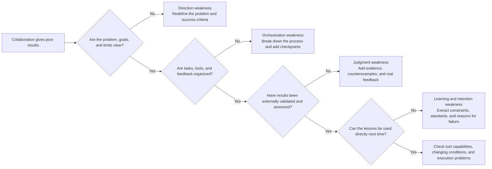
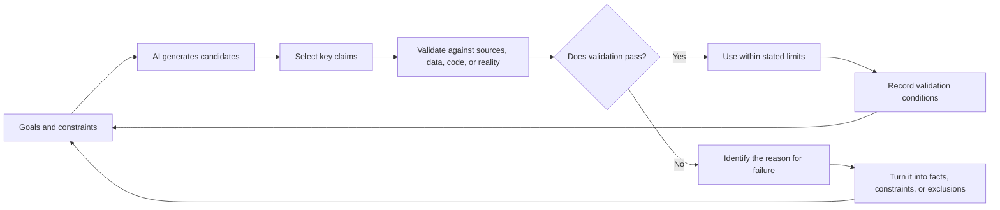
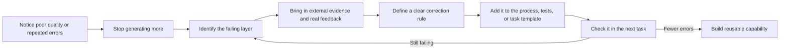
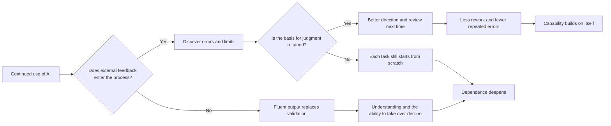

Once a framework for collaboration is reasonably stable, the bottleneck shifts from organizing the system to whether its users can grow with it. Using AI more efficiently does not necessarily make us better at collaborating with it. The difference between using it and using it well lies in whether external feedback tests the results, whether errors change what happens next, and whether judgment carries over to other tasks. Faster generation and more complete documents do not, by themselves, show growth in capability.

<!--more-->

The four layers of direction, orchestration, judgment, and learning and retention offer a way to locate weaknesses in collaboration. A failure at any layer can leave additional generation concealing gaps in direction, evidence, or responsibility. Collaboration begins to build transferable capability when validation results become constraints for the next round, and consistently useful lessons become templates, tests, and rules. Otherwise, it may remain a faster way to repeat the same work.

## Diagnosing the weak point

When collaboration produces disappointing results, the immediate response is often to switch models, change the prompt, add more context, or regenerate the answer. These adjustments sometimes help, but they can also hide the underlying problem: no clear direction, no organized sequence of work, no real acceptance check, or no record of what went wrong.

The four layers provide a sequence for diagnosis. Begin with whether the problem and goal are clear, then examine how the work is organized, how results are validated, and how lessons are retained. Look for the first point at which the process breaks down:





Different weaknesses have different symptoms and call for different initial checks:



| Weakness | Common signs | What to check first |
|:----:|:--------:|:--------------:|
| Direction | Plenty of output, but the real problem remains; the goal keeps changing during the conversation | The subject, goal, success criteria, permitted materials, and prohibited actions |
| Orchestration | Reliance on one long answer; failure leads only to requests for another version | Task order, tool choices, checkpoints, feedback channels, and stopping conditions |
| Judgment | Polished, professional output is accepted directly; evidence is sought only after an error | Sources, assumptions, counterexamples, execution results, practical constraints, and the strength of claims |
| Learning and retention | Similar tasks start from scratch; the same errors and disputes recur | Decision records, failed paths, stable constraints, review questions, and limits of applicability |



Diagnosis should work backward from actual results, rather than rely on how using the model feels. A model that "doesn't understand the business" may lack context. A prompt that seems "not strong enough" may be attached to a task with no validation criteria. Repeated manual rework may reflect a failure to turn recurring errors into automated tests. Locating the weak layer helps avoid blindly spending more effort on generation.

Tool capabilities and the execution environment can also impose limits. Insufficient context capacity, unreliable tool connections, and missing data permissions are real problems. They should be examined separately after direction, orchestration, judgment, and learning and retention have been checked, rather than becoming the default explanation for every failure.

## A simple collaboration protocol

Finding the weakness is only the first step. Diagnosis identifies where the problem lies, but improving collaboration means protecting essential actions in every round, connecting the work to external feedback, and preserving useful judgments for the next attempt. Otherwise, even a correct diagnosis can lead back to old habits.

### Setting a basic protocol

We do not need an elaborate process for every task. We do need a minimal protocol that keeps essential steps in place when time is short or the output reads convincingly. It should cover four moments: before starting, while working, before using the result, and after finishing.



| Moment | Minimum action | What to retain |
|:----:|:--------:|:--------------:|
| Before starting | State the problem, goal, constraints, success criteria, and risk level | A short task brief |
| While working | Distinguish facts, assumptions, candidates, and validated results; arrange tools and checkpoints | Candidate status and a list of outstanding checks |
| Before using the result | Check against sources, data, execution, or real feedback, and assess applicability | Validation results and reasons for adoption |
| After finishing | Record what was adopted, rejected, or failed, and why | Reusable constraints, standards, and decision records |



The task brief need not be long, but it should answer at least these questions:

- What real problem needs to be solved, beyond the document we intend to generate?
- Will the result be used for internal exploration, formal analysis, public release, or a real decision?
- Which materials may the model use, and which data or information must stay out of it?
- What would make the result useful, and which errors are unacceptable?
- What can be checked automatically, and what requires human judgment?
- Who decides whether to use the result, and how can the work stop or roll back if it fails?

Once the brief is clear, the status of candidates needs to be maintained during the work. A factual claim proposed by AI without a source is awaiting verification. An explanation that fits the data but has plausible alternatives is a candidate hypothesis. Code that passes a limited set of tests is usable only within the coverage established so far. Explicit status prevents "possible" from quietly becoming "confirmed" over several rounds of conversation.

The minimal protocol protects the acts of judgment most easily lost in the pursuit of speed, while keeping recordkeeping manageable. Low-risk, repetitive tasks can use templates, automatic checks, and sampling. Higher-risk tasks need fuller records of sources, versions, and decisions.

### Connecting validation to feedback

Several rounds of conversation with a model do not necessarily constitute iteration. Iteration requires each round to move closer to the facts, rather than simply produce more text. A model can keep generating new versions from the same material. Without new sources, data, execution results, or human judgment, however, it is rearranging existing material without testing it against reality. Productive iteration needs contact beyond the conversation with feedback that can support or reject a candidate.

A personal feedback cycle can be represented as follows:





When validation fails, the reason should become information the next round can use. For example:

- If the original paper does not support the model's summary, record the actual claim and where the misreading occurred.
- If SQL produces biased results because of incorrect metric definitions, add field definitions and denominator rules to the task constraints.
- If code fails on an edge case, turn that input into a lasting test case.
- If resources make a proposal infeasible, include the actual schedule, permissions, and costs in later comparisons.
- If user feedback contradicts an assumption, revise the problem definition rather than merely rewording the proposal.

With that feedback carried forward, the next set of possibilities should be narrower. Confirmed facts become fixed inputs, rejected paths are no longer repeated without reason, and new candidates must satisfy stronger constraints. If the range never narrows, it may be only the frequency of generation that is increasing, with no corresponding improvement in collaboration.

Validation also has a cost. Checks should prioritize what is most likely to change the decision, hardest to reverse, and most consequential if wrong. Low-risk content can be sampled; high-risk claims need stronger evidence. Where machines can check something consistently, it should become a test, rule, or automated validation, leaving human attention for exceptions and trade-offs that are difficult to formalize.

### Retaining reusable judgment

Records of collaboration do not automatically become capability for the next round. Useful learning requires extracting judgments from the process: which goals and constraints repeatedly help, which questions catch common errors, which paths have been ruled out, and under what conditions a conclusion fails.

A minimal decision record can contain the following:



| Field | What to record |
|:----:|:------------:|
| Problem and goal | What was actually being solved and what counted as success |
| Confirmed facts | What sources, data, or execution results established |
| Candidates and choices | Which paths were considered, adopted, or abandoned |
| Basis for judgment | Which evidence, constraint, or feedback changed the decision |
| Failures and exceptions | What went wrong, the root cause, and how it was discovered |
| Limits of applicability | Under what conditions the result holds and what changes require rechecking |
| Starting points for next time | Which constraints, tests, and questions should carry directly into similar tasks |



Recording should happen alongside judgment wherever possible, rather than being reconstructed from memory at the end. A sentence explaining a key choice, or a saved failure input and correction rule, is often more valuable than a retrospective compilation of the entire conversation. AI can summarize and structure the material, but people still need to identify what actually changed the decision.

The test is whether the record can be reused. Some records reconstruct what happened but do little to help the next task find its direction, validate results, or avoid errors. They serve mainly as archives. Records that can become task templates, metric definitions, test cases, review questions, and stopping conditions begin to build lasting capability.

Reusable does not mean valid forever. Outdated experience should not harden into permanent rules. Models, data, organizations, and markets change, so retained lessons need conditions of applicability and a time for review. What is worth reusing is the method and reasoning used to form, test, and revise an answer. A particular answer is valid only under its corresponding conditions.

## Capability and false progress

Whether collaboration leaves us more capable also depends on retaining enough independent judgment and recognizing signs that apparent progress is actually decline.

### Staying able to step in

AI can take on more and more retrieval, coding, analysis, and writing. Effective delegation still requires a minimum ability to understand the work, recognize anomalies, and take over. If someone cannot explain how a result was produced or spot obvious errors, what looks like delegation may be closer to a loss of control.

How much independent capability is needed depends on the risk and the available validation. Low-risk, reversible tasks with stable automated checks may need less human involvement. Tasks involving important data, complex methods, external commitments, or irreversible consequences require someone on the team who understands the key principles, can examine the central assumptions, and can take over if the system fails.

Retaining that ability does not mean doing everything personally or competing with AI on speed. More useful practices include:

- Independently explaining selected parts of important code and analyses, instead of rewriting every line.
- Listing likely errors and validation criteria yourself before looking at model output you may adopt.
- Periodically doing a few tasks without relying on a fully generated solution, to check that you can still define the problem and design an approach.
- Using cross-review, independent recalculation, or different tools to check high-risk work.
- Recording tasks that current staff can no longer take over, then providing training or reducing the scope of automation.

The more automated the work, the more important it becomes to check what people can still do. A long period without reported anomalies may mean that the system is working well, but it may also mean that problems have not been detected. Sampling, failure drills, and boundary tests help establish whether people still understand the system and whether escalation works.

The value of human expertise also changes with the division of work. Time once spent retrieving information, calculating, and drafting may shift toward defining problems, designing validation, handling exceptions, and connecting judgments across fields. Retaining independent capability ensures that someone still understands the critical steps and bears responsibility after work is redistributed. It does not require preserving every old operation.

### Recognizing false progress

Decline in human–AI collaboration does not usually look like an inability to use AI. It may look like faster output and increasingly complete documents. Speed and polish can hide a deeper weakening of direction, judgment, and feedback that is difficult to notice.

Common patterns and ways to correct them include:



| Pattern | What it looks like | What is missing | Corrective action |
|:------:|:--------:|:--------:|:--------:|
| Becoming a relay | Lightly editing AI output and presenting it as one's own conclusion | Judgment and responsibility for evidence have dropped out | Require sources, verification status, and reasons for adopting each key claim |
| Expecting one answer to finish the job | Trying to complete a complex task in a single response | An organized process and opportunities for feedback | Separate candidate generation, checking, external validation, and revision |
| Letting review standards slip | Accepting clear structure and professional tone as reasons to check less | Quality of expression has replaced quality of thought | Set acceptance criteria before generation and verify key content independently |
| Blaming the tools | Responding to poor results only by changing models, plugins, or prompts | No diagnosis of weaknesses in direction, process, or judgment | Locate the problem across the four layers before deciding whether to upgrade tools |
| Mistaking records for learning | Saving many chats and files while still starting from scratch next time | No reusable judgment has been extracted | Capture constraints, tests, reasons for failure, limits, and decision records |



These patterns look different, but each skips an essential act of direction, judgment, or feedback. They can therefore be addressed through a common path:





The first corrective step is to stop generating more. When the problem lies in direction, evidence, or process, additional text only adds noise. Breaking the momentum of the conversation and returning to the problem and the outside world makes substantive change possible in the next round.

## Measuring growth by outcomes

Model calls, conversation length, generated file counts, and apparent hours saved describe intensity of use. They are not enough to demonstrate improved collaboration. Growth should show up in problem-solving results and the cost of the next round.

The following indicators say more about actual progress:

- **Repeated errors:** Do the same mistakes recur after they have been identified and explained?
- **Time to useful feedback:** How long does it take to get from a proposed answer to external feedback that could change a decision?
- **Where rework occurs:** Are problems caught earlier, while defining the direction, designing, or validating, rather than repeatedly surfacing at the end of delivery?
- **Traceability:** Can key conclusions be traced to sources, validation conditions, and reasons for adoption?
- **Consistency of judgment:** Are similar risks assessed against consistent standards, without being swayed by the tone of an answer?
- **Setup effort:** Can the next similar task draw directly on existing constraints, metric definitions, tests, and lessons from failure?
- **Ability to take over:** When a model or tool fails, can someone understand the problem and use an alternative approach?
- **Real outcomes:** Is research more reliable? Does work produce verifiable improvement while the opportunity remains open?

These indicators do not all need formal numerical measures. Periodic reviews can also reveal progress. The point is to move from asking how much AI helped generate to asking how many repeated errors the collaboration system prevented, how much sooner useful feedback arrived, and how much reusable judgment was retained.

Improvement forms a cycle: locate weaknesses, establish a minimal protocol, obtain external feedback, retain useful judgments, check independent capability, and use the next real result to see whether the changes helped. Fewer repeated errors, earlier feedback, a continuing ability to take over, and a better starting point next time provide the evidence. AI usage itself is not a measure of capability.

## When generation is no longer scarce

When text, code, analyses, and proposals can be produced quickly, generation itself is no longer scarce. The cost of developing possible answers, once a major limit on problem solving, falls sharply. More hypotheses, code drafts, and variations on a plan can be proposed, compared, and revised in the same time, giving individuals and organizations new ways to extend their thinking.

Meanwhile, validation capacity, professional judgment, and structures of responsibility have not expanded automatically. Review, testing, and checks against reality remain relatively limited resources. A new imbalance between production and validation changes where judgment is needed and how responsibility is distributed. The benefits, costs, and long-term effects of the fifth paradigm emerge in the gap between those changes.

### Cognitive leverage and validation gaps

#### What AI makes possible

The most immediate benefit is that more people can begin work on problems that once had high entry costs. Someone can build a preliminary map of an unfamiliar field, turn a vague idea into something inspectable earlier, or use AI to create code, an analysis, or a prototype despite lacking some of the required skills. Expertise has not lost its value, but the threshold for beginning an investigation is lower, and gaps in particular skills are easier to cross.

This also widens the range of work individuals and small teams can attempt. An initial proposal that once required several people may now be explored, partly implemented, and prepared for validation by fewer people, allowing scarce expert attention to focus on the hard parts. Methods and experience from other fields become easier to notice. They can be actively proposed, compared, and tried, rather than encountered only by chance.

More importantly, failure can happen earlier. Faster drafts, code, and prototypes create opportunities for earlier contact with literature, data, tests, and user feedback. The real benefit is completing more informative attempts in the same time: exposing errors sooner and grounding the next action in clearer facts and constraints.

#### The validation gap

Easy generation creates a tempting illusion: mistaking a model's fluent output for our own understanding, judgment, and knowledge. A complete answer arrives quickly, and it feels as though the problem has been understood. Several proposals appear, and it feels as though the options have been thoroughly compared. Technical terms and citations are readily available, and it feels as though the corresponding knowledge has been acquired.

More candidates do not mean more knowledge. A candidate earns credibility only through sources, logic, methods, and real feedback. More unverified versions simply create more uncertainty to handle. Polished expression can make that uncertainty harder to see, because completeness of presentation is easily mistaken for completeness of thought.

The result is a **validation gap**. Teams can generate large quantities of requirements, code, analyses, and proposals without a corresponding increase in review, testing, or real-world validation. Unanchored intermediate work keeps moving downstream, leaving later participants to search for errors in a growing volume of material. Missed errors may be incorporated into formal deliverables and surface only after a launch, decision, or public release.

The gap does not disappear because no error has been reported yet. It has to be addressed later, often at greater cost through revisions and investigations of responsibility. It exists in factual claims, metric definitions, causal explanations, judgments about users, and business commitments as well as code. The faster content is produced, the more important it is to know what has been validated and what is still an assumption being used provisionally.

More candidates also consume attention. Each version may be well structured and persuasively argued, turning selection into a new kind of work. Without goals and evaluation standards, the breadth AI offers can become cognitive noise. People keep reading and comparing versions without any path getting closer to reality.

Information overload thus takes on a new form. We already had more material than we could read; now we can also generate more than we can judge. AI can help condense and filter it, but the problem and real outcomes still have to determine the selection criteria and what evidence is enough to stop exploring.

A richer body of knowledge means more claims with support, more hypotheses tested by evidence that can distinguish them, and more errors recorded and ruled out. It means much more than having an answer available at any moment. Generation expands the range of possibilities. Evidence and judgment determine how much of it becomes dependable understanding.

### Judgment and diverging paths

#### Why judgment matters more

As AI takes on more retrieval, calculation, coding, and writing, it is easy to assume that expertise will lose value. What may change more is how expertise is expressed, while some intermediate forms of work become less scarce. Defining problems, designing validation, handling exceptions, and taking responsibility for trade-offs become more important.

Expertise has often been demonstrated through what a person can do unaided. Knowing the material, mastering tools, remembering methods, and producing work independently were necessary to finish a task. With AI, someone can pursue more complex work without fully mastering every local operation. The expression of expertise shifts accordingly: the more that can be generated quickly, the more we need people who can spot a wrongly defined task, an unsuitable method, or a technically correct answer to the wrong question.

Judgment needs specific knowledge beneath it. Recognizing a misread paper requires understanding its evidence and research context. Checking an analysis requires knowledge of metrics, samples, and methods. Deciding whether to launch requires an understanding of users, systems, and business constraints. AI makes knowledge and methods more accessible, but does not enable someone without the relevant understanding to make consistently sound high-risk judgments.

Expertise may therefore shift away from producing large amounts of work directly and toward activities with greater influence on the outcome:

- From accepting a task to defining the central problem.
- From remembering answers to assessing sources and conditions of applicability.
- From following established steps to designing validation and feedback.
- From polishing one proposal to comparing competing paths.
- From handling routine operations to recognizing exceptions and limits.
- From delivering content to explaining why it can be used and taking responsibility for the consequences.

This does not require everyone to become a manager. Foundational skills still need to be retained. Without understanding the key parts of a process, it is difficult to design useful acceptance checks or take over when automation fails. Judgment still rests on domain knowledge, real experience, and feedback. A subjective preference for one AI answer over another cannot replace those foundations.

As generation becomes commonplace, scarce expertise increasingly lies in asking worthwhile questions, selecting a few paths worth testing from many possibilities, exercising restraint when evidence is insufficient, and clearly stating the limits of a conclusion.

#### Two paths for capability

The same tool can lead to opposite long-term outcomes. AI can take over low-value repetition so people can devote time to more demanding judgments. It can also make output so convenient that people gradually stop understanding, validating, and recording their work. Short-term efficiency may look similar, while long-term capability moves in very different directions.





The path that strengthens capability depends on real feedback. AI helps someone finish a task faster; external results reveal which judgments were right and which assumptions were missing; retaining those lessons carries them into the next round. Over time, AI does more than replace labor. It helps expose weaknesses and accelerate learning.

The path that substitutes for capability is less visible. It is the false progress described earlier becoming a lasting habit. Output meets immediate delivery needs, so people check less. With less checking, sensitivity to errors and limits weakens. The next task relies even more heavily on the model to generate the whole process. Usage and familiarity increase, while the ability to explain results, identify anomalies, and take over independently declines.

The difference lies in whether people remain involved in goals, evidence, and feedback, rather than whether they use AI or perform every step themselves. Reliable automation can reduce manual work while deepening understanding of the system's limits. Uncontrolled dependence means handing over more final judgments without the validation or ability to intervene that would justify doing so, while gradually withdrawing from decisions.

Organizations can diverge in similar ways. Teams that build up evaluations, error cases, decision records, and escalation mechanisms can develop a more reliable foundation with continued use. Teams that accumulate only prompts, chats, and generated files may increase output while repeatedly missing goals and overlooking problems during review.

Whether AI strengthens capability or substitutes for it depends on whether feedback enters the process, judgment is retained, and responsibility is clear.

### Responsibility and the new paradigm

#### Work shifts, responsibility remains

AI can perform more of the work people once did, including collecting material, writing code, analyzing data, generating proposals, running tests, and even acting through systems within authorized limits. Changes in who does the work do not automatically transfer responsibility to the model.

A model holds no organizational position, legal obligation, or real-world stake. It does not independently bear the consequences of a bad decision. Even when AI generates most of the content, identifiable people and organizations still decide to adopt it, configure permissions, reduce review, or publish it. "That is what AI said" may describe one source of an error, but responsibility cannot end there.

This imbalance deserves more attention as automation grows. Systems affect the world faster and more broadly, while people farther from execution may find anomalies harder to notice. Tasks can be divided by risk into those that can be delegated, those requiring human review, and those whose final responsibility must remain human. Responsibility for decisions, boundaries, and process also needs clear ownership. Greater efficiency does not reduce responsibility. It calls for earlier explanations of why the system has been authorized to act, and how people will stop it, correct it, and take responsibility if it goes off course.

As AI comes to feel more like a collaborator, phrases such as "it decided", "it thinks", and "it is responsible" are convenient ways of speaking. They cannot replace an actual structure of responsibility. AI can contribute advice and execution, and work can be redistributed, but the consequences still return to the people and organizations using, deploying, and managing it.

#### A new dividing line

The most visible differences in the AI era may be who starts using models first, has better tools, or generates content faster. As capabilities spread and access becomes easier, those advantages are likely to narrow. A more lasting difference may be who can turn generation speed into more frequent cycles that establish something trustworthy.

That difference is measured by whether the work gets closer to reality. The number of candidates alone tells us little. Have key claims encountered external evidence? Has failure changed the next round? Has judgment been retained? Does responsibility have a clear owner? Each cycle may be short, but it should move the system toward reality, beyond merely producing a complete text.

Once generation is no longer scarce, the expensive work is making time for judgment, allocating resources to validation, keeping records of failure, and maintaining responsibility while pursuing efficiency. Consistently doing that allows generation speed to extend our thinking. Without it, more generation accumulates more unanchored content and a validation gap that becomes harder to close.

Working well with AI means using models to see more possibilities while building a process that keeps ruling out errors, approaching the facts, and accumulating judgment. We can call on generative capability, but need to retain our capacity to judge. Work can be redistributed; responsibility does not disappear. Keeping those commitments while pursuing efficiency is what can make a lasting difference in the fifth paradigm.
