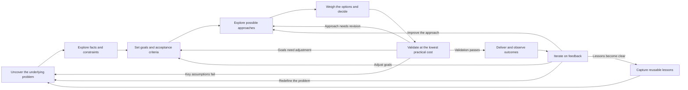
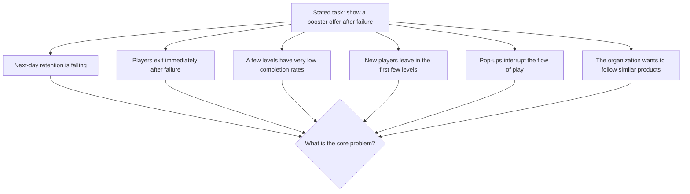
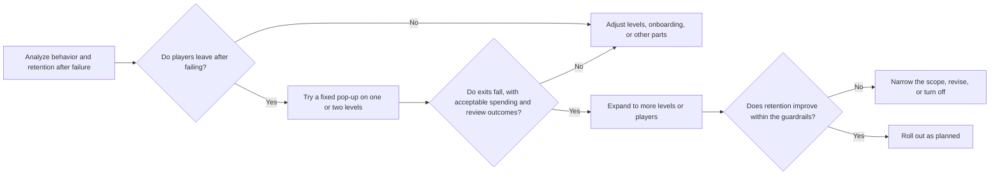

Work projects need to produce verifiable results within limits on time, resources, organizational capacity, and risk. AI reduces the effort involved in uncovering the underlying problem, developing options, and processing feedback. Teams can test key assumptions earlier and revise their next steps faster. Until a generated proposal has been checked against user feedback, business metrics, and system status, it remains a candidate awaiting validation. A rigorous analysis that misses the opportunity, or an on-time launch that fails to solve the real problem, does not amount to successful delivery.

<!--more-->

Agile development, MVPs, A/B testing, continuous delivery, and staged rollouts are already common in internet businesses. AI lowers the cost of each iteration, allowing teams to complete more rounds of testing and revision with minimal resources while the opportunity remains open. The pace of iteration can therefore increase.

## Workflow and example

The following hypothetical project illustrates what changes when AI becomes part of a workflow:

A team making a casual tile-matching game receives a request to "show an offer for a bundle of boosters after a failed level to improve retention".
{:.info}

The work around this request can be organized into nine stages, connected by feedback loops:





These stages break the journey from receiving a task to retaining what was learned into parts that can be examined separately. They help establish whether the problem exists, the goal is clear, an approach is worth investing in, and validation has succeeded. The reasoning at each stage needs to be traceable so feedback can return to the right level, rather than producing patches only at the execution stage.

Low-risk tasks can pass quickly through several stages. Higher-risk projects need stronger evidence at each step, approval of key judgments at a higher level, and predefined escalation and rollback mechanisms so the team can stop or adjust promptly when something goes wrong. The point is to expose a mistaken direction earlier. Formalities that add nothing to a decision are of little use.

## Understanding problems and facts

### Understanding the problem

Work requests often arrive as proposed solutions, with the problem, the desired outcome, and the means of achieving it tangled together. "Show a booster offer after a failed level to improve retention" describes an action, but does not establish whether failure is where the underlying problem lies. Moving straight into design and scheduling risks treating the requester's initial explanation as a fact.

The request includes both a goal and a proposed solution, yet several things remain unknown: whether retention is actually falling, whether players leave mainly after failing, whether they get stuck on a few particular levels or leave within the first few, and whether the pop-up itself might cause more exits.

The stated task could reflect several different problems:





Several of these problems may coexist, or only some may be present. If most players leave before starting a round, an offer after failure will have little effect. If many get stuck on the same one or two levels, adjusting those levels may help more directly than adding another purchase option. If players prefer to retry after failing, interrupting them with another pop-up might actually increase exits.

AI can organize existing descriptions, suggest follow-up questions, and identify alternative explanations hidden by the proposed solution. But a task description alone cannot tell it the real retention figures, how the levels feel to play, or how much spending players will tolerate. Understanding the underlying problem still requires game logs, level data, user feedback, or the team's experienced judgment.

This stage should produce an initial problem statement: who encounters what problem, in which situation, with what consequences; what is known and what is inferred; and why it needs attention now. The statement can change, but it should say more than "launch a feature".

### Exploring facts and constraints

Once the problem is tentatively framed, the team needs to examine both internal facts and external experience. Internal material explains how the current system works; external material helps the team understand available technologies and industry practices. If the two are blurred, AI may fill gaps in internal knowledge with generic advice, producing a plan that looks complete but does not fit the actual situation.

In this example, the internal facts to establish first include:

- Whether next-day retention is falling, and in which levels, sessions, and player groups.
- Whether players retry, buy boosters, watch an ad, or exit after failing.
- Whether failures cluster in a few levels or players begin leaving almost immediately.
- Which buttons already appear on the failure screen, including any bundle or ad options.
- Whether booster inventories, prices, and existing purchase prompts leave room for another offer.
- Whether the pop-up can be enabled for selected levels or players and turned off at any time.
- Whether its effects can be reversed: could it make players feel pressured to pay, generate negative reviews, or make later levels harder to complete?

Where permissions allow, AI can organize failure logs, compare levels and player groups, and write queries and analysis code. It can also look up how similar products respond to player failure and what side effects have been observed, broadening the team's view.

The findings should distinguish three states: facts confirmed by internal data or reliable sources; explanations developed from the available material; and possibilities still awaiting validation. Material involving user privacy, commercial secrets, or restricted data must not be sent to external services before permissions and handling rules have been established.

Constraints deserve as much attention as opportunities. Alongside what the booster offer might achieve, the team needs to establish available resources, the target release date, levels that cannot currently be changed, unacceptable effects on the player experience, and conditions for pausing or rolling back. These constraints determine whether an approach is feasible.

## Goals, options, and trade-offs

### Goals and acceptance criteria

"Improve retention" is not yet a complete goal. It does not say which retention measure should improve, what cost is acceptable, or where the limits on player experience and monetization lie. The less clear the goal, the easier it is for AI to produce an apparently thorough proposal that cannot be meaningfully assessed. The team may also end up choosing whichever post-launch metrics favor its preferred interpretation.

The goal in this example could be restated as follows:

Reduce the share of players who leave after repeated failures, and improve next-day retention among players who fail the target levels, without excessively interrupting play or turning failure into pressure to pay.
{:.info}

This still gives only a direction. It needs to become observable criteria, such as:

- Which levels and players will receive the offer, and after how many failures.
- The expected changes in exit, retry, and booster-use rates after failure.
- The expected change in next-day retention, and whether three-day retention will also be observed.
- How much deterioration in booster spending, the ad experience, or negative reviews is acceptable.
- Which metric anomalies require the offer to be turned off.
- The release window by which enough feedback must be available to justify further investment.

AI can help turn goals into metrics, guardrails, and checks. It can also use historical data to simulate coverage and risk under different thresholds. But deciding which outcomes are worth pursuing, what harm to which users is unacceptable, and how to balance short-term costs against the longer-term experience remains a business judgment for which the team is responsible.

Where possible, acceptance criteria should be set before choosing the final approach or seeing the results. Experience and risk that cannot be quantified directly still need agreed observation methods, reviewers, and decision processes.

### Exploring the range of options

Once the goal is clear, the team should resist immediately refining the original booster pop-up. AI's ability to generate possibilities is better used to develop several paths that could meet the goal.

Possible approaches include:

- Reduce the difficulty of levels with unusually low completion rates, addressing failure at its source.
- Give players a free booster after several failures instead of showing a paid offer.
- Keep the failure screen focused on retrying, with no new options.
- Show a booster offer only on selected levels and only after repeated failures.
- Follow the original request and show a paid offer immediately after failure.
- Hold off on a new pop-up and first check whether retention changes come from user acquisition or onboarding.

Options can also be combined. The team might first adjust one or two levels, then give free boosters to players who still fail, and only afterward decide whether to introduce a paid offer. Exploring options prevents "add a bundle" from becoming the default answer without comparison. A longer list of names alone has no value.

AI can help develop variations, simulate ways they might fail, identify dependencies, and organize comparisons. The team needs to remove options that differ only in wording, establish how each path would affect the goal, and decide what feedback would justify continuing.

The options should include doing nothing and waiting. Internet businesses value quick action, but that does not make every opportunity worth pursuing. If the window is too short, failure is not the main reason players leave, or another paid offer would be too disruptive, holding back may be the better decision.

### Weighing the options

Comparing approaches is not a matter of asking AI to score each one and automatically choosing the highest total. Important dimensions are often difficult to quantify. A short-term increase in completion rates may weaken the sense of fairness or later retention. Higher spending may bring more negative reviews. A quick launch may leave the team maintaining bundle settings for every level. Decisions need to distinguish facts, forecasts, values, and risks.

The team can compare options along the following dimensions:



| Dimension | Questions to answer |
|:----:|:--------------:|
| Value to players | Does it reduce unproductive frustration? Does it add purchase interruptions or make the game harder to understand? |
| Business benefit | How much might retention and spending improve? Where would the benefit come from, and would it last? |
| Risk | Are the effects of failure reversible? Could the approach pressure players to pay or trigger negative reviews? |
| Feasibility | Are the required level settings, client pop-ups, data, and operational capabilities available? |
| Ease of validation | Can the team obtain useful, discriminating feedback at low cost? Are the success criteria clear? |
| Reversibility | Can the approach be tested on a small scale, paused, or turned off? |
| Time window | How soon can it deliver initial value, and will the release opportunity still be there? |
| Long-term cost | Will level configuration, bundle changes, and monitoring create an ongoing burden? |



AI can build comparison tables from existing material, look for missed risks, simulate objections from different roles, and identify untested assumptions behind a conclusion. People need to set priorities, recognize risks that average gains cannot offset, and decide where limited resources should go.

A decision need not commit the team to a complete plan. It can be a series of smaller commitments: first check whether departures are concentrated after failure, then decide whether a pop-up is warranted; try free boosters or a fixed bundle on one or two levels before expanding. Breaking a large decision into smaller ones that yield new information helps control both risk and delivery time.

Each choice should leave a record of its basis: which facts were used, which assumptions were accepted, why alternatives were rejected, and what result would change the decision. Later feedback can then revise the reasoning, instead of merely judging whether the delivery team finished on time.

## Validating and delivering

### Low-cost validation

A common inefficiency in internet projects is to finish building a feature before testing in the real world whether it solves the problem. Requirements clarification, proposal review, resource scheduling, development and integration, testing, and release proceed in sequence. By the time real feedback arrives, substantial resources have been spent, and the market or user opportunity may have changed.

Low-cost validation starts by identifying the assumption most likely to overturn the proposal. The team then spends as little as practical to answer a question that could change the decision. A rough-looking but otherwise complete product is not necessarily the cheapest way to learn that.

In the booster-offer example, key assumptions may include:

- Whether next-day churn is mainly driven by exits after failure, rather than onboarding, energy limits, or the quality of acquired users.
- Whether players need an intervention after failing, or would retry anyway.
- Whether a small-scale offer can reduce exits without materially increasing negative reviews or pressure to pay.
- Whether changing only one or two levels and using an existing pop-up component would provide enough information.
- Whether the expected retention gain simply postpones frustration to later levels.

These assumptions do not have to be tested in one complete launch. The team can gradually increase realism and exposure:





AI can organize failure cases, help build prototypes, write analysis and monitoring code, and suggest revisions based on results. But the sample must represent real levels and players. Spending and negative reviews need separate checks, and the model's assessment of the offer's effect still requires external validation.

Fast validation depends on reversibility and observability. At every step, the team needs to know what is being tested, what counts as success, how to stop if it fails, and which later decision the result will support. Repeatedly generating demos and documents without input from users, data, or systems is not productive iteration.

This also addresses the limited window of opportunity. The team need not wait for a complete store and operational configuration system before judging the direction. It can obtain enough feedback sooner to continue, narrow the scope, or stop. Even if the offer never launches, early validation may uncover the actual problem in level difficulty, the failure screen, or onboarding.

### Delivery and outcomes

After the initial validation succeeds, the project can move gradually into formal delivery. The task now includes more than expanding a prototype into a feature. Event tracking, level configuration, feature switches, exception handling, and rollback all need to be in place. Any change in copy, price, timing, or level coverage can change the outcome.

During delivery, AI can break down development work, generate code and tests, organize interface documentation, analyze logs, and maintain release checklists. Generated code still needs to go through the normal engineering process, and data access remains subject to the rules discussed earlier. Using AI does not lower expectations for stability or maintainability.

Testing and acceptance need to distinguish two questions:

- **Does the implementation match the design?** Does the offer appear on the intended levels? Do purchasing, closing, and rollback work?
- **Does the design solve the problem?** Do exits after failure fall and next-day retention rise? What happens to spending and negative reviews?

Much of the first can be checked before release. The second usually requires observation in a live setting. Launch is an important stage in obtaining real evidence and connects the project to subsequent feedback.

Observation should include metrics that could challenge the proposal as well as support it. Higher completion rates may accompany more difficulty on later levels or more negative reviews. Increased spending may simply mean that failure has become a barrier players must pay to cross. The team needs to examine target metrics, guardrails, differences between groups, unusual cases, and configuration maintenance costs, retaining comparisons with a pre-launch baseline or a suitable control.

To make use of the opportunity while managing risk, the team can release by level, expose a small share of players, set explicit rollback thresholds, and monitor continuously. Fast delivery should seek early feedback that is real, interpretable, and does not cause irreversible harm, without exposing the entire player base too soon.

## Feedback and lessons

### Iterating on feedback

When results miss expectations, the team needs to identify the level at which the problem arose before asking AI to rewrite the plan. If the offer appears but nobody clicks, the problem definition or timing may be wrong. If completion rates rise but next-day retention does not, failure may not be the main source of churn. If next-day retention improves while three-day retention falls, the difficulty may merely have been postponed. If only a few levels benefit, level selection or configuration may be at fault.

Feedback can return to different levels:

- **Problem:** The presumed central issue does not exist, or most of the loss occurs elsewhere.
- **Goal:** Success criteria are incomplete, or some guardrails and long-term costs were missed.
- **Approach:** The technical path, scope, division of human work, or product design needs to change.
- **Execution:** There are defects in the data, configuration, code, monitoring, or operational process.

AI can classify failed cases, compare versions, propose possible causes, and organize the next round of tests. Diagnosis still has to return to logs, user feedback, system status, and business data. A model's explanation of a failure is another candidate; the evidence comes from those external sources.

Productive iteration gives the next round clearer goals, a tighter scope, and stronger validation criteria. Unproductive iteration merely creates more versions: different booster combinations, revised copy, or more pop-ups, without explaining why the previous attempt failed. Useful iteration shortens the cycle from action to feedback to decision. The frequency of new output alone says little.

When market, user, or organizational conditions have changed, iteration may also mean stopping. Further investment is not necessarily better than recognizing that the opportunity has passed. Ending a path that no longer creates value is also a good use of feedback.

### Capturing lessons

When a project ends or stabilizes, keeping only the feature, code, report, and final metrics leaves the team likely to repeat the same exploration next time. Reusable lessons usually lie in how the underlying problem was identified, why an approach was chosen, which assumptions failed, and what feedback changed the decision.

In this example, useful records include:

- Which failures warrant an interruption and which levels should not contain paid pop-ups.
- Definitions used to track behavior after failure, retention, and spending.
- Reasons for adopting, narrowing, or abandoning an approach at each stage.
- Key metrics, guardrails, alerts, and rollback conditions.
- The relationship between pop-up settings, bundle contents, and level versions.
- User feedback, negative reviews, and unresolved risks.
- Which lessons may transfer to other levels or the next matching game, and which depend on the current game economy.

AI can maintain decision logs, organize meetings and version differences, turn error cases into tests, and help create checklists for the next round. Saving the entire chat history preserves a trace of collaboration. Reducing the setup and trial-and-error costs of future projects requires extracting constraints, standards, reasons for failure, and decision rationales that can actually be used again.

Lessons also need limits on their applicability. The timing, price, and level coverage that worked in one project may cease to work as the player population, difficulty curve, or economy changes. Records should explain why a judgment made sense at the time and what changes would trigger another test, rather than treating the result as permanently correct.

## Human–AI roles

Across the nine stages, AI helps the team develop and organize questions, material, and options. Data and real-world feedback narrow those options. People remain responsible for goals, trade-offs, limits, and final decisions:



| Stage | AI's main role | People's main responsibility | Key external anchors |
|:----:|:--------------:|:------------:|:--------------:|
| Uncover the problem | Organize descriptions, suggest questions, and develop alternative explanations | Identify the real problem, who is affected, and the opportunity window | User feedback, retention, and level data |
| Explore facts and constraints | Classify material, generate queries, and research examples and risks | Confirm facts, permissions, internal conditions, and unknowns | Game logs, completion rates, and behavior after failure |
| Set goals and acceptance criteria | Break goals into metrics, guardrails, and review questions | Weigh values and define success and firm limits | Business goals, player experience, and release windows |
| Explore approaches | Generate variations, identify dependencies, and simulate failures | Select feasible paths that differ meaningfully | Level configuration, client capabilities, and past campaigns |
| Weigh options and decide | Organize comparisons, find omissions, and raise objections | Set priorities, risk tolerance, and staged commitments | Retention, spending, negative reviews, and reversibility |
| Initial validation | Assist with prototypes, analysis, code, and grouping errors | Choose key assumptions, standards, and stopping conditions | Historical play data, small-scale offers, and limited real feedback |
| Deliver and observe | Assist implementation, testing, logs, and monitoring | Assess engineering quality, outcomes, and limits | Pop-up behavior, retention and spending, and system operation |
| Iterate on feedback | Group problems, compare versions, and suggest diagnoses | Decide which level feedback should return to and whether to continue | Unusual levels, user feedback, and metric changes |
| Capture lessons | Organize records, generate tests, and create checklists | Make reasoning traceable and lessons reusable | Decision logs, configuration versions, and retrospective material |



This division is flexible. Human judgment should carry more weight when risk is high, consequences are irreversible, or goals are still unclear. AI can take on more generation and organization when risk is low, changes can be rolled back, and standards are clear. What determines the quality of a stage is whether its key external anchors are connected: does problem definition return to real data, does comparison include feasibility and risk, and does delivery lead to observation in a live setting? Skipping those anchors, whoever does the work, postpones judgment until mistakes are more expensive.

This workflow helps teams identify the core problem before committing heavily, compare alternatives properly, and obtain real feedback early through low-cost validation. AI speeds up the generation and execution of possibilities. Internet projects need to turn that speed into shorter, useful feedback cycles, rather than simply producing more requirements, documents, and features.

The value of collaboration shows up in whether the same time and resources allow a team to discover mistaken directions earlier, achieve verifiable results while the opportunity is still open, and manage risk.

The nine stages form a cycle that keeps returning to the problem. Each round aims to give the next one a more focused factual basis, clearer standards, and more dependable judgment. Producing a complete proposal is only part of that work.
